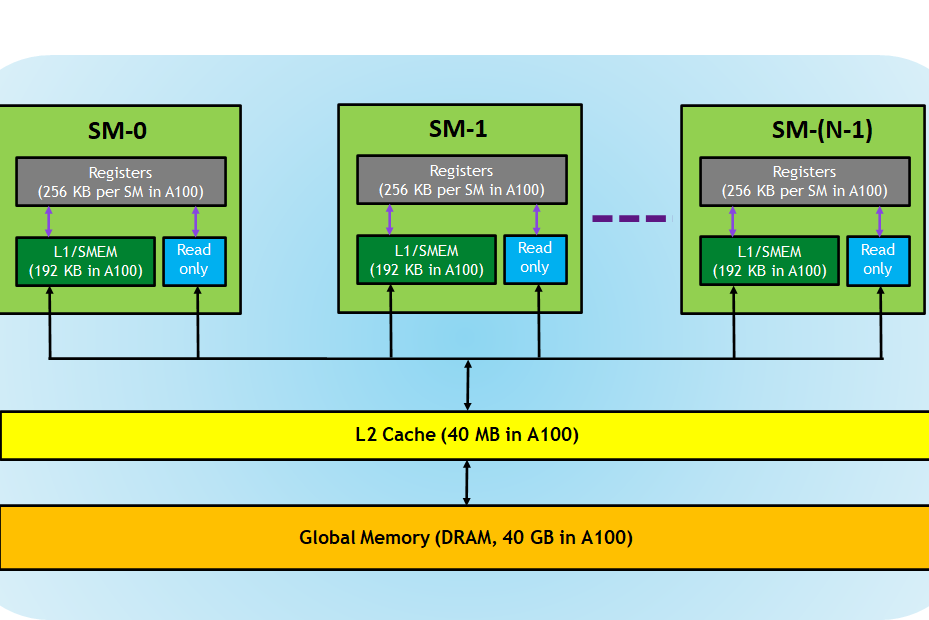

# CUDATutorial

从零开始学习 CUDA 高性能编程，从入门到放弃，哦不！一起来边学习，边打笔记，日拱一卒！

> [!NOTE]
> 你可以访问 https://cuda.keter.top/ 来访问本仓库的网页版

## 学习路线

### 预备知识系列
+ [ CUDA 入门知识概念](./docs/00_prev_concept/)

### 新手村系列

+ [构建 CUDA 编程环境](./docs/01_build_dev_env/)
+ [手写第一个 Kernel](./docs/02_first_kernel/)
+ [nvprof 性能分析](./docs/03_nvprof_usage/)
+ [尝试第一次优化 Kernel](./docs/04_first_refine_kernel/)
+ [了解cuda线程分布](./docs/10_what_my_id/)

### 初阶系列

+ [初识多线程并行计算](./docs/05_intro_parallel/)
+ [手写实现矩阵乘 Matmul](./docs/06_impl_matmul/)
+ [矩阵乘 Matmul 性能优化实践](./docs/07_optimize_matmul/)

### 中阶系列

+ [手写实现 Reduce](./docs/08_impl_reduce/)
+ [Reduce 性能优化实践—交叉寻址](./docs/09_optimize_reduce/01_interleaved_addressing/README.md)
+ [Reduce 性能优化实践—解决 Bank Conflict](./docs/09_optimize_reduce/02_bank_conflict/README.md)
+ [Reduce 性能优化实践—解决空闲线程](./docs/09_optimize_reduce/03_idle_threads_free/README.md)
+ [Reduce 性能优化实践—展开最后一个 warp](./docs/09_optimize_reduce/04_unroll/README.md)
+ [GEMM 优化专题-二维 Thread Tile 并行优化](./docs/11_gemm_optimize/01_tiled2d/README.md)
+ [GEMM 优化专题-向量化 Shared Memory 和 Global Memory 访问](./docs/11_gemm_optimize/02_vectorize_smem_and_gmem_accesses/README.md)
+ [GEMM 优化专题-warp tiling](./docs/11_gemm_optimize/03_warptiling/README.md)
+ [GEMM 优化专题-双缓冲](./docs/11_gemm_optimize/04_double_buffer/README.md)
+ [GEMM 优化专题-解决 Bank Conflict](./docs/11_gemm_optimize/05_bank_conflicts/README.md)
+ [卷积算子优化专题-卷积算子简易实现](./docs/12_convolution/01_naive_conv/README.md)
+ [卷积算子优化专题-卷积算子优化思路介绍](./docs/12_convolution/02_intro_conv_optimize/README.md)
+ [卷积算子优化专题-im2col + gemm 实现卷积](./docs/12_convolution/03_im2col_conv/README.md)
+ [卷积算子优化专题-隐式 GEMM 实现卷积](./docs/12_convolution/04_implicit_gemm/README.md)
+ [卷积算子优化专题-CUTLASS 中的卷积优化策略](./docs/12_convolution/05_cutlass_conv/README.md)

### 高阶系列

+ 页锁定和主机内存
+ CUDA 流和多流使用
+ 使用多个 GPU 计算
+ ...(补充中)

### 大师系列

我现在还不知道写啥，毕竟我现在还是菜鸡~~
