# CUDA 入门知识概念

## ※ 前言

此文档面向的是「CUDA编程」新同学，「由浅入深」阐述CUDA并行编程模型、基础概念和语言特点，期望在如下方面对新同学有所裨益：

* 能帮助读懂一个复杂的CUDA Kernel 实现逻辑；
* 能帮助判断一个CUDA Kernel 是「计算密集型」还是「访存密集型」；
* 能帮助捕捉一个CUDA Kernel 使用了哪些「优化方法」，尚存在哪些问题可深度优化；
* 能以此为「跳板」，具备自主深入调研、系统学习「CUDA 优化方法论」，具备写Demo验证的能力；


## 一、CUDA 应用实例

概括的讲，CUDA C++ 通过允许程序员定义称为 kernel的 C++ 函数来扩展 C++。当调用内核时，由 N 个不同的 CUDA 线程并行执行 N 次，而不是像常规 C++ 函数那样只执行一次。使用 __global__ 声明说明符定义内核，并使用新的 `<<<...>>>` 执行配置（execution configuration）语法指定内核调用时的 CUDA 线程数（请参阅 C++ 语言扩展）。

### 1.矩阵乘法朴素版
我们分别从CPU、CUDA编程的视角分别看下 Matmul 的朴素实现，详细的代码可参考：[06_impl_matmul](../06_impl_matmul/README.md)。

如下是 CPU 版本代码实现，可以看出：
* 有3层for循环，其中外2层循环分别是对「行」「列」索引的遍历
* 无并行

```cpp
void sgemm_naive_cpu(float *A, float *B, float *C, int M, int N, int K)
{
    for (int x = 0; x < M; x++)
    {
        for (int y = 0; y < N; y++)
        {
            float sum = 0.0f;
            for (int i = 0; i < K; i++)
            {
                sum += A[x * K + i] * B[i * N + y];
            }
            C[x * N + y] = sum;
        }
    }
}
```
如下是 CUDA 版本代码实现，可以看出：
* 只有1层循环，函数中无外层「行」「列」索引的循环遍历
* kernel 即并行单元，由大量模型的Thread来组织并行

```cpp
__global__ void sgemm_naive(int M, int N, int K, float alpha, const float *A,
                            const float *B, float beta, float *C) {
  // compute position in C that this thread is responsible for
  const uint x = blockIdx.x * blockDim.x + threadIdx.x;
  const uint y = blockIdx.y * blockDim.y + threadIdx.y;

  // `if` condition is necessary for when M or N aren't multiples of 32.
  if (x < M && y < N) {
    float tmp = 0.0;
    for (int i = 0; i < K; ++i) {
      tmp += A[x * K + i] * B[i * N + y];
    }
    // C = α*(A@B)+β*C
    C[x * N + y] = alpha * tmp + beta * C[x * N + y];
  }
}
```

### 2.矩阵乘法进阶版
如下是经过定向优化后的 Matmul Kernel 实现：
```cpp
template <const int BM, const int BN, const int BK, const int TM>
__global__ void sgemm_blocktiling_1d_kernel(float *A, float *B, float *C, int M, int N, int K)
{
    // the output block that we want to compute in this threadblock
    const uint c_row = blockIdx.y;
    const uint c_col = blockIdx.x;

    // allocate shared memory for the input and output submatrices
    __shared__ float A_shared[BM * BK];
    __shared__ float B_shared[BK * BN];

    // the inner row & col that we're accessing in this thread
    const uint thread_row = threadIdx.x / BN;
    const uint thread_col = threadIdx.x % BN;

    // advance pointers to the starting positions
    A += c_row * BM * K;
    B += c_col * BN;
    C += c_row * BM * N + c_col * BN;

    // use to avoid out-of-bounds accesses
    int global_m_pos = c_row * BM * K;
    int global_n_pos = c_col * BN;
    const uint m_size = M * K;
    const uint n_size = N * K;

    assert(BM * BK == blockDim.x);
    assert(BN * BK == blockDim.x);

    const uint A_inner_row = threadIdx.x / BK; // warp-level GMEM coalescing
    const uint A_inner_col = threadIdx.x % BK;
    const uint B_inner_row = threadIdx.x / BN; // warp-level GMEM coalescing
    const uint B_inner_col = threadIdx.x % BN;

    // allocate thread-local cache for results in registerfile
    float thread_results[TM] = {0.0};

    // outer loop over block tiles
    for (uint bk_idx = 0; bk_idx < K; bk_idx += BK)
    {
        // load the next block of the input matrices into shared memory
        A_shared[A_inner_row * BK + A_inner_col] = (global_m_pos + A_inner_row * K + A_inner_col < m_size) ? A[A_inner_row * K + A_inner_col] : 0.0f;
        B_shared[B_inner_row * BN + B_inner_col] = (global_n_pos + B_inner_row * N + B_inner_col < n_size) ? B[B_inner_row * N + B_inner_col] : 0.0f;

        // wait for all threads to finish loading
        __syncthreads();

        // advance the pointers
        A += BK;
        B += BK * N;
        global_m_pos += BK;
        global_n_pos += BK * N;

        // compute the partial sum
        for (uint dot_idx = 0; dot_idx < BK; dot_idx++)
        {
            // we make the dotproduct loop the outside loop, which facilitates
            // reuse of the Bs entry, which we can cache in a tmp var.
            float tmp_b = B_shared[dot_idx * BN + thread_col];
            for (uint res_idx = 0; res_idx < TM; res_idx++)
            {
                thread_results[res_idx] += A_shared[(thread_row * TM + res_idx) * BK + dot_idx] * tmp_b;
            }
        }

        // wait for all threads to finish computing
        __syncthreads();
    }

    for (uint res_idx = 0; res_idx < TM; res_idx++)
    {
        if (c_row * BM + thread_row * TM + res_idx < M && c_col * BN + thread_col < N)
        {
            C[(thread_row * TM + res_idx) * N + thread_col] = thread_results[res_idx];
        }
    }
}
```
### 3.涉及的一些概念
从上面优化后的代码里能看到一些新的代码段或者概念关键词：
* `__shared__` 关键字
* `__syncthreads()`
* warp-level
* GMEM、SMEM
* Block 1D Tiling

至此给大家提供了一个优化全流程的「概览性认知」，但只是CUDA编程的「冰山一角」。接下来，我们将尝试一起掀开大幕的一角，将从如下几个维度来介绍：
* CUDA 编程、执行、内层模型
* CUDA 面向高性能的硬件架构
* 剖析 Matmul 的性能优化思路


## 二、CUDA编程模型

### 1.CUDA编程模型概述
从设计目的而言，GPU和 CPU 截然不同。

* **CPU 是一种低延迟的设计**，有「强大」的 ALU（逻辑运算部件），时钟频率很高，其内核数量较少，专为通用计算而设计，具有复杂的控制单元；Cache很大，一般包含 L1、L2 和 L3 三级高速缓存。其中 L3 可以达到 8MB；
* **GPU 是一种高吞吐的设计**，有「大量」的 ALU，具有数百或数千个内核，经过优化，可并行运行大量计算，主要用来处理计算性强而逻辑性不强的计算任务；没有复杂的控制逻辑，没有分支预测等这些组件；Cache 很小，缓存的目的不是保存后面需要访问的数据的，而是为 Thread 提高服务的

GPU 是并行编程模型，和 CPU 的串行编程模型完全不同，导致很多 CPU 上优秀的算法都无法直接映射到 GPU 上，并且 GPU 的结构相当于共享存储式多处理结构，

因此在 GPU 上设计的并行程序与 CPU 上的串行程序具有很大的差异。**简单来说，CPU 是一个具有多种功能的优秀领导者。它的优点在于调度、管理、协调能力强，但计算能力一般。而 GPU 相当于一个接受 CPU 调度的 “拥有大量计算能力” 的员工。**

<p align="center">
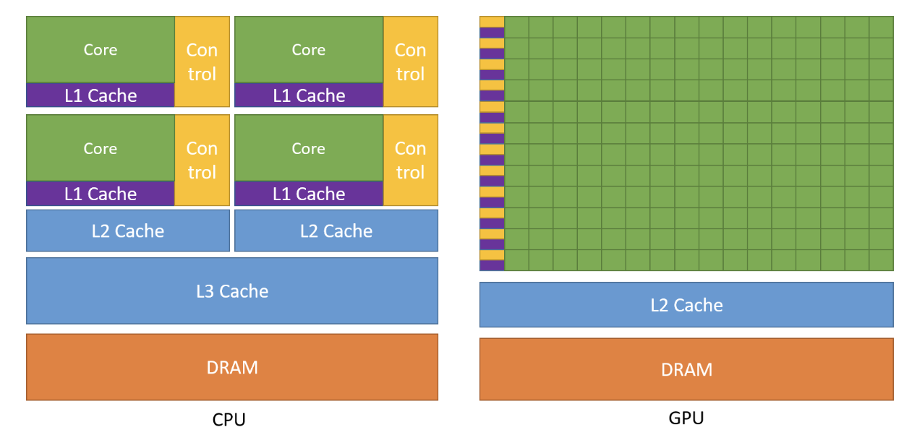
</p>

CUDA 的并行计算分为三层，自顶向下分别为：
+ **领域层**：在「算法设计」时考虑「如何解析数据和函数」；
+ **逻辑层**：在「编程实现」时确保「线程和计算可以正确解决问题」；
+ **硬件层**：通过理解「线程如何映射到核心Core」从而提高性能；

<p align="center">
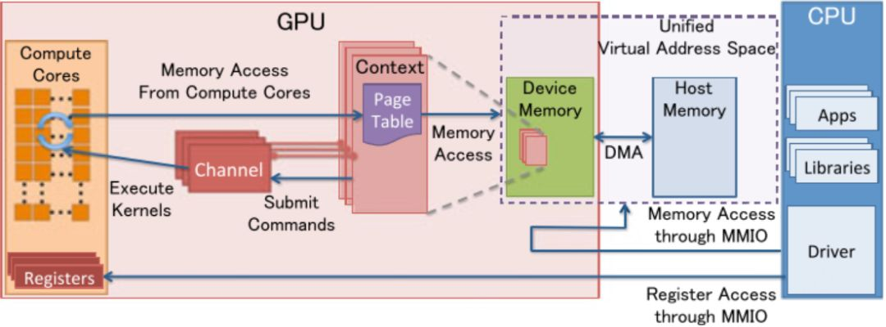
</p>


**CUDA 编程结构和流程，大致可以分为：**
1. 申请分配 GPU 内存
2. 进行CPU → GPU 数据搬运
3. 调用CUDA Kernel 完成计算
4. 进行GPU → CPU 搬回数据
5. 最后释放 GPU 内存

### 2.执行模型与核函数
CUDA的执行模型中，核函数是一个非常重要的概念，意味着所有的 Thread 运行相同的代码，且每个Thread都有一个唯一的ID，用于计算内存地址和做出控制决策。

<p align="center">
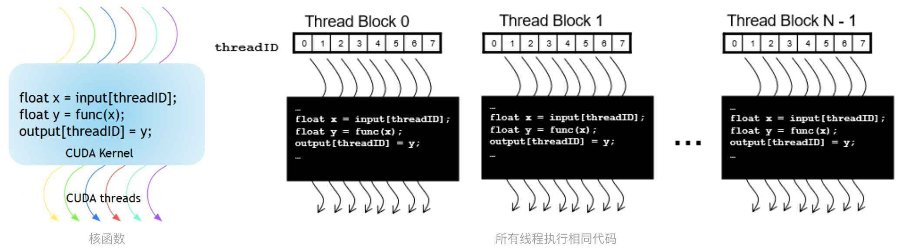
</p>

<p align="center">
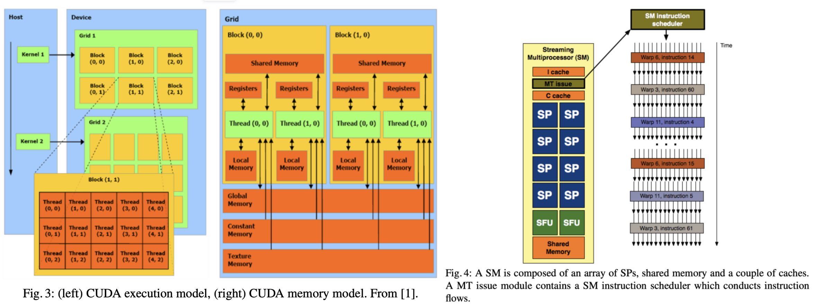
</p>


**在执行模型中，一个 Kernel 总会对应一个 Grid（要Keep in Mind）。**

Grid 内的线程在执行时，是以 Warp 来组织的（具体概念下文会阐述）。一个 Warp 包含了 32 个线程且会运行在一个 SM 上（下文也会介绍），Warp 内共享指令。每4个周期执行一条 Warp 指令且由 SM 动态调度（下文会介绍Warp Scheduler）。Warp 的线程组织方式，类似老式织布机的「一排」，织一次有32根线。

**需要注意**，Blocks 的执行顺序与它的 BlockIdx无关，而是可能以任意的顺序执行；但是单个Block中的线程却不能以任意顺序执行，它们的执行顺序是warp order（线程束顺序）

### 3.线程的层次结构

<p align="center">
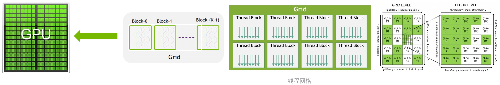
</p>

#### 3.1 线程网格 Grid
前面提到，在执行模型中，一个Kernel总会总会对应一个Grid。网格 Grid 是一个层次结构中最大的概念，一个 Grid 可以包括很多 Block，这些 Block 可以被组织为一维、二维、三维。

Host 端常采用 `<<<...>>>` 的方式来 Launch Kernel，比如 `MatAdd<<<numBlocks, threadsPerBlock>>>` ，前者用来描述「一个Grid包含了多少块」，后者用来描述「一个Block包含了多少个线程」

网格中的 Block 数量通常由「正在处理的数据的大小」决定，通常会超过系统中的处理器数量。

#### 3.2 线程块 Block
Block 包含了很多可并行执行的线程，同样可以被组织为一维、二维、三维。每个块的线程数量是「有限制」的，因为一个块中的所有线程都应当驻留在同一个处理器核心上，并且共享了该核心有限的内存资源（要Keep in Mind）。在当前的 GPU 中，一个线程块可能包含多达 1024 个线程。

Block 需要具备「独立执行』的能力：必须可以以『任何顺序』执行它们，同时无论『并行或串行』均可以。 这种独立性的要求让线程块可以在『任意数量的内核之间』，以『任意顺序』来调度，如下图所示，这使程序员能够编写支持处理器核心数量扩展的代码。

<p align="center">
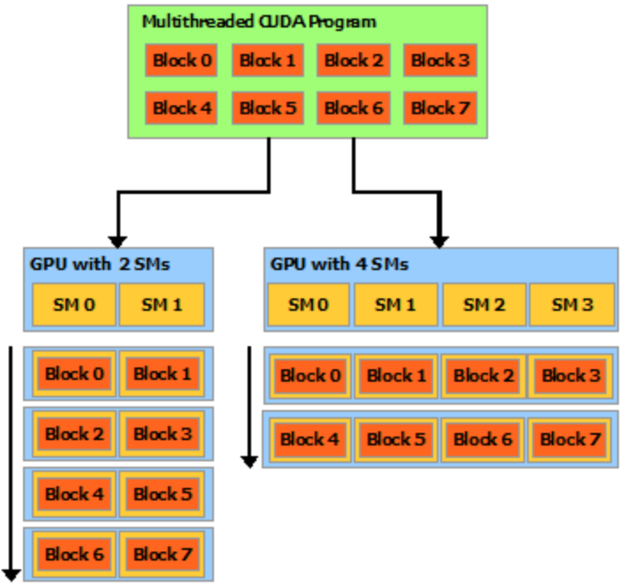
</p>


一个块内的线程可以进行协作，协作通过使用一些共享内存(shared memory)来共享数据或通过同步彼此执行来协调内存访问实现。 更准确地说，可以通过调用 __syncthreads() 内部函数来指定内核中的同步点； __syncthreads() 充当屏障，块中的所有线程必须等待同步，然后才能继续运行。 Shared Memory 给出了一个使用共享内存的例子。 除了 __syncthreads() 之外，Cooperative Groups API 还提供了一组丰富的线程同步示例。

<p align="center">
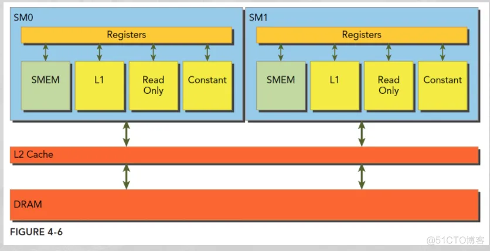
</p>


为了高效协作，共享内存是每个「处理器核心」附近的低延迟内存（很像 L1 缓存），并且 __syncthreads() 是轻量级的。不同 Block 下的线程无法进行同步（因为这些线程可能分布在不同的SM中）。

#### 3.3 线程 Thread
大家常见的Grid Dims 最多是2维，Block Dims 是 3维。因为 3维的Grid组织一般在3D视觉比较常见。

每个执行内核的线程都有一个「唯一的」线程ID，可以通过内置变量在内核中访问（要Keep in Mind）。如在前面的 Matmul 代码中，我们能看到类似threadIdx.x的内置变量。

线程的索引和它的线程 ID 以一种直接的方式相互关联：
* 对于一维块，它们是相同的； 
* 对于大小为(Dx, Dy)的二维块，索引为(x, y)的线程的线程ID为 (x + y*Dx)； 
* 对于大小为(Dx, Dy, Dz) 的三维块，索引为 (x, y, z) 的线程的线程 ID 为 (x + y*Dx + z*Dx*Dy)

### 4.数据传输与内存管理

我们依然先从 CPU 和 GPU 的对比来看待这个问题。

<p align="center">

</p>


一般来说，CPU 和主存之间的带宽只有「数十」 GB/s。例如：Intel Xeon E5-2699 v3，内存带宽达到 68GB/s（(2133 * 64 / 8)*4 MB/s）。
而 GPU 的高速缓存虽然较小，高速缓存与显存（上图中的 Memory）之间的带宽可以达到「数百」 GB/s，比如 P40 的显存带宽为 346GB/s，远远大于 CPU 的内存带宽。但是，相对于 GPU 的计算能力，显存仍然是性能瓶颈的所在。

在现代的异构计算系统中，GPU 是以 PCIe 卡作为 CPU 的外部设备存在的，两者之间通过 「PCIe 总线」通信。对于 PCIe Gen3 x1 理论带宽约为 1000MB/s，所以对于 Gen3 x32 的最大带宽约为 32GB/s，而受限于本身的实现机制，有效带宽往往只有理论值的 2/3，甚至更低。所以，CPU 与 GPU 之间的通信开销是比较大的。

<p align="center">
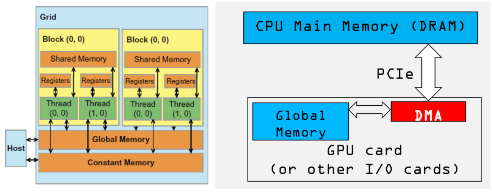
</p>


从上图我们可以看出:
1. CPU 和 GPU 之间的总线 bus 是 PCIe，是双向传输的
2. CPU 和 GPU 之间的数据拷贝使用 DMA 机制来实现，非常容易理解，为了更快的传输速度

关于「深入理解共享内存」机制，可以结合[《CUDA Shared Memory 共享内存》](https://dorianzi.github.io/2020/04/02/cuda-shared-memory/)来理解。

CUDA里的 shared memory是 Block级别的，所以两件事需要 Keep in Mind：
1. 当 allocate shared memory 的时候，其实在「每个block」里面都创建了一份同样大小「却互相独立」的share memory
2. 当进行__syncthreads()操作的时候，只能保证「此block内」的thread在同步，以及此block里的shared memory在同步


### 5.计算密集&访存密集

<p align="center">

</p>

对于深度学习算子的性能优化主要受2个方面的限制，一个是「硬件资源」的限制，另一个就是「算法层面」的局限性。
* 硬件资源限制主要包括「显存带宽」限制和「计算资源」限制
* 算法层面的限制是由于自己「算法设计」和实现不合理导致算子运行性能较差，例如重复运算，复杂度高等。
若在实际的开发中，最大限度的优化算法设计充分利用硬件资源，执行时间就会最短（指导原则）。通常结合硬件「访存带宽」和「算力」计算出当前算法的理论性能，当然在实际开发中一般以实际性能为准，但是通过对比理论性能和实际性能的差距可以定位当前算子的性能瓶颈，从而进一步优化算子。

如何有效的计算算子的理论性能、分析实际显存带宽资源和计算资源呢？下文会介绍一下算子理论性能的计算公式和算子瓶颈分析方法，之后结合针对不同瓶颈的算子进行特性分析。

### 5.1 算子理论性能

算子基本运算一般包括2个部分：
* 一部分是数据加载时间Time_IO，一般是指将数据从片外内存加载到片上内存的时间Time_in和从片上内存写回到片外内存的时间Time_out
* 一部分是计算时间Time_compute，是指片上计算单元完成所有计算的总时间。因此算子的理论性能公式可以总结为:

Time_total = Time_IO(Time_in + Time_out) + Time_compute

进行理论性能评估时，一般使用理论带宽和理论算力进行性能计算，具体的数据可以参考硬件产品给出的硬件规格获取。例如TeslaV100的理论带宽为900GB/S, 理论算力为7.5TFlops， 假设进行ADD操作规模为{128,1024,128,1}，数据类型为float32则根据上述给出的理论带宽和算力可以得出该规模下ADD操作的IO时间为:

TIO =TIO ×(Tin1,Tin2)+Tout = 3×(128×1024×128×1×sizeof(float32)/(1024×1024×1024)/900×10^6 = 208.3333333(us)
Tcompute =128×1024×128/(7.5×10^15)×10^6 =0.002236962(us)

则当前规模的整体运行理论时间为:
TIO + Tcompute = 208.3333333 + 0.002236962 = 208.3355703 (us).

从这里就能够看出来对于ADD OP的整体时间主要受IO影响， 计算时间基本可以忽略，像ADD算子这种IO时间远大于计算时间，整体运行时间是由IO时间决定的，即使将计算时间优化完也依旧不会对总时间产生多大的影响，我们就认定它为IO瓶颈的算子。实际带宽是算子计算过程中的实际IO量与所花时间的比值，单位时间内加载子节数，单位GB/S。


#### 5.2 Roof-Line
前面给出的ADD算子是相对简单的，我们可以直接通过分析总时间占比，进而推断算子的瓶颈。但是对于复杂的算子呢？对于复杂的算子通常采用Roof-line进行区分。所谓“Roof-line”，指的就是由计算平台的算力和带宽上限这两个参数所决定的“屋顶”形态，如下图所示:
* **算力**： $\pi$ **也称为计算平台的性能上限**，指的是一个计算平台倾尽全力每秒钟所能完成的浮点运算数。单位是FLOPS or FLOP/s。
* **带宽**： $\beta$ **也即计算平台的带宽上限**，指的是一个计算平台倾尽全力每秒所能完成的内存交换量。单位是Byte/s。
* **计算强度上限**： $I_{max}$ **两个指标相除即可得到计算平台的计算强度上限**。它描述的是在这个计算平台上，单位内存交换最多用来进行多少次计算。单位是FLOPs/Byte。

<p align="center">
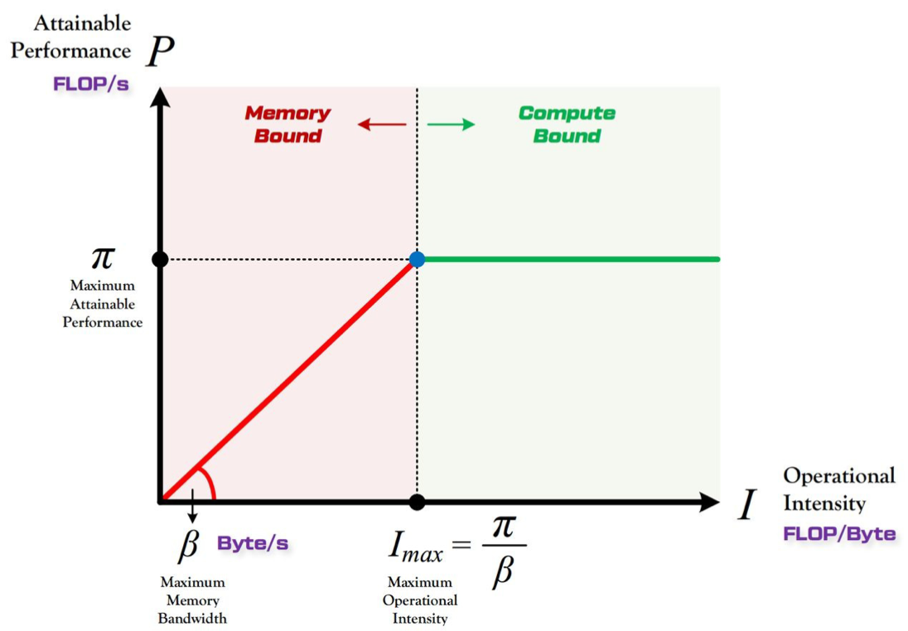
</p>


算力决定“屋顶”的高度(绿色线段)；带宽决定“房檐”的斜率(红色线段)

<p align="center">
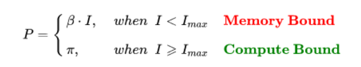
</p>


理论性能只是用于评估算子能达到的最好的性能，就相当于该算子优化的天花板， 但是实际的算子性能是否优化到了极限还需要结合其他的因素进行评估，在进行优化的时候，我们通常针对不同限制因素采取不同的优化技巧，那么实际的性能优化因素我们需要考虑哪些呢?对于访存优化而言，主要考虑的就是实际访存带宽了，实际访问存带宽可以是通过实际的IO总量/实际运行时间得出的。

#### 5.3 IO访存密集型

<p align="center">
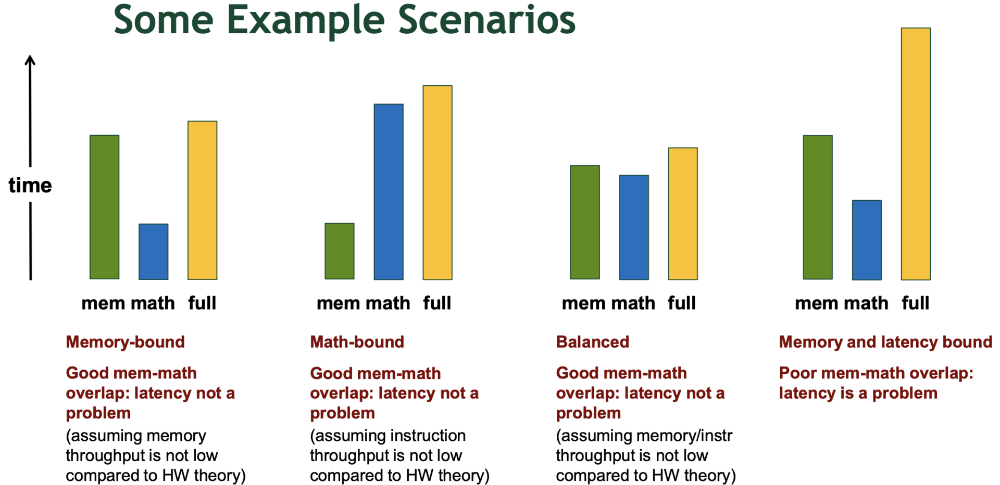
</p>

带宽瓶颈区域 Memory-Bound。当模型的计算强度 $I$ 小于计算平台的计算强度上限 $I_{max}$ 时，由于此时模型位于“房檐”区间，因此模型理论性能 $P$ 的大小完全由计算平台的带宽上限 $\beta$ (房檐的斜率)以及模型自身的计算强度 $I$ 所决定，因此这时候就称模型处于 Memory-Bound 状态。可见，在模型处于带宽瓶颈区间的前提下，计算平台的带宽$\beta$ 越大(房檐越陡)，或者模型的计算强度 $I$ 越大，模型的理论性能 $P$ 可呈线性增长。

IO 瓶颈算子在总体神经网络模型中的占比较高，像常见 elementwise 类算子基本都属于IO瓶颈，通过解决算子在访存方面的问题就能使算子实际性能接近理论性能，还有就是比较常见的算子为softmax， reduce， broadcast等算子。


#### 5.4 计算密集型
计算瓶颈区域 Compute-Bound。不管模型的计算强度 $I$ 有多大，它的理论性能 $P$ 最大只能等于计算平台的算力 $\pi$ 。当模型的计算强度 $I$ 大于计算平台的计算强度上限 $I_{max}$ 时，模型在当前计算平台处于 Compute-Bound状态，即模型的理论性能 $P$ 受到计算平台算力 $\pi$ 的限制，无法与计算强度 $I$ 成正比。但这其实并不是一件坏事，因为从充分利用计算平台算力的角度上看，此时模型已经 $P$ 的利用了计算平台的全部算力。可见，计算平台的算力 $\pi$ 越高，模型进入计算瓶颈区域后的理论性能 $P$ 也就越大。

尽管计算瓶颈的算子在总体算子库中的占比较少，但是却起着举足轻重的地位，这是因为这些算子真的很耗时也确实很复杂，例如 conv， 矩阵乘法。注意此处的计算瓶颈影响整体性能是指已经完成算子IO访存的情况下。


## 三、CUDA编程语言与工具

### 1.CUDA C/C++编程语言特性
CUDA C++ 为熟悉 C++ 编程语言的用户提供了一种可以轻松编写设备执行程序的简单途径。它由 C++ 语言的「最小扩展集」和「运行时库」组成。
编程模型通过引入了核心语言扩展，使得程序员可将内核函数定义为 C++ 函数，并在每次函数调用时通过一些新语法来指定网格和块的维度。所有扩展的完整描述可以在 C++ 语言扩展中找到。包含这些扩展名的任何源文件都必须使用 nvcc 进行编译，如 使用NVCC编译 中所述。

#### 1.1 函数执行空间说明符
函数执行空间说明符 (Function Execution Space Specifiers  ) 表示函数是在「主机上（即Host端）」执行还是在「设备上（即Device端）」执行，以及它可「被主机调用」还是可「被设备调用」。

<p align="center">
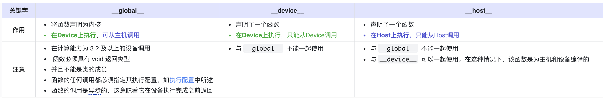
</p>


关于 `__noinline__` and `__forceinline__` ：
* 编译器在认为合适时内联任何 `__device__` 函数
* `__noinline__` 函数限定符可用作提示编译器尽可能不要内联函数。
* `__forceinline__` 函数限定符用于强制编译器内联函数。
* `__noinline__` 和 `__forceinline__` 函数限定符不能一起使用，并且两个函数限定符都不能应用于内联函数。

#### 1.2 变量内存空间说明符
变量内存空间说明符 ( Variable Memory Space Specifiers ) 表示变量在设备上的内存位置。
在设备代码中声明的没有本节中描述的任何 `__device__` 、`__shared__` 和 `__constant__`内存空间说明符的自动变量通常驻留在「寄存器」中。 但是，在某些情况下，编译器可能会选择将其放置在本地内存中，这可能会产生不利的性能后果，如设备内存访问中所述。
<p align="center">
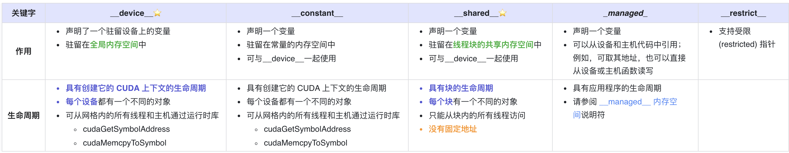
</p>

<p align="center">
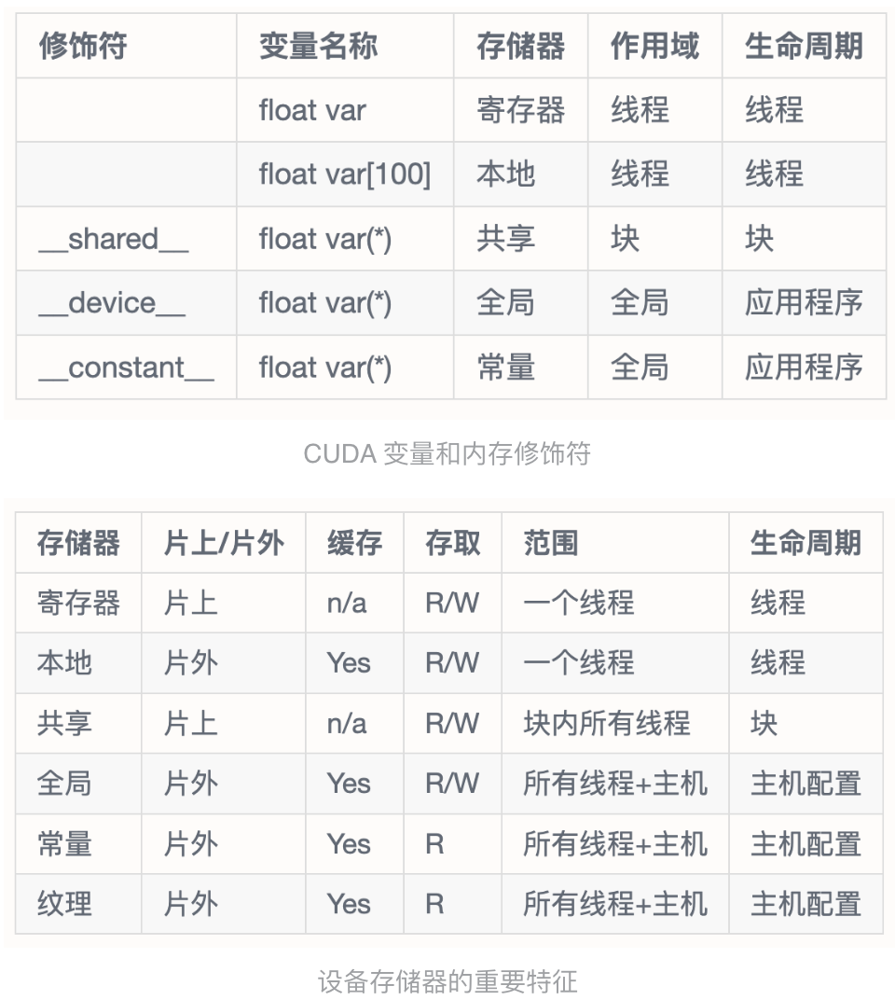
</p>


### 2.CUDA内存管理

<p align="center">
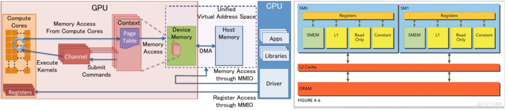
</p>

<p align="center">

</p>


我们用 cudaMalloc() 为GPU分配内存，用 malloc() 为CPU分配内存。除此之外，CUDA还提供了自己独有的机制来分配 host 内存：cudaHostAlloc()。 这个函数和 malloc 的区别是什么呢?

malloc() 分配的标准的，可分页的主机内存(上面有解释到)；而 cudaHostAlloc()分配的是页锁定的主机内存，也称作固定内存pinned memory，或者不可分页内存。它的一个重要特点是操作系统将不会对这块内存分页并交换到磁盘上，从而保证了内存始终驻留在物理内存中。也正因为如此，操作系统能够安全地使某个应用程序访问该内存的物理地址，因为这块内存将不会被破坏或者重新定位。

由于 GPU 知道内存的「物理地址」，因此就可以使用 DMA 技术来在GPU和CPU之间复制数据。当使用可分页的内存进行复制时(使用malloc)，CUDA驱动程序仍会通过 dram 把数据传给GPU，这时复制操作会执行两遍：第一遍从可分页内存复制一块到临时的页锁定内存，第二遍是再从这个页锁定内存复制到GPU上。当从可分页内存中执行复制时，复制速度将受限制于PCIE总线的传输速度和系统前段速度相对较低的一方。在某些系统中，这些总线在带宽上有着巨大的差异，因此当在GPU和主机之间复制数据时，这种差异会使页锁定主机内存比标准可分页的性能要高大约2倍。即使PCIE的速度与前端总线的速度相等。由于可分页内存需要更多一次的 CPU 参与复制操作，也会带来额外的开销。

当我们在调用 `cudaMemcpy(dest, src, ...)` 时，程序会自动检测 dest 或者 src 是否为Pinned Memory，若不是，则会自动将其内容拷入一不可见的Pinned Memory中，然后再进行传输。可以手动指定 Pinned Memory，对应的API为：cudaHostAlloc(address, size, option)分配地址，cudaFreeHost(pointer)释放地址。注意，所谓的Pinned Memory都是在Host端的，而不是Device端。

那么，在写代码的过程中是否可以把所有的 malloc都替换成cudaHostAlloc()呢？这样也是不对的。

固定内存是一把双刃剑。当时使用固定内存时，虚拟内存的功能就会失去。尤其是在应用程序中使用每个页锁定内存时都需要分配物理内存，而且这些内存不能交换到磁盘上。这将会导致系统内存会很快的被耗尽。因此应用程序在物理内存较少的机器上会运行失败。不仅如此，还会影响系统上其他应用程序的性能。


### 3.CUDA内置函数与特性

#### 3.1 内置变量

<p align="center">
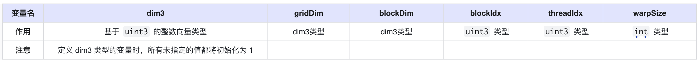
</p>


#### 3.2 Warp Shuffle Function
__shfl_sync、__shfl_up_sync、__shfl_down_sync 和 __shfl_xor_sync 在 [warp](https://docs.nvidia.com/cuda/cuda-c-programming-guide/index.html#simt-architecture) 内的线程之间交换变量。由计算能力 3.x 或更高版本的设备支持。

+ 弃用通知：__shfl、__shfl_up、__shfl_down 和 __shfl_xor 在 CUDA 9.0 中已针对所有设备弃用。
+ 删除通知：当面向具有 7.x 或更高计算能力的设备时，__shfl、__shfl_up、__shfl_down 和 __shfl_xor 不再可用，而应使用它们的同步变体。

3.3 Asynchronous Barrier
> 参考链接[此处](https://github.com/HeKun-NVIDIA/CUDA-Programming-Guide-in-Chinese/blob/main/%E9%99%84%E5%BD%95B%E5%AF%B9C%2B%2B%E6%89%A9%E5%B1%95%E7%9A%84%E8%AF%A6%E7%BB%86%E6%8F%8F%E8%BF%B0/%E9%99%84%E5%BD%95B%E5%AF%B9%20C%2B%2B%20%E8%AF%AD%E8%A8%80%E6%89%A9%E5%B1%95%E7%9A%84%E8%AF%A6%E7%BB%86%E6%8F%8F%E8%BF%B0.md#b25-asynchronous-barrier)

NVIDIA C++ 标准库引入了 [std::barrier](https://nvidia.github.io/libcudacxx/extended_api/synchronization_primitives/barrier.html) 的 GPU 实现。 除了 std::barrier 的实现，该库还提供允许用户指定屏障对象范围的扩展。 屏障 API 范围记录在 [Thread Scopes](https://nvidia.github.io/libcudacxx/extended_api/thread_scopes.html) 下。 计算能力 8.0 或更高版本的设备为屏障操作和这些屏障与 memcpy_async 功能的集成提供硬件加速。 在计算能力低于 8.0 但从 7.0 开始的设备上，这些障碍在没有硬件加速的情况下可用
nvcuda::experimental::awbarrier被弃用，取而代之的是cuda::barrier。


### 4.CUDA调试工具与性能分析工具
CUDA中的性能分析工具是专门为开发者提供的一系列工具，用于分析和优化CUDA应用程序的性能。这些工具帮助开发者了解代码在GPU上的执行情况，从而定位性能瓶颈，优化代码，确保充分发挥GPU的计算能力。最主要的性能分析工具是NVIDIA Visual Profiler和 NVIDIA Nsight 。

nvprof 有命令行工具，大家前期写Demo验证性能优化时，推荐使用这个，参考[nvprof 使用](../03_nvprof_usage/README.md)

NVIDIA Visual Profiler (nvprof) :
* 功能 ：它提供了一个图形界面，允许用户对CUDA应用程序进行性能分析，如内存带宽、计算利用率、线程块执行情况等。
* 统计数据 ：能够捕获详细的硬件计数器数据和API调用时间。
* 指导性意见 ：基于分析结果，Visual Profiler还会提供优化建议，帮助开发者找到并解决性能问题。

```bash
==33356== Profiling application: ./add
==33356== Profiling result:
            Type  Time(%)      Time     Calls       Avg       Min       Max  Name
 GPU activities:   92.23%  570.25ms         1  570.25ms  570.25ms  570.25ms  add_kernel(float*, float*, float*, int)
                    4.79%  29.586ms         1  29.586ms  29.586ms  29.586ms  [CUDA memcpy DtoH]
                    2.99%  18.459ms         2  9.2297ms  9.2245ms  9.2349ms  [CUDA memcpy HtoD]
      API calls:   56.06%  619.64ms         3  206.55ms  9.4402ms  600.73ms  cudaMemcpy
                   43.58%  481.72ms         3  160.57ms  359.50us  481.00ms  cudaMalloc
                    0.16%  1.7937ms       101  17.759us     239ns  933.68us  cuDeviceGetAttribute
                    0.09%  1.0061ms         3  335.36us  278.68us  444.81us  cudaFree
                    0.09%  956.79us         1  956.79us  956.79us  956.79us  cuDeviceTotalMem
                    0.01%  132.25us         1  132.25us  132.25us  132.25us  cuDeviceGetName
                    0.00%  50.300us         1  50.300us  50.300us  50.300us  cudaLaunchKernel
                    0.00%  14.994us         1  14.994us  14.994us  14.994us  cudaDeviceSynchronize
                    0.00%  10.974us         1  10.974us  10.974us  10.974us  cuDeviceGetPCIBusId
                    0.00%  3.0460us         3  1.0150us     421ns  2.1590us  cuDeviceGetCount
                    0.00%  1.7330us         2     866ns     328ns  1.4050us  cuDeviceGet
                    0.00%     543ns         1     543ns     543ns     543ns  cuDeviceGetUuid
```

NVIDIA Nsight:
* 集成开发环境：Nsight是一个集成的开发环境，提供了代码编辑、调试、性能分析等功能。
* 详细追踪：可以追踪CUDA内核的执行，展示线程的行为、内存访问模式等。
* 系统级分析：Nsight还提供了系统级的分析功能，例如显示CPU和GPU之间的交互、数据传输等。
* 支持图形应用：对于图形应用，Nsight还能够展示渲染的帧、GPU渲染时间等信息。


### 5.NVCC编译和PTX代码
内核可以使用被称为PTX的 CUDA 指令集架构来编写，PTX参考手册中对此进行了描述。 但是通常使用高级编程语言（如 C++）更有效。在这两种情况下，内核都必须通过nvcc编译成二进制代码才能在设备上执行。

nvcc是一种编译器驱动程序，可简化C++或PTX代码的编译流程：它提供了简单且熟悉的命令行选项，并通过调用不同编译阶段的工具集来执行代码编译。 本节概述了nvcc工作流程和命令选项。 完整的描述可以在nvcc用户手册中找到。

#### 5.1 离线编译
使用 nvcc 编译的源文件可以包含主机代码（即在host上执行的代码）和设备代码（即在device上执行的代码）。 nvcc 的基本工作流程包括：
* 将设备代码与主机代码分离
* 将设备代码编译成汇编形式（PTX代码）或二进制形式（cubin对象）
* 通过 CUDA 运行时中的函数调用来替换主机代码中的 <<<...>>>语法，对主机代码进行修改（更具体的描述可以参照执行配置），来从PTX代码或cubin对象中加载和启动每个编译好的内核。

修改后的主机代码要么作为 C++ 代码输出，然后使用另一个工具编译，要么作为目标代码直接输出——通过让 nvcc 在最后编译阶段调用主机编译器对代码进行编译。然后应用程序可以：
* 链接已编译的主机代码（这是最常见的情况）
* 或者忽略修改后的主机代码（如果有），使用 CUDA 驱动程序 API（请参阅驱动程序 API）来加载和执行PTX代码或cubin对象。


#### 5.2 即时编译
应用程序在「运行时」加载的任何 PTX 代码都由设备驱动程序「进一步编译」为二进制代码。这称为即时编译（just-in-time compilation）。即时编译增加了应用程序加载时间，但它使得应用程序可以从每个新的设备驱动程序内置的新编译器中获得性能改进。同时它也是使得应用程序能够在那些编译时不存在的设备中运行的唯一方式，如应用程序兼容性中所述。

当设备驱动程序为某些应用程序即时编译一些 PTX 代码时，驱动程序会自动缓存生成的二进制代码副本，避免应用程序在后续函数调用中重复的编译。缓存（称为计算缓存）在设备驱动程序升级时自动失效，因此应用程序可以从新的设备驱动程序的内置即时编译器中获得改进收益。

环境变量可用于控制即时编译，如 CUDA 环境变量中所述。作为 nvcc 编译 CUDA C++ 设备代码的替代方法，NVRTC 可在运行时将 CUDA C++ 设备代码编译为 PTX。 NVRTC 是 CUDA C++ 的运行时编译库；更多信息可以在 NVRTC 用户指南中找到。

> 注：CINN中在CodeGen之后，使用的就是NVRTC来编译的。

#### 5.2 CUDA Runtime
运行时在cudart库中实现，该库链接到应用程序，可以通过cudart.lib或libcudart.a静态链接，也可以通过cudart.dll或libcudart.so动态链接。 

通常动态链接cudart.dll或cudart.so的应用程序会将运行时库作为应用程序安装包的一部分。只有在两个组件链接到同一个 CUDA 运行时实例时，在它们之间进行 CUDA 运行时符号的地址传递才是安全的。

它的所有入口都以cuda为前缀。如[异构编程](https://docs.nvidia.com/cuda/cuda-c-programming-guide/index.html#heterogeneous-programming)中所述，CUDA 编程模型假设系统由主机和设备组成，每个设备都有自己独立的内存。 [设备内存](https://docs.nvidia.com/cuda/cuda-c-programming-guide/index.html#device-memory)概述了用于管理设备内存的运行时函数。[共享内存](https://docs.nvidia.com/cuda/cuda-c-programming-guide/index.html#shared-memory)说明了使用线程层次结构中引入的共享内存来最大化性能。


## 四、CUDA硬件基础
> 所有的优化出发点，都是为了更好地通过编程来「压榨」硬件性能。故先阐述硬件基础，再谈优化理论


### 1.GPU硬件架构

<p align="center">
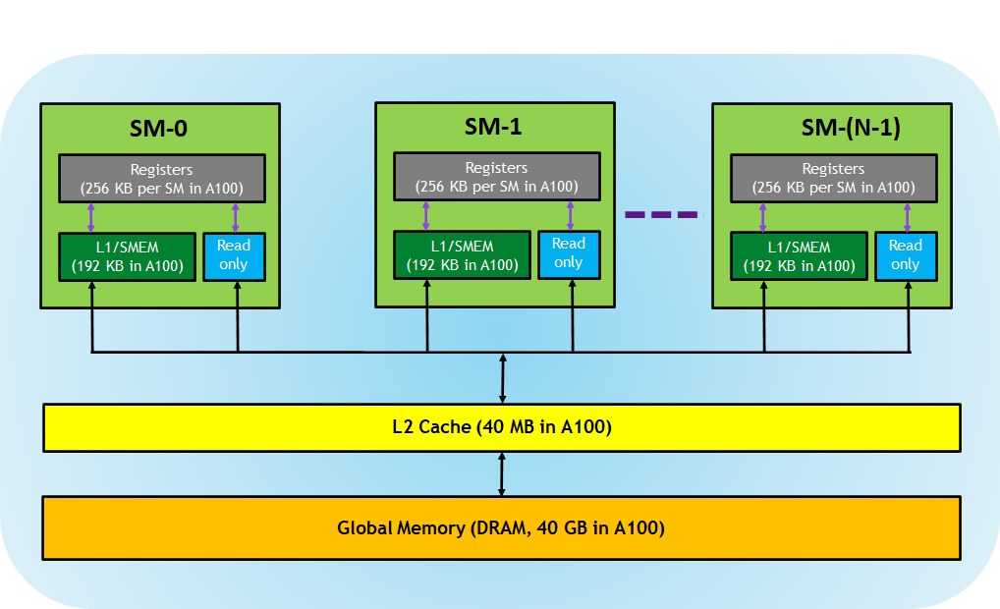
</p>

A100 硬件的架构如上图。其中A100 SM 包含新的第三代Tensor 内核：
* **Registers**：每个thread 专用的，这意味着分配给该线程的寄存器对其他线程不可见，编译器做出有关寄存器利用率的决策。
*** L1/Shared memory (SMEM)**：每个SM都有一个快速的 on-chip scratched存储器，可用作L1 cache和shared memory。CUDA block中的所有线程可以共享shared memory，并且在给定SM上运行的所有CUDA Block可以共享SM提供的物理内存资源。
* **Read-only memory**：每个SM都具 instruction cache，constant memory，texture和RO cache，这对kernel代码是只读的
* **L2 cache**：L2 cache在所有SM之间共享，因此每个CUDA block中的每个线程都可以访问该内存。
* **Global memory**：这是GPU和位于GPU中的DRAM的帧缓冲区大小。
<p align="center">
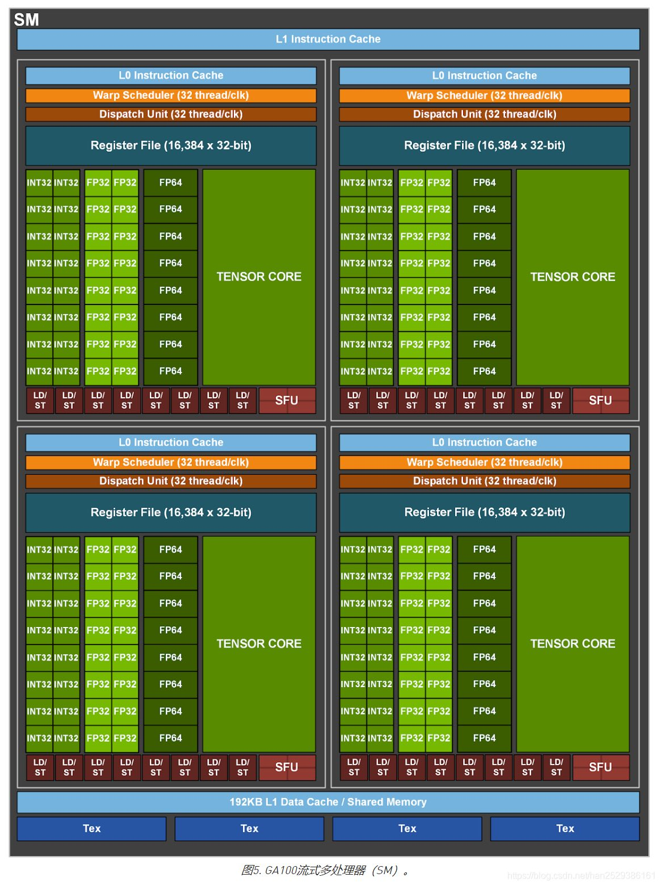
</p>

从上图可以看出 GA100 的 SM 架构相比 G80 复杂了很多，占地面积也更大。每个 SM 包括 4 个区块，每个区块有独立的 L0 指令缓存、Warp 调度器、分发单元，以及 16384 个 32 位寄存器，这使得每个 SM 可以并行执行 4 组不同指令序列。4 个区块共享 L1 指令缓存和数据缓存、shared memory、纹理单元。

从图中也能看出 INT32 计算单元数量与 FP32 一致，而 FP64 计算单元数量是 FP32 的一半，这在后面峰值计算能力中会有体现。

<p align="center">
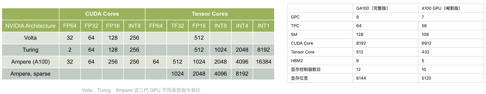
</p>


每个 SM 除了 INT32、FP32、FP64 计算单元之外，还有额外 4 个身宽体胖的 Tensor Core，这是加速 Deep Learning 计算的重磅武器，已发展到第三代，每个时钟周期可做 1024 次 FP16 乘加运算，与 Volta 和 Turing 相比，每个 SM 的吞吐翻倍，支持的数据类型也更为丰富，包括 FP64、TF32、FP16、BF16、INT8、INT4、INT1。
* 192 KB的共享内存和L1 数据缓存组合，比V100 SM 大1.5倍
* 40 MB 的L2 Cache 比V100 大了7倍，借助新的partitioned crossbar结构（2个L2 Cache），提供了V100的L2缓存读取带宽的2.3倍。
* 新的异步复制指令将数据直接从「全局存储器」加载到「共享存储器」中，可以绕过L1高速缓存，并且不需要中间寄存器文件；

> 具体细节可以参考[《NVIDIA GPU A100 Ampere(安培) 架构深度解析》](https://blog.csdn.net/han2529386161/article/details/106411138)。


### 2.GPU 内存结构

<p align="center">
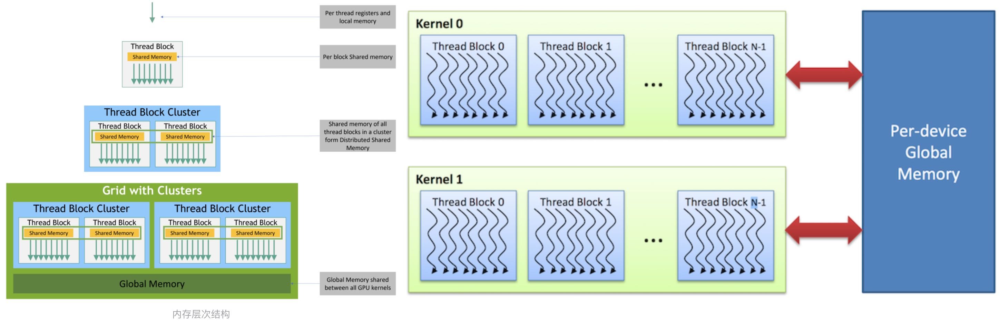
</p>

<p align="center">

</p>


### 3.SM和并行执行模型
如下图是一个SM，保存了传入线程和Block的ID，并且管理线程的执行。里面绿色的小方块实际上都是CUDA Core，我们也可以叫它Streaming Processors (SPs)，这些SPs是真正执行命令的单元，也是GPU最基本的处理单元，在fermi架构开始被叫做 CUDA core。它可以进行浮点（整数）运算，逻辑判断等一些简单操作。除了SP以外，SM中还有指令缓存，L1缓存，共享内存（前面提到过）。

**下面我们来详细介绍一下每个SP的相关组成：**
* core 也称之为cuda core，主要用来进行FP和INT的计算
* DP Unit主要是在HPC场景用来进行double precison 计算，而机器学习场景基本上不会用到
* SFU也是一个计算单元，它主要负责 sine, cosine, log and exponential等函数的计算
* LD/ST即load uint和store unit即内存控制器的常用组件
* Register File即寄存器组
* Tex即图形渲染时需要用到的内存

<p align="center">
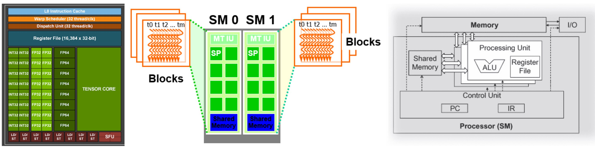
</p>


在并行的执行过程中，线程们被打包成一个个Block传入 Streaming Multiprocessors (SM)。一个block只能调度到一个Streaming Multiprocessor上运行。一个Streaming Multiprocessor可以同时运行多个block。但是每个SM 是有对同时运行的Block数量和线程数量的限制，比如较近的CUDA装置就限制一个SM上最多同时运行8个Block和1536个线程。当然，一个CUDA 设备上可以有多个SM，比如一个有30个SM的CUDA设备，如果每个SM最多同时运行1536个线程，则同时最多可以运行46080个线程

<p align="center">
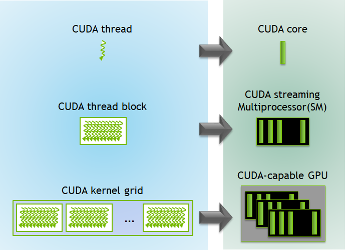
</p>


### 5.Warp-Level 概念
按照SIMD模型，SM最小执行单元为 Warp，一个Warp中有多个线程。SM执行单元SPs共享单个指令fetch/dispatch，这些线程将同一个指令应用于不同数据。因此，一个warp中的所有线程将总是具有相同的执行时间。

**warp是SM的基本执行单元。**一个 Warp包含32个并行thread，这32个thread执行于SIMT(Single-Instruction, Multiple-Thread，单指令多线程)模式。也就是说所有thread执行同一条指令，并且每个thread会使用各自的data执行该指令。
<p align="center">
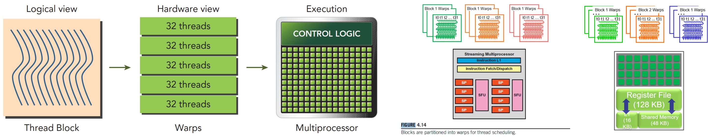
</p>


**一个warp中的线程必然在同一个block中**，同一个block不会再两个SM中，也就是block会调用多个warp，如果block的线程数不能整除warp线程数，则最后一个warp没有填满，没填满的warp中的thread是inactive。只要调用warp就会消耗SM资源，只不过有些warp中的线程是inactive。

**在早期的GPU中，一个SM只能在同一个时刻为单个线程束执行一条指令**。随着GPU的发展，在任意时刻，一个SM可以有多个线程束同时执行指令了。但是即使如此，SM中可以同时执行的线程束数量还是小于传入单个SM中Blocks被拆分后的线程束数量。那么，一个自然的问题就是，如果每次SM能够同时执行的线程束仅仅是传入线程束的一个子集的话，为什么我们要传入那么多线程束呢？实际上这样的设计能够让CUDA处理器有效地执行长延迟操作，如全局内存访问，这种操作常常在一个kenerl中出现，但是从全局内存中读取数据其实是很慢的，如果只是等待，那将浪费很多时间。

于是SM在执行运算的时候采取以下策略：
在执行一个线程束的过程中，如果这个线程束遇到了长延迟操作，则在等待长延迟操作完成的过程中SM可以抓取其他可以快速的线程束执行，当前一个线程束的长延迟操作结束后继续执行之前未完成的操作。

<p align="center">
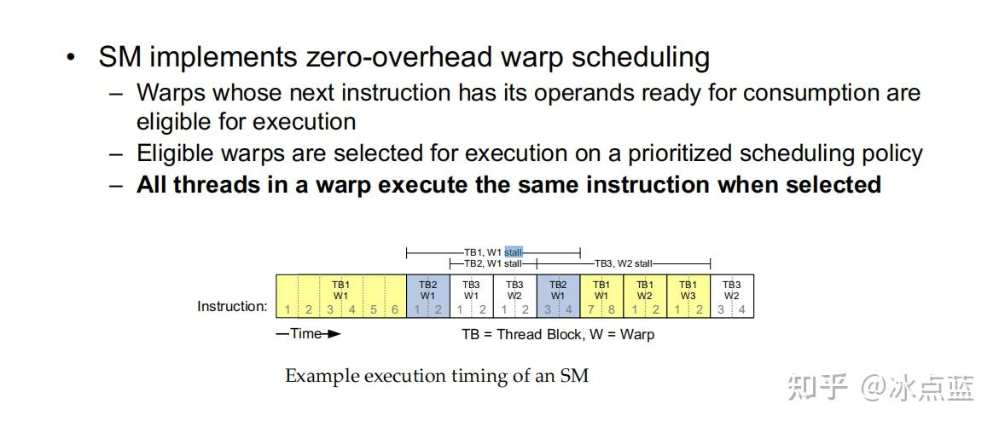
</p>


这里举一个图例说明这种策略工作的方式，假设在时间的最开始时，SM处理第一个Block中的第一个线程束，我们记它的编号为 `<TB1,W1>` ,其中TB代表BlockId，W代表在该Block中的线程束编号。在运行了6个时间单位后，`<TB1,W1>` 这个线程束突然遭遇了长延迟操作,语句需要等待8个时间单位。于是我们的SM就抓取了可以立即执行的 `<TB2,W1>` 线程束，希望在等待 `<TB1,W1>` 的过程中来运行一些其他线程束的任务来提高效率。不巧的是 `<TB2,W1>`在运行了2个时间单位也遭遇了长延迟操作，需要四个时间单位响应。被逼无奈的SM只好去抓取第三个线程束 `<TB3,W1>` ,这次运气比较好，2个时间单位运行完毕，还有两个时间单位去抓 `<TB3,W2>` 运行，但是`<TB3,W2>`在运行了2个单位也遭遇了长时间延迟操作。好在这个时候最先开始的`<TB1,W1>`已经可以恢复运行了，于是我们又继续运行`<TB1,W1>`直到结束.....后续与之前的大同小异

**一个warp中的thread执行相同的指令，有相同的执行时间，如果某一个thread阻塞了，同一个warp的其他thread都会阻塞，因此有了warp divergence。**所以warp divergence只会出现在同一个warp中。

如下例子中，同一个线程束的线程根据编号被分为了奇数线程和偶数线程，但是这样就带了一个问题，所有该线程束中的线程先计算 if 语句中的逻辑运算，于是奇数的线程被激活了并且进行if中的运算，而未被激活的偶数线程只能等待。假设这是一个if else语句，那么轮到else的时候则是未被激活的奇数线程等待，由于当前GPU总是串形的执行不同的路径，因此我们造成了50%的计算资源浪费。

<p align="center">
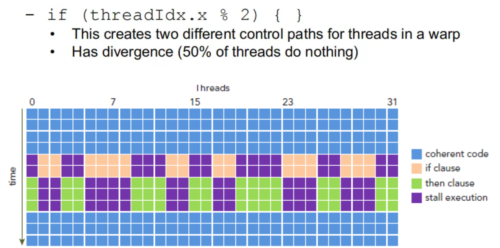
</p>


为了更加清晰的说明线程束发散，可以看看如下图例：

<p align="center">

</p>

在上述图例中，if else控制语句将线程束里的8个线程（假定一个线程束里8个线程）分成左4个和右4个，在左4运行A,B,C的时候，右4只能等待；同理在右4运行X，Y的时候左4也只能等待。在结束控制语句以后才能会和起来一起运行Z。这样串形的执行不同路径让左4和右4都等待了一段时间，造成了计算资源的浪费。

**是不是这种if else语句总会造成线程发散呢？其实不是。**同一个warp中的thread执行同一操作，如果因为控制流语句（if）进入不同的分支才触发的warp divergence，那么只要避免控制流语句触发即可。也就是将同一分支放入同一warp。也就引入了branch efficiency，代码比较简单的时候，CUDA编译器自动优化代码。如下图，虽然说它也把线程分为了两堆，但是同一个线程束在 if 逻辑运算中得到的是相同的结果，因此同一个线程束要么全部被激活要么全部沉默，不会存在计算资源的浪费。

<p align="center">
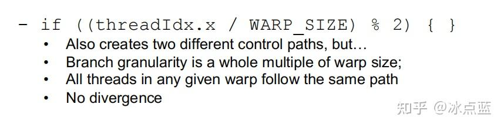
</p>


**warp的context包含三个部分：**
1. Program counter
2. Register
3. Shared memory

当一个block得到足够的资源时，就成为active block。block中的warp就称为active warp。**active warp又可以被分为下面三类：**
1. Selected warp 被选中的warp
2. Stalled warp 没准备好要执行的称为Stalled warp
3. Eligible warp 没被选中，但是已经做好准备被执行的称为Eligible warp

SM中warp调度器每个cycle会挑选active warp送去执行。warp是否「适合执行」需要满足下面两个条件：
1. 32个CUDA core有空
2. 所有当前指令的参数都准备就绪


### 6.Scheduler

<p align="center">
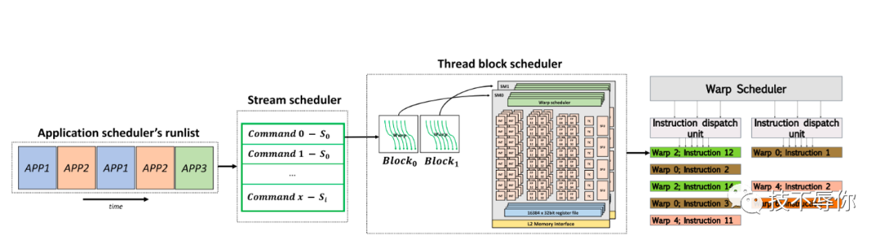
</p>


GPU的整个调度结构如上图所示，从左到右依次为 Application Scheduler、Stream Scheduler、Thread-Block Scheduler、Warp Scheduler。

在聊调度之前，我们还是先来重点介绍几个相关的概念：channel、tsg、runlist、pbdma。
* **channel**：这是nv driver层的才有的概念，每一个gpu应用程序会创建一个或者多个channel。而channel也是gpu硬件(在gpu context 层面来说)操作的最小单位。
* **tsg**：全称为timeslice group，通常情况下一个tsg含有一个或者多个channel，这些channel 共享这个tsg的timeslice。
* **runlist**：多个tsg或者channel的集合，gpu硬件就是从runlist上选取channel来进行任务执行。
* **pbdma**：全称为pushbuffer dma。push buffer可以简单的理解为一段主机内存，这段内存主要有cpu写然后gpu来读。gpu通过从pushbuffer 里面拿到的数据生成相应的command(也叫methods) 和data(address) 。而上面讲到的channel里面包含有指向pushbuffer的指针。

<p align="center">
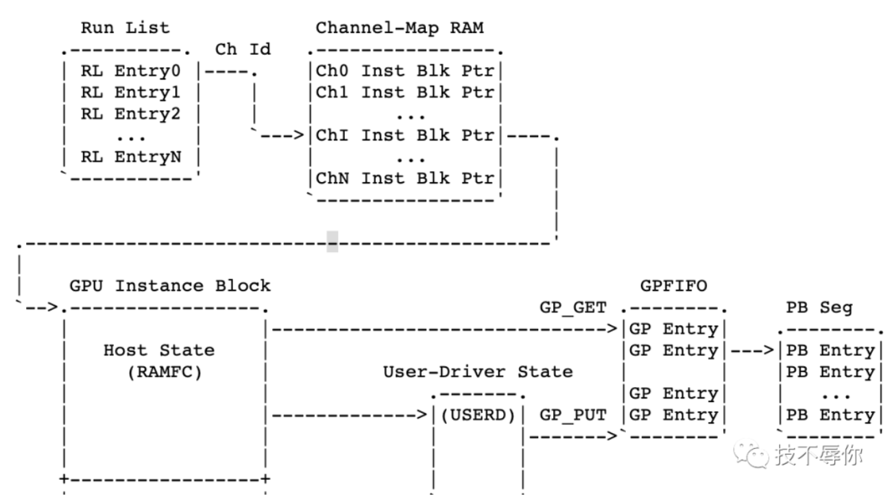
</p>


结合上图给大家理一下上面几个概念之前的一些关联。首先，runlist里面的每个entry就是一个channel，每个channel里面有Inst Blk Ptr 也即instance块指针，这些指针分别指向保存gpu上下文的内存和push buffer也即上图当中的PB seg。

#### 6.1 Application Scheduler
通常情况下两个不同的GPU应用不能同时占用GPU的计算单元，只能通过「时分复用」的方法来使用GPU，这个我们在性能优化是接触比较少，故此处不详细展开。

#### 6.2 Stream Scheduler
当GPU从runlist中取出channel之后，会生成对应的command和数据，而每个stream里包含了一系列的commands。由于不同应用的stream是可以设置不同的优先级的，所以stream scheduler主要负责不同应用的stream调度和抢占

#### 6.3 Thread Block Scheduler
它主要负责将Thread Block 分发给GPU上的SM，完成Thread Block 与GPU SM之间的一一映射。通常，能不能将一个Kernel的 Thread Block 分发给某个SM，主要看SM的计算能力。
举个例子，假如一个SM支持 2048个Threads 和 32 个Blocks，如果存在一个Kernel有 64个Threads和64个Blocks（应该是<<<>>>启动参数），则Scheduler也只能选择选取这个Kernel一半的Blocks去运行。

#### 6.4 Warp Scheduler
通常情况下，一个Warp包含32个Thread。Warp Scheduler的主要作用是从Warp中获取准备好的「待执行的Instrunction」，并把这些Instrunction分配给SM上的 Dispatch Unit。接着Dispatch Unit会把这些指令发送到SM的 SIMD Core上去执行。


### 7.Bank Conflict
**bank 是CUDA中一个重要概念，是内存的访问时一种划分方式**，在CPU中，访问某个地址的内存时，为了减少读写内次次数，访问地址并不是随机的，而是一次性访问bank内的内存地址，类似于内存对齐一样，一次性获取到该bank内的所有地址内存，以提高内存带宽利用率，一般CPU认为如果一个程序要访问某个内存地址时，其附近的数据也有很大概率会在接下来会被访问到。

在CUDA中 在理解bank之前，需要了解共享内存，我们复习下「共享内存」的知识：
**shared memory为CUDA中内存模型中的一中内存模式，为一个片上内存，比全局内存（global memory)要快很多，在同一个block内的所有线程都可以访问到该内**

存中的数据，与local 或者global内存相比具有高带宽、低延迟的作用。
为了提高share memory的访问速度 除了在硬件上采用片上内存的方式之外，还采用了很多其他技术。其中为了提高内存带宽，共享内存被划分为相同大小的内存模型，称之为bank，这样就可以将n个地址读写合并成n个独立的bank，这样就有效提高了带宽。

<p align="center">
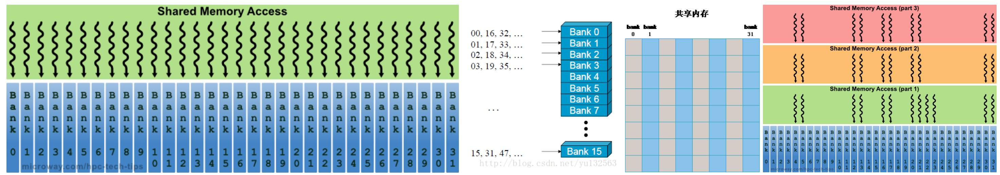
</p>

**那什么是 Bank Conflict？**
如果在block内多个线程访问的地址落入到同一个bank内，那么就会访问同一个bank就会产生bank conflict，这些访问将是变成串行，在实际开发调式中非常主要bank conflict.

* 上述最右图中part1、part2、part3都会访问到同一个bank，将会产生bank conflict ,造成程序串行化，会发现此时性能会产生严重下降。
* 对于`__shared__ float sData[32][32]`数组，如果有多个线程同时访问一个列中的不同数组将会产生bank conflict
* 如果多个线程同时访问同一列中相同的数组元素 不会产生bank conflict，将会出发广播，这是CUDA中唯一的解决方案，在一个warp内访问到相同内存地址，将会将内存广播到其他线程中，同一个warp内访问同一个bank内的不同地址貌似还没看到解决方案。
* 不同的线程访问不同的bank，不会产生bank conflict

<p align="center">
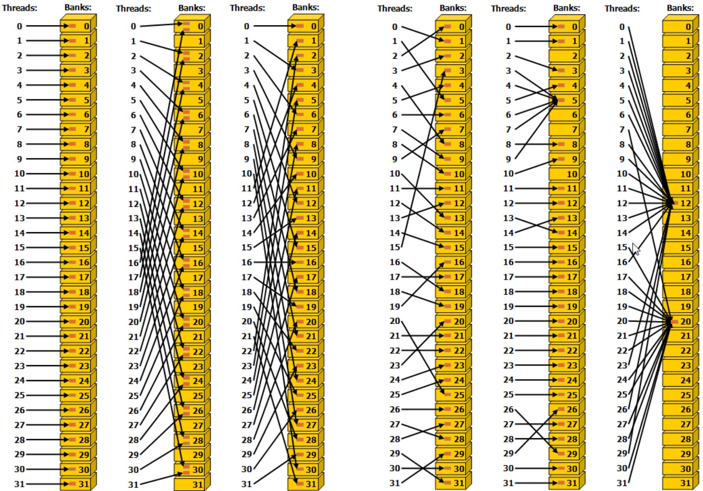
</p>


上面左图中左侧和右侧都没有发生bank conflict，而在中间存在bank conflict：
* 线性寻址，步幅为一个 32 -bit（无bank conflict）
* 线性寻址，步幅为两个 32 -bit（双向bank conflict
* 线性寻址，步幅为三个 32 -bit（无bank conflict）

上面右图三个都没有bank conflict：
* 通过随机排列实现无冲突访问
* 无冲突访问，因为线程 3、4、6、7 和 9 访问Bank5 中的同一位置。属于广播
* 无冲突广播访问（线程访问Bank内的相同位置）

如果warp中的线程经过最多两次冲突就能得到所要的数据则成为2-way bank conflict，如果同一个warp中的所有线程访问一个bank中的32个不同的地址，则需要分32此，则称为32-way bank conflict。

只要同一个 warp 的不同线程会访问到同一个 bank 的不同地址就会发生 bank conflict，除此之外的都不会发生 bank conflict。


#### 7.1 避免 bank conflict 的技巧
> 详见：[CUDA 共享内存 bank conflict](https://blog.csdn.net/syoung9029/article/details/78165840)

我们可以通过添加一个附加列来避免 bank conflict，如下图所示，左图为申请的共享内存矩阵形式，右图是表示成 bank 后的形式，通过这种方式，原来在一个 bank 中的同一个 warp 都正好偏移到了不同的 bank 中。

原始代码实现：
```cpp
int x_id = blockDim.x * blockIdx.x + threadIdx.x; // 列坐标
int y_id = blockDim.y * blockIdx.y + threadIdx.y; // 行坐标
int index = y_id * col + x_id;
 
__shared__ float sData[BLOCKSIZE][BLOCKSIZE];
 
if (x_id < col && y_id < row)
{
    sData[threadIdx.x][threadIdx.y] = matrix[index];
    __syncthreads();
    matrixTest[index] = sData[threadIdx.x][threadIdx.y];
}
```

<p align="center">
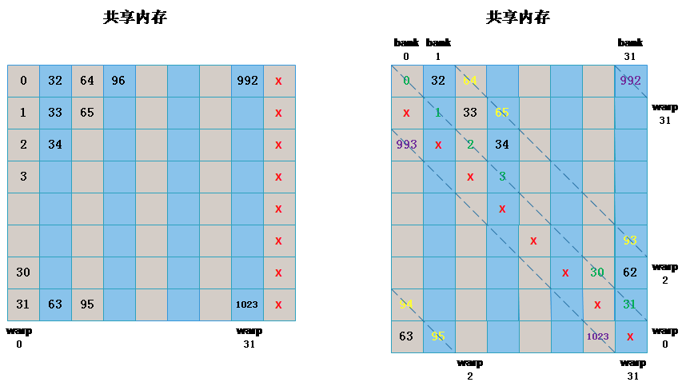
</p>


可以通过插入一个占位符来解决：

```cpp
int x_id = blockDim.x * blockIdx.x + threadIdx.x; // 列坐标
int y_id = blockDim.y * blockIdx.y + threadIdx.y; // 行坐标
int index = y_id * col + x_id;
 
__shared__ float sData[BLOCKSIZE][BLOCKSIZE+1];  // <<----- 这里
 
if (x_id < col && y_id < row)
{
    sData[threadIdx.x][threadIdx.y] = matrix[index];
    __syncthreads();
    matrixTest[index] = sData[threadIdx.x][threadIdx.y];
}
```


## 五、CUDA编程优化（部分）

我们回过头来，原始版本的 Matmul 的 Kernel 实现是：

<p align="center">
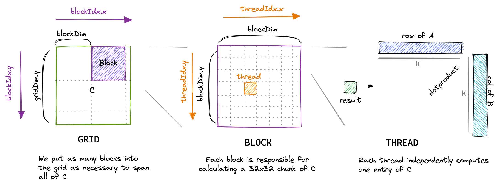
</p>


```cpp
__global__ void sgemm_naive(int M, int N, int K, float alpha, const float *A,
                            const float *B, float beta, float *C) {
  // compute position in C that this thread is responsible for
  const uint x = blockIdx.x * blockDim.x + threadIdx.x;
  const uint y = blockIdx.y * blockDim.y + threadIdx.y;

  // `if` condition is necessary for when M or N aren't multiples of 32.
  if (x < M && y < N) {
    float tmp = 0.0;
    for (int i = 0; i < K; ++i) {
      tmp += A[x * K + i] * B[i * N + y];  // 分别在GM上读一次A和B，外加一次FMA（乘累加）
    }
    // C = α*(A@B)+β*C
    C[x * N + y] = alpha * tmp + beta * C[x * N + y];  // 这里有1次GM上Load和Store指令（循环外）
  }
}
```

**借助理论分析，我们先分析下它是「计算密集型」还是「访存密集型」。**
* Line 11行上，分别在GM上读一次A和B，外加一次FMA（乘累加）
  * GM读取代价很大，通常上需要几百个cycle；依次FMA只需要几个cycle
  * 若将A和B放到shared Mem上，可以将读取降低到几十cycle

对于2个[4096, 4096]的矩阵相乘，外加一个C累加，则：
* Total FLOPS：2*4096^3 + 4096^2 = 137 GFLOPSas
* Total Read: 3 * 4096^2 * 4B = 201MB
* Total Write: 4096^2 * 4B = 67 MB

也就是说与GM至少有268MB的数据交互，假设对于FP32的算力是 30 TFLOPs/s，带宽是 768 GB/s，则计算时间是 4.5ms，内存读写时间是 0.34ms。

问题本质：循环内由两条 Load 指令与一条 FMA 指令构成，计算指令只占总体的 1/3，计算访存比过低，最终导致了访存延迟不能被隐藏，从而性能不理想。


### 1.Matmul 优化技巧梳理

TBD


## 参考资料
1. [[Nvidia官网] CUDA C++ 编程指南（个人强推）](https://docs.nvidia.com/cuda/cuda-c-programming-guide/index.html#programming-model)
2. [[论文]An Overview of Hardware Implementations of P Systems](https://idus.us.es/bitstream/handle/11441/107616/An%20Overview%20of%20Hardware%20Implementations%20of%20P%20Systems.pdf?sequence=1&isAllowed=y)
3. [[PDF]GPU Programming in CUDA: How to write efficient CUDA programs](http://www.einkemmer.net/training/cuda-efficiency.pdf)
4. [[PDF]GPU Architecture](https://acg.cis.upenn.edu/milom/cis371-Spring12/lectures/GPU-Architecture.pdf)
5. [How to Optimize a CUDA Matmul Kernel for cuBLAS-like Performance](https://siboehm.com/articles/22/CUDA-MMM)
6. [CUDA共享内存概述](https://face2ai.com/CUDA-F-5-1-CUDA%E5%85%B1%E4%BA%AB%E5%86%85%E5%AD%98%E6%A6%82%E8%BF%B0/)
7. [CUDA sample volumeRender](https://blog.csdn.net/fanre/article/details/109215446)
8. [CUDA 總複習：CUDA 程式設計模型](https://blogs.nvidia.com.tw/2020/11/25/cuda-refresher-cuda-programming-model/)
9. [CUDA 计算和访存优化](https://www.nvidia.com/content/PDF/sc_2010/CUDA_Tutorial/SC10_Analysis_Driven_Optimization.pdf)
10. [[Blog]理解线程束的执行](https://qipccc.github.io/2019/11/12/CUDA_03%E7%90%86%E8%A7%A3%E7%BA%BF%E7%A8%8B%E6%9D%9F%E7%9A%84%E6%89%A7%E8%A1%8C/)
11. [[Blog]CUDA bank 及bank conflict](https://blog.csdn.net/weixin_42730667/article/details/106171382)
12. [[Blog]Shared Memory,Warp和Bank Conflict](https://blog.csdn.net/Rita_2017/article/details/124649784)