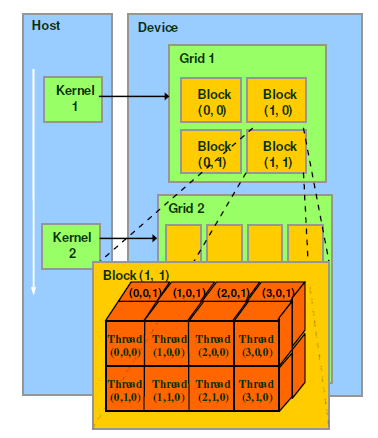
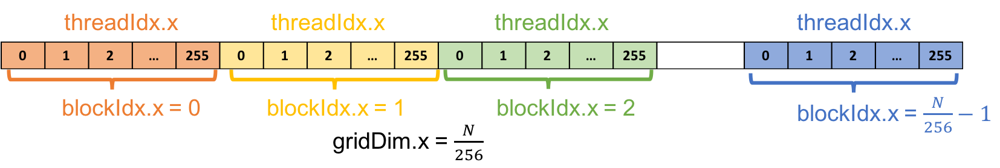

# 尝试第一次优化 Kernel

## 1. 多线程计算

在[《手写第一个 Kernel》](https://cuda.keter.top/first_kernel/) 章节中，我们实现了两个 1D 张量的最朴素版本的 CUDA kernel：
```cpp
__global__ void add_kernel(float *x, float *y, float *out, int n){
    for (int i = 0; i < n; ++i) {
        out[i] = x[i] + y[i];
    }
}

int main(){
  //...
  add_kernel<<<1, 1>>>(cuda_x, cuda_y, cuda_out, N);
  //...

}
```

从代码中可以看出，我们是通过`<<<1, 1>>>`方式拉起了 `add_kernel` ，意味着我们只是利用了 1 个线程，从起点 0 &rarr; n 依次遍历张量数据做加法操作，这个完全没有利用 GPU 并行计算的优势。

这里我们再复习下 `<<<M, T>>>` 的含义：三尖括号告诉 CUDA 在使用多少个 thread 拉起 kernel。多个线程一组成为 `thread block`，多个`thread block`一组成为 `grid`。因为前面的 `M` 表示一个 `grid` 有 `M` 个 `thread block`， 一个 `thread block` 里有 `T` 个 `thread`。



我们首先将上面的 kernel 升级为多线程版本，即类似 `add_kernel<<<1, 256>>>`。CUDA 提供了一些内建的变量来访问线程相关的信息，比如：

+ `threadIdx.x`: 指此线程在`thread block`中的下标位置
+ `blockDim.x`: 指一个`thread block`中的线程数

对于 `add_kernel<<<1, 256>>>` 而言，`threadIdx.x` 取值为 0~256 中的某个值，`blockDim.x` 的值为 256。

如果要将 `N = 10000000` 切分到 256 个线程里并行去计算，需要调整下 `add_kernel` 中的 for 语句的写法，实现同一份代码在被不同线程调用时，自动地各自计算各自的数据，首先改成如下的范式：
```cpp
__global__ void add_kernel(float *x, float *y, float *out, int n){
    int index = 0;
    int stride = 1;

    for (int i = index; i < n; i += stride) {
        out[i] = x[i] + y[i];
    }
}
```

每个线程从下标 index 开始遍历到 n，步长间隔为 stride，然后循环计算。为了让 256 个线程独立计算，我们只需要设置 stride = 256，然后每个线程计算的 index 是各自所在的 `threadIdx.x` 下标位置即可（取值范围为[0, 256)），如下图所示


则上述 `add_kernel` 的最终版本实现为：
```cpp
__global__ void add_kernel(float *x, float *y, float *out, int n){
    int index = threadIdx.x;  // 当前线程所在的下标位置
    int stride = blockDim.x;  // 此样例中为 256，由<<<1, 256>>>自动传递过来

    for (int i = index; i < n; i += stride) {
        out[i] = x[i] + y[i];
    }
}
```

完整的代码可以参考文件：[vector_add_thread.cu](./vector_add_thread.cu)。

编译命令：`nvcc ./vector_add_thread.cu -o add_thread`，执行和 Profile 命令： `nvprof ./add_thread`，结果如下：
```plain
==36546== Profiling application: ./add_p
==36546== Profiling result:
            Type  Time(%)      Time     Calls       Avg       Min       Max  Name
 GPU activities:   46.76%  29.188ms         1  29.188ms  29.188ms  29.188ms  [CUDA memcpy DtoH]
                   29.62%  18.485ms         2  9.2425ms  9.2208ms  9.2642ms  [CUDA memcpy HtoD]
                   23.62%  14.745ms         1  14.745ms  14.745ms  14.745ms  add_kernel(float*, float*, float*, int)
```

相对于[《手写第一个 Kernel》](../02_first_kernel/) 章节中的性能提升：

|     | 耗时 |加速比|
|:---:|:---:|:---:|
|单线程| 570 ms | - |
|多线程| 14.7 ms| 38.7x |


## 2. 多网格计算

上面我们只用到了 1 个 Thread block 就实现了 38 倍的加速比。接下来我们再看如何改为多个 Thread block 的版本。

一般而言，GPU 显卡上包含了很多流式处理器（即 Streaming Multiprocessors，简称 SMs），其中每个 SM 都包含了多个并行处理单元，均支持并发地执行多个 thread block。只有将 Kernel 放在多个 thread block 上去执行，才能最大限度地利用 GPU 并行加速的能力。

巧的是，CUDA 也提供了一些内建变量访问 block 相关的信息：

+ `blockIdx.x`: 指当前 thread block 在网格（grid）中的下标位置
+ `gridDim.x`: 指网格（grid）的大小（size）


同样的，我们么只需要修改 `add_kernel` 中的实现，确保每个 thread 都各自独立做计算即可，我们期望每个线程都只做 1 个浮点数的加法操作，也就意味着我们期望在 N = 10000000 个线程上并发地同时计算，切分示意图如下：



其中，每个 thread block 包含的线程数依旧为 256，则需要 N/256 个 thread block，即 grid size = N/256：

```cpp
__global__ void add_kernel(float *x, float *y, float *out, int n){
    // blockIdx.x 为当前 thread 所在的 block 在网格 grid 中下标索引，取值为[0, N/256)
    // blockDim.x = 256，为每个 block 中包含的线程数
    // threadIdx.x 为当前 thread 所在 block 的下标索引，取值为 [0, 256)
    int tid = blockIdx.x * blockDim.x + threadIdx.x;


    // 这里必须加判断，因为有的 thread 算出来的 tid 可能大于 n, 让它空跑就可以了
    if(tid < n) {
        out[tid] = x[tid] + y[tid];
    }
}
```

完整的代码可以参考文件：[vector_add_grid.cu](./vector_add_grid.cu)。

编译命令：`nvcc ./vector_add_grid.cu -o add_grid`，执行和 Profile 命令： `nvprof ./add_grid`，结果如下：
```plain
==32660== Profiling application: ./add_g
==32660== Profiling result:
            Type  Time(%)      Time     Calls       Avg       Min       Max  Name
 GPU activities:   63.20%  29.522ms         1  29.522ms  29.522ms  29.522ms  [CUDA memcpy DtoH]
                   36.47%  17.036ms         2  8.5178ms  8.4890ms  8.5466ms  [CUDA memcpy HtoD]
                    0.33%  152.61us         1  152.61us  152.61us  152.61us  add_kernel(float*, float*, float*, int)
```

相对于[《手写第一个 Kernel》](https://cuda.keter.top/first_kernel/) 章节中的性能提升：

|     | 耗时 |加速比|
|:---:|:---:|:---:|
|单线程| 570 ms | - |
|多线程| 14.7 ms| 38.7x |
|多 block| 0.153 ms| 3725x |


## 附参考文档

+ [CUDA in Actions](https://cuda-tutorial.readthedocs.io/en/latest/tutorials/tutorial02/#tutorial-02-cuda-in-actions)