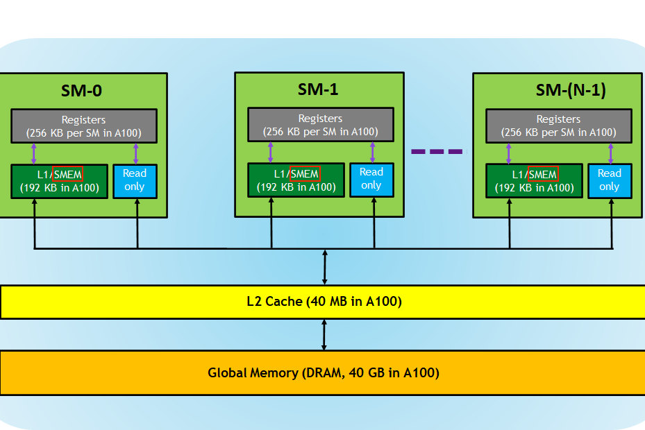
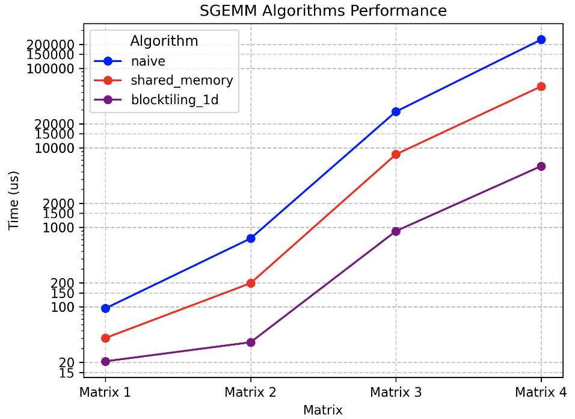

# 矩阵乘 Matmul 性能优化实践

在上文中，我们介绍了手写实现矩阵乘法的方法。本文我们将介绍如何优化矩阵乘法的性能。矩阵乘法有很多优化算法，本文中我们着重介绍两种算法：共享内存缓存块和一维 Thread Tile 并行优化。


## 共享内存缓存块

在全局内存之外，GPU 还有一块位于芯片上的较小区域，被称为共享内存（SMEM）。每个 SM（流多处理器）都配备了一块共享内存。

### GPU 内存层次结构

以下是 A100 GPU 内存层次结构的图示：

  

从逻辑上看，共享内存在各个块之间进行了分区。这意味着一个线程可以通过共享内存块与同一块内的其他线程进行通信。共享内存的大小是可配置的，可以通过权衡以获得更大的共享内存而减小 L1 缓存的大小。

### 共享内存的使用

对于这个新的内核，我们将 A 和 B 的全局内存一块加载到共享内存中。接着，我们将在这两块上尽可能多地执行计算。这样做的好处是，我们可以减少对全局内存的访问次数，因为共享内存的访问速度比全局内存快得多。

计算的流程如下图所示，可以看到我们将 A 和 B 的一块加载到共享内存中，然后在共享内存中进行计算。


我们还是延续了上一篇文章中的矩阵乘法的实现，只是在内核中加入了共享内存的使用。每一个线程负责计算 C 中的一个元素。

以下是代码的重要部分，其中变量名称对应上面的图表：

```cpp
// 推进指针到起始位置
A += cRow * BLOCKSIZE * K;                    // 行=cRow，列=0
B += cCol * BLOCKSIZE;                        // 行=0，列=cCol
C += cRow * BLOCKSIZE * N + cCol * BLOCKSIZE; // 行=cRow，列=cCol

float tmp = 0.0;
// 外部循环推进 A 沿列和 B 沿行，直到我们完全计算出 C 中的结果。
for (int bkIdx = 0; bkIdx < K; bkIdx += BLOCKSIZE) {
  // 每个线程从全局内存加载 A 和 B 中的一个元素到共享内存中。
  // 将 threadCol（=threadIdx.x）设为连续的索引，以允许全局内存访问协同。
  As[threadRow * BLOCKSIZE + threadCol] = A[threadRow * K + threadCol];
  Bs[threadRow * BLOCKSIZE + threadCol] = B[threadRow * N + threadCol];

  // 阻塞本块内的线程，直到缓存完全填充
  __syncthreads();

  // 在当前缓存块上执行点积
  for (int dotIdx = 0; dotIdx < BLOCKSIZE; ++dotIdx) {
    tmp += As[threadRow * BLOCKSIZE + dotIdx] *
            Bs[dotIdx * BLOCKSIZE + threadCol];
  }
  // 在最后需要再次同步，以避免更快的线程在较慢的线程完成之前将下一个块提取到缓存中
  __syncthreads();

  // 推进指针到下一个块
  A += BLOCKSIZE;
  B += BLOCKSIZE * N;
}
C[threadRow * N + threadCol] = tmp;
```

对于初学者来说，代码中对于矩阵的索引可能有些难以理解，我们可以结合图来理解。代码中首先将 A、B、C 的指针推进到当前块的起始位置。也就是图中对应的 &A、&B、&C。以 A 举例，`A += cRow * BLOCKSIZE * K`，其中 `cRow` 为当前块的行索引，`BLOCKSIZE` 为块的大小，`K` 为矩阵 A 的列数。这样就将 A 的指针推进到当前块的起始位置。

接着，我们将 A、B 的数据读取到共享内存中。这里我们使用了二维数组，`As[threadRow * BLOCKSIZE + threadCol]`，其中 `threadRow` 和 `threadCol` 分别为当前线程在块中的行索引和列索引。这样就将 A 的数据读取到了共享内存中。同理，我们将 B 的数据也读取到了共享内存中。需要注意的是，这里我们使用了 `__syncthreads()` 来同步线程，这是由于不同线程之间是并行执行的。如果不同步，可能会导致某些线程读取到的数据不是最新的。这也是比较难理解的地方，虽然我们在编写代码时，是按照顺序编写的，但是实际上不同线程是并行执行的，写代码的时候需要考虑到这一点。

后面就是计算矩阵乘法的过程，可以对比一下上一篇文章中的矩阵乘法的实现。这里我们外层循环的 Step 是 `BLOCKSIZE`，也就是每次计算 32 个数据。内层循环的 Step 是 `1`，也就是每次计算一个数据。这里我们使用了 `tmp` 变量来保存计算的结果，最后再将 `tmp` 写入到 C 中。这里我们使用了 `C[threadRow * N + threadCol]`，其中 `threadRow` 和 `threadCol` 分别为当前线程在块中的行索引和列索引。这样就将 C 的数据写入到了共享内存中。

### 编译运行

运行命令：

```cpp
nvcc -o matmul_shared matmul_shared.cu
./matmul_shared
```

## 一维 Thread Tile 并行优化

###  性能优化分析

在上一个例子中，我们使用了共享内存来提高性能。但是，我们还可以进一步优化性能。我们可以使用一维 Thread Tile 并行来进一步提高性能。所谓的一维 Thread Tile 并行，就是将一个线程块中的线程按照一维的方式进行划分，然后每个线程负责计算一部分的数据。这样做的好处是，可以减少线程块的数量，从而减少线程块的同步开销。不像上一个 Kernel，每个线程负责计算一个数据，这样的话，线程块的数量就是矩阵的大小。而一维 Thread Tile 并行，每个线程负责计算多个数据，这样的话，线程块的数量就是矩阵的大小除以每个线程负责计算的数据的数量。

让内核运行得更快的主要原因是这样策略提高了算术强度，即在 GMEM 和 SMEM 之间传输的每字节执行的 FLOP 数（加载 + 存储）。下面我会尝试更直观地解释为什么每个线程计算更多的结果会提高算术强度。

以下图为例：

  

上图中，A 和 B 都是 7x7 的矩阵。当每一个线程只计算一个结果的时候，我们需要从 A 中读取 7 个数据，从 B 中读取 7 个数据，从 C 中读取 1 个数据，然后写一次 C。这样的话，每个线程需要读取 15 个数据，写一次数据。如果我们每一个线程计算 4 个结果，那么我们需要从 A 中读取 14 个数据，从 B 中读取 14 个数据，从 C 中读取 4 个数据，然后写 4 次 C。这样的话，每个线程需要读取 32 个数据，写 4 次数据。计算每个线程的平方结果比计算结果的列更有效，因为这样我们可以共享更多的输入。

所以，我们可以看到，每个线程计算更多的结果，可以减少读取数据的次数，从而提高性能。这里我们用一维 Thread Tile 并行来实现这个功能。也即下图：

  

总的来说，虽然我们的所有内核执行的 FLOP 数量相同，但通过每个线程计算更多的结果，我们能够减少对 GMEM 的访问次数。 

### 一维 Thread Tile 并行实现

这个新的内核的实现与前一个内核相似，但增加了一个新的内循环，用于计算每个线程的多个 C 条目。我们现在使用的 SMEM 缓存大小为 `BM*BK + BN*BK = 64*8 + 64*8 = 1024` 个浮点数，每个块总共为 4KB。下面是一个可视化效果，橙色和红色突出显示了两个线程以及它们在内循环中访问的值。


在这个内核中，所有重要的更改都发生在内循环中。与之前相比，从 GMEM 到 SMEM 的加载基本相同。下面是代码的重要部分：

```cpp
// 为寄存器文件分配线程本地缓存
float threadResults[TM] = {0.0};

// 外循环遍历
for (uint bkIdx = 0; bkIdx < K; bkIdx += BK) {
  // 填充SMEM缓存（与之前相同）
  As[innerRowA * BK + innerColA] = A[innerRowA * K + innerColA];
  Bs[innerRowB * BN + innerColB] = B[innerRowB * N + innerColB];
  __syncthreads();

  // 推进外循环的指针
  A += BK;
  B += BK * N;

  // 计算每个线程的结果
  for (uint dotIdx = 0; dotIdx < BK; ++dotIdx) {
    // 我们将点积循环放在外循环中，这有助于重用Bs，我们可以将其缓存在tmp变量中。
    float Btmp = Bs[dotIdx * BN + threadCol];
    for (uint resIdx = 0; resIdx < TM; ++resIdx) {
      threadResults[resIdx] +=
          As[(threadRow * TM + resIdx) * BK + dotIdx] * Btmp;
    }
  }
  __syncthreads();
}

// 将结果写回GMEM
for (uint resIdx = 0; resIdx < TM; ++resIdx) {
  C[(threadRow * TM + resIdx) * N + threadCol] = threadResults[resIdx];
}
```

下面我们对比一下上一个内核和这个内核的内存访问：

共享内存缓存块：

- GMEM：K/32 次外循环迭代 \*         2 次加载
- SMEM：K/32 次外循环迭代 \* BLOCKSIZE（=32） \*         2 次加载
- 每个结果的内存访问：K/16 GMEM，K\*2 SMEM

对于我们的新内核，其中每个线程计算了八个结果：

- GMEM：K/8 次外循环迭代 \*         2 次加载
- SMEM：K/8 次外循环迭代 \* BK（=8）\*（1 + TM（=8））
- 每个结果的内存访问：K/32 GMEM，K\*9/8 SMEM

### 编译运行

运行命令：

```cpp
nvcc -o matmul_tiled matmul_tiled.cu
./matmul_tiled
```

## 速度对比

我们将上面两个内核的性能进行比较，我们分别计算 256x256、512x512、1024x1024、2048x2048 （Matrix 1、Matrix 2、Matrix 3、Matrix 4）的矩阵乘法的性能。在 1080Ti 上运行，结果如下：

  


| Algorithm | Matrix 1 | Matrix 2 | Matrix 3 | Matrix 4 |
| --------- | -------- | -------- | -------- | -------- |
| Naive     | 95.5152  | 724.396  | 28424    | 228681   |
| 共享内存缓存块    | 40.5293  | 198.374  | 8245.68  | 59048.4  |
| 一维 Thread Tile     | 20.6685  | 35.8774  | 894.779  | 5880.03  |

## 总结

本文我们介绍了两种优化矩阵乘法的方法：共享内存缓存块和一维 Thread Tile 并行。共享内存缓存块的优化方法是将矩阵的一块加载到共享内存中，然后在共享内存中进行计算。一维 Thread Tile 并行的优化方法是将一个线程块中的线程按照一维的方式进行划分，然后每个线程负责计算一部分的数据。这样做的好处是，可以减少线程块的数量，从而减少线程块的同步开销。这两种方法都可以提高矩阵乘法的性能。

> [!NOTE]
矩阵乘法有很多优化方法，本文只是介绍了两种方法。读者可以尝试其他的优化方法，比如：使用二维 Thread Tile 并行、使用 CUDA 的 Cublas 库等等。这里推荐几篇文章，读者可以参考一下：
>
> - [sgemm 优化代码实践](https://github.com/wangzyon/NVIDIA_SGEMM_PRACTICE)
> - [UNIVERSAL_SGEMM_CUDA](https://github.com/AndSonder/UNIVERSAL_SGEMM_CUDA)
> - [CUDA 矩阵乘法终极优化指南](https://zhuanlan.zhihu.com/p/410278370)
> - [cuda gemm 优化笔记](https://wu-kan.cn/2019/12/13/CUDA%E7%9F%A9%E9%98%B5%E4%B9%98%E6%B3%95%E7%9A%84%E4%BC%98%E5%8C%96/)
>
> UNIVERSAL_SGEMM_CUDA 这个仓库是笔者学习矩阵乘法优化的时候整理的仓库，主要还是参考了其他大佬的仓库，在其基础上进行了整理。目前还在更新中，欢迎大家来提 issue 和 PR。


## Reference 

1. https://siboehm.com/articles/22/CUDA-MMM
2. https://space.keter.top/docs/high_performance/GEMM%E4%BC%98%E5%8C%96%E4%B8%93%E9%A2%98/%E5%85%B1%E4%BA%AB%E5%86%85%E5%AD%98%E7%BC%93%E5%AD%98%E5%9D%97
3. https://space.keter.top/docs/high_performance/GEMM%E4%BC%98%E5%8C%96%E4%B8%93%E9%A2%98/%E4%B8%80%E7%BB%B4Thread%20Tile%E5%B9%B6%E8%A1%8C%E4%BC%98%E5%8C%96
4. https://github.com/AndSonder/UNIVERSAL_SGEMM_CUDA


