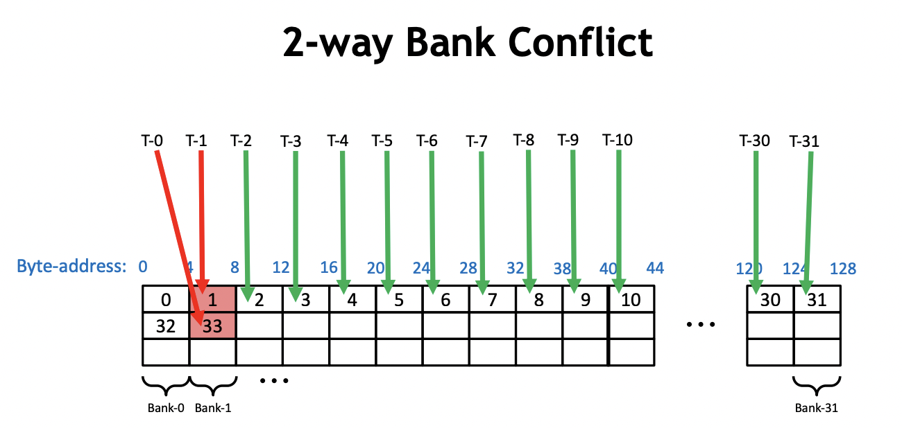
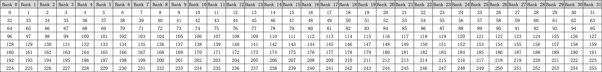
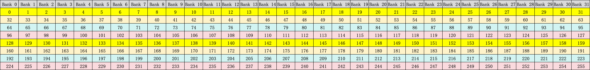
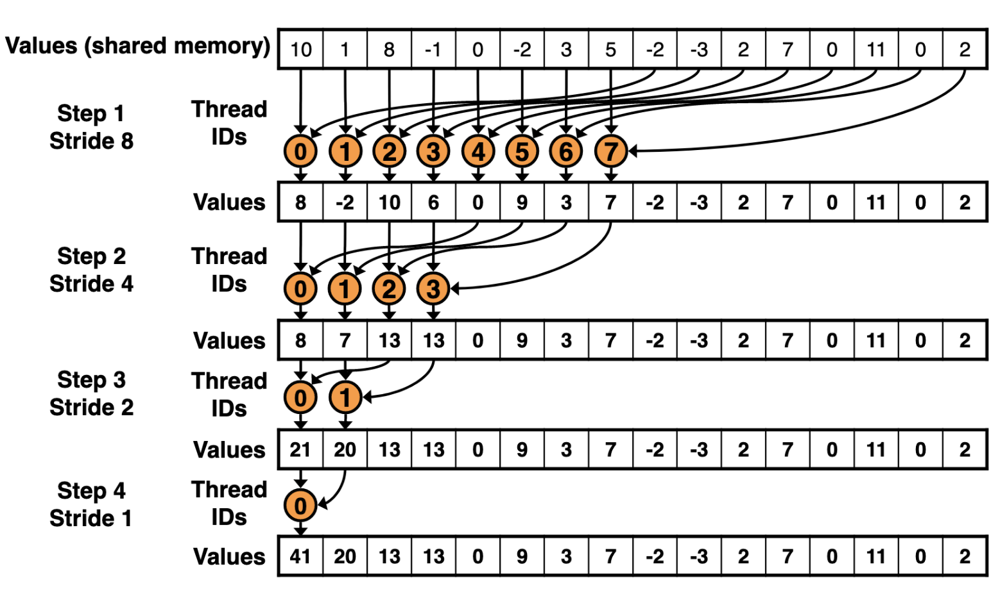

# 解决 bank conflict

上一篇文章中我们通过交叉寻址的方式解决了 warp divergence 的问题。具体的做法就是让连续的线程尽可能保持一样的行为，这样就不会出现分支判断的情况，从而避免了 warp divergence。但是这种做法也会带来一个新的问题，那就是 bank conflict。本文将会介绍 bank conflict 的原因以及解决方案。

## 1. Bank Conflict

Bank conflict 是指当多个线程同时访问同一个 bank 的时候，会出现 bank conflict。bank是共享内存的最小单元，每个bank可以同时为一个线程提供数据。如果多个线程同时访问同一个bank，那么它们的访问就会被串行化，从而降低性能。为了避免或减少访存冲突，可以使用一些技巧，如改变数据布局、使用padding、使用shuffle指令等。

同一个 Block 的线程会共享一块共享内存，共享内存在逻辑上被分为 32 个 bank。当同一个 warp 中的线程访问同一个 bank 的时候，会出现 bank conflict。在最坏的情况下，即一个 warp 中的所有线程访问了相同 bank 的 32 个不同地址的话，那么这 32 个访问操作将会全部被序列化，大大降低了内存带宽。在一个 warp 内对同一个 bank 中的 n 个地址同时访问将导致 n 次内存事务，称为发生了 n 路 bank conflict。需要注意的是，不同 warp 中的线程之间不存在 bank conflict。

接下来让我们来分析上一个 Kernel 中的 bank conflict。上一个 Kernel 中，我们使用了交叉寻址的方式，使得连续的线程访问的地址不再连续。这样做的目的是为了避免 warp divergence。但是这样做也会导致 bank conflict。

我们以0号 warp 为例。在第一次迭代中，0号线程需要加载 shared memory 的0号和1号地址，然后写回0号地址。同时，0号 warp 的16号线程需要加载 shared memory 的32和33号地址，并写回 32 号地址。因此，在一个 warp 内同时访问了一个bank的不同内存地址，导致发生了2路的 Bank Conflict，如下图所示：

  

类似地，在第二次迭代过程中，0号 warp 的0号线程会加载0号和2号地址并写回0号地址。然后，0号 warp 的8号线程需要加载 shared memory 的 32 号和 34 号地址（228=32，32+2=34），并写回32号线程。此时，16号线程会加载64号和68号地址，24号线程会加载96号和100号地址。由于0号、32号、64号、96号地址都在一个bank中，产生了4路的 Bank Conflict。这样以此类推，下一次迭代会产生8路的 Bank Conflict，使得整个Kernel一直受到 Bank Conflict 的影响。

我们可以使用 nvprof 来查看 bank conflict 的情况。

```bash
nvprof --events shared_st_bank_conflict ./reduce_interleaved_addressing
```

| Invocations | Event Name               | Min      | Max      | Avg      | Total    |
|-------------|--------------------------|----------|----------|----------|----------|
| 1           | shared_st_bank_conflict | 4587520  | 4587520  | 4587520  | 4587520  |


如果你的设备不支持 nvprof，你可以使用 nsight-compute 的命令行工具 ncu 来查看 bank conflict 的情况。

```bash
sudo ncu --metrics      l1tex__data_bank_conflicts_pipe_lsu_mem_shared_op_st.sum  ./reduce_interleaved_addressing
```


## 2. 解决方案

根据上面的分析我们了解到，只要让一个 warp 内的线程不是同一个 bank 的，就可以避免 bank conflict。下面我们来想一想如何让一个 warp 内的不同线程访问不同的 bank。

一个 warp 有 32 个线程，bank 也有 32 个。当 `BLOCKSIZE` 是 256 的时候，布局图如下所示：



每个 Block 里面有一半的线程是需要加载数据的，这些加载数据的线程就可能会发生 bank conflict。我们可以让这些线程访问不同的 bank。前面我们已经说过了为了防止线程束分化，所以这一半加载数据的线程就是0-127号线程。这 128 个线程可以分成 4 个 warp，每个 warp 有 32 个线程。我们可以让这 4 个 warp 分别访问 4 个不同的 bank。每个 warp 访问一个 bank。仔细看看上面的布局图，我们一共有8行，正好可以分成4个 warp，每个 warp 有 2 行。结合交叉寻址的方式，我们可以让每个 warp 访问一个 bank。这样就可以避免 bank conflict 了。我用不同颜色的线表示了不同的 warp，如下图所示：

  

0 号 warp 的 0 号线程访问 0 号 bank 的 0 号地址和 128 号地址，1 号 warp 的 0 号线程访问 1 号 bank 的 32 号地址和 128 号地址，2 号 warp 的 0 号线程访问 2 号 bank 的 64 号地址和 160号地址，以此类推。

整体过程如下图所示：

  

> [!NOTE]
> 图里面的 block size 是 16 而不是 256，这是为了方便说明。实际上，我们的 block size 是 256。

了解了意图之后，我们就可以开始编写代码了。代码的改动也不对，主要是把循环迭代的顺序修改一下，使得每个 warp 访问一个 bank。具体的代码如下所示：

```cpp
// 修改之前
for (int s = 1; s < bdim; s *= 2)
{
    int index = 2 * s * tid;
    if ((index + s < bdim) && (bdim * bid + s < len))
    {
        sdata[index] += sdata[index + s];
    }
}

// 修改之后
for(int s=blockDim.x/2; s>0; s >>= 1) {
    if (tid < s){
        sdata[tid] += sdata[tid + s];
    }
    __syncthreads();
}
```

修改后我们可以再次运行 nvprof 来查看 bank conflict 的情况，输出如下所示：

| Invocations | Event Name               | Min      | Max      | Avg      | Total    |
|-------------|--------------------------|----------|----------|----------|----------|
| 1           | shared_st_bank_conflict | 0  | 0  | 0  | 0  |

性能和带宽的测试情况如下：

| 优化手段 | 运行时间(us) | 带宽 | 加速比 |
| --- | --- | --- | --- |
| Baseline | 3118.4 | 42.503GB/s | ~ |
| 交错寻址 | 1904.4 | 73.522GB/s | 1.64 |
| 解决 bank conflict | 1475.2 | 97.536GB/s | 2.29 |

可以看到，解决 bank conflict 之后，性能和带宽都有了很大的提升。

本文代码可以按如下方式编译运行：

```bash
nvcc -o reduce_bank_conflict_free reduce_bank_conflict_free.cu
```

## Reference 

- [https://developer.nvidia.com/blog/using-shared-memory-cuda-cc/](https://developer.nvidia.com/blog/using-shared-memory-cuda-cc/)
- [http://giantpandacv.com/project/OneFlow/%E3%80%90BBuf%E7%9A%84CUDA%E7%AC%94%E8%AE%B0%E3%80%91%E4%B8%89%EF%BC%8Creduce%E4%BC%98%E5%8C%96%E5%85%A5%E9%97%A8%E5%AD%A6%E4%B9%A0%E7%AC%94%E8%AE%B0/#2-bank-conflict](http://giantpandacv.com/project/OneFlow/%E3%80%90BBuf%E7%9A%84CUDA%E7%AC%94%E8%AE%B0%E3%80%91%E4%B8%89%EF%BC%8Creduce%E4%BC%98%E5%8C%96%E5%85%A5%E9%97%A8%E5%AD%A6%E4%B9%A0%E7%AC%94%E8%AE%B0/#2-bank-conflict)
- [https://github.com/BBuf/how-to-optim-algorithm-in-cuda](https://github.com/BBuf/how-to-optim-algorithm-in-cuda)

