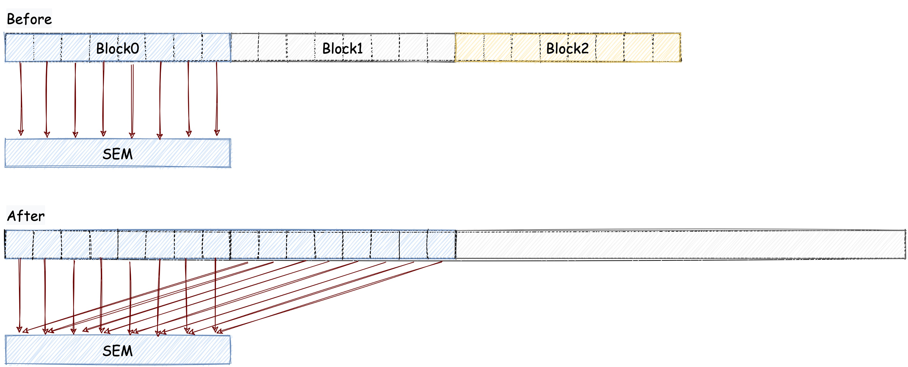

# IDLE 线程 


## 1. 问题分析

在上一个 Kernel 有大量的空闲线程。在 BLOCKSIZE 为 256 的配置下，第一轮迭代只有 128 个线程是在工作的，第二轮迭代只有 64 个线程是在工作的，第三轮迭代只有 32 个线程是在工作的。

这些空闲线程会浪费大量的计算资源，因为 GPU 会为这些线程分配资源，但是这些线程并没有工作要做。所以我们就可以让这些闲置的线程也做一些工作，这样就可以提高 GPU 的利用率。

## 2. 优化方案


为了让空闲的线程也做一些工作，我们可以让一个线程干俩个线程的活。
原本我们在把数据加载到共享内存的时候，我们只加载一个数据，我们现在可以在加载的时候顺便做一次加法计算。
也就是说，现在我们的一个 BLOCK 干了俩个 BLOCK 的活，所以我们的 BLOCK 数量就可以减半了（原来一个 BLOCK 是负责 256 个元素现在是负责 512 个了）。

下图可以帮助我们更好的理解这个优化方案：



我们需要修改的代码如下：

```cpp
// 修改前
__shared__ int sdata[BLOCKSIZE];
int tid = threadIdx.x;    // 线程 id (block 内)
int bid = blockIdx.x;     // block id (grid 内)
int bdim = blockDim.x;    // block 大小
int i = bid * bdim + tid; // 全局 id

// 将数据拷贝到共享内存
if (i < len)
{
    sdata[tid] = arr[i];
}

// 修改后
__shared__ int sdata[BLOCKSIZE];
int tid = threadIdx.x;    // 线程 id (block 内)
int bid = blockIdx.x;     // block id (grid 内)
int bdim = blockDim.x;    // block 大小
// 注意这里是 bdim * 2 因为我们要让一个线程干俩个线程的活
int i = bid * bdim * 2 + tid; // 全局 id

// 将数据拷贝到共享内存
if (i < len)
{
    sdata[tid] = arr[i] + arr[i + bdim];
}
```

完整代码在 reduce_idle_threads_free.cu 中，编译代码如下：

```bash
nvcc reduce_idle_threads_free.cu -o reduce_idle_threads_free
```

下面让我们对比一下优化后的 Kernel 和前几个 Kernel 的性能：

| 优化手段 | 运行时间(us) | 带宽 | 加速比 |
| --- | --- | --- | --- |
| Baseline | 3118.4 | 42.503GB/s | ~ |
| 交错寻址 | 1904.4 | 73.522GB/s | 1.64 |
| 解决 bank conflict | 1475.2 | 97.536GB/s | 2.29 |
| 去除 idle 线程 | 758.38 | 189.78GB/s | 4.11 |

## 3. 总结

通过本文的实践，我们学习到了如何通过减少空闲线程来提高 GPU 的利用率。
当程序中有大量的空闲线程时，我们可以让空闲的线程也做一些工作，也可以减少线程的数量。
下一篇文章中我们会通过展开 warp 来进一步提高 Kernel 的性能。

## Reference

1. https://developer.download.nvidia.com/assets/cuda/files/reduction.pdf
2. http://www.giantpandacv.com/project/OneFlow/%E3%80%90BBuf%E7%9A%84CUDA%E7%AC%94%E8%AE%B0%E3%80%91%E4%B8%89%EF%BC%8Creduce%E4%BC%98%E5%8C%96%E5%85%A5%E9%97%A8%E5%AD%A6%E4%B9%A0%E7%AC%94%E8%AE%B0/
