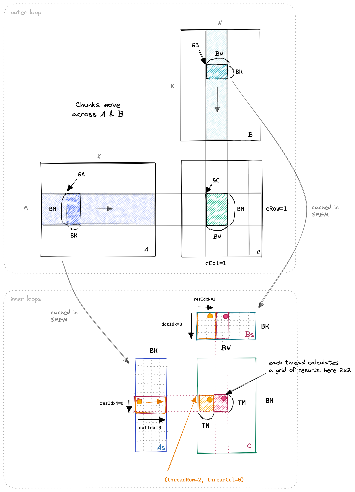
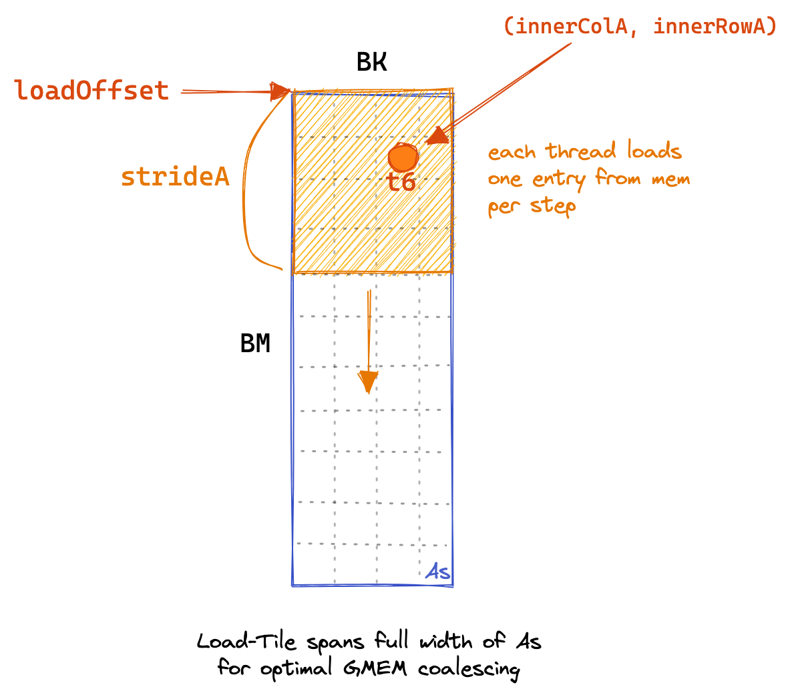
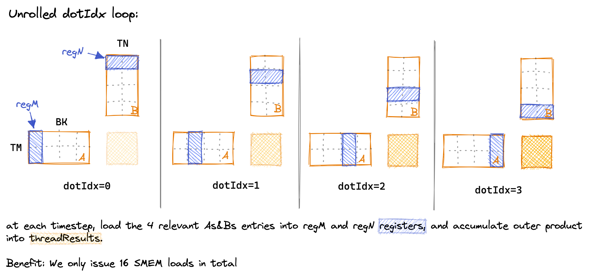

# 二维 Thread Tile 并行优化

在初级系列中我们已经实现了一个简单的矩阵乘法的 kernel，并使用共享内存和一维线程块来优化了矩阵乘法的性能。在 GEMM 优化专栏里面，我们将会继续优化矩阵乘法的性能，这一节我们将会使用二维线程块来优化矩阵乘法的性能。

## 1. 一维 Thread Tile

在介绍二维 Thread Tile 之前，我们先来回顾一下一维 Thread Tile 的优化方法。在初级系列中，我们使用了一维线程块来优化矩阵乘法的性能，我们将矩阵乘法的计算任务分配给了一维线程块，每个线程块负责计算一个小的矩阵块。这样做的好处是可以充分利用共享内存，减少全局内存的访问次数，从而提高矩阵乘法的性能。

我们在每个线程中计算了一维的矩阵块。想要继续优化这个 Kernel 的性能，我们可以使用二维线程块来计算二维的矩阵块。

## 2. 二维 Thread Tile

### 2.1 优化思路

本文的主要优化思路就是让每个线程计算一个 8\*8 的网格。下面我们来看一下这个 Kernel 的主题思路图：

  

首先在内核的第一阶段, 所有线程协同工作, 从全局内存中加载矩阵 A 和矩阵 B 到共享内存中。

当 SMEM 缓存填充完毕后，每个线程负责将其相关的 SMEM 条目相乘，并将结果累加到本地寄存器中。可以看到, 每个线程计算的是一个 TM \* TN 的矩阵块。如果图中的 TN 是 1, 那么就是一维 Thread Tile。

### 2.2 代码实现

接下来让我们动手实现这个内核, 我们按照上面的原理图来写代码。

:::tip

写 Kernel 代码的时候, 适当画图是非常有帮助的。这样可以帮助我们更好的理解 Kernel 的执行流程。

:::

首先我们需要定义一些常量方便后续使用：

```cpp
// Block 索引
const uint c_row = blockIdx.y;
const uint c_col = blockIdx.x;

// Thread 索引
const uint thread_col = threadIdx.x % (BN / TN);
const uint thread_row = threadIdx.x / (BN / TN);

// 二维 tile (block tile) 的大小
const uint total_results_block_tile = BM * BN;
// 一个 block tile 需要的线程数量
const uint number_threads_block_tile = total_results_block_tile / (TM * TN);

assert(number_threads_block_tile == blockDim.x);

// 计算该 Thread 负责加载的共享内存索引
const uint inner_row_A = threadIdx.x / BK;
const uint inner_col_A = threadIdx.x % BK;
// 计算每个线程块一次加载的行数
const uint stride_A = number_threads_block_tile / BK;

const uint inner_row_B = threadIdx.x / BN;
const uint inner_col_B = threadIdx.x % BN;
const uint stride_B = number_threads_block_tile / BN;
```

其中 `c_row` 和 `c_col` 表示的是当前计算的结果矩阵的行和列 (对应图上的 cRow 和 cCol)。
`thread_col` 和 `thread_row` 对应的是当前线程在 `BM * BN` 的网格中的列和行 (结合图中的标注理解)。
`inner_row_A` 和 `inner_col_A` 表示的是当前线程在共享内存中加载矩阵 A 的索引。
`stride_A` 表示的是每个线程块一次加载的行数。 单纯这样解释可能有点抽象，不用急结合后面代码的实现就会明白。

接下来我们需要定义一些共享内存，线程块的结果和寄存器变量：

```cpp
__shared__ float smem_A[BM * BK];
__shared__ float smem_B[BN * BK];

float thread_results[TM * TN] = {0.0};
float reg_m[TM] = {0.0};
float reg_n[TN] = {0.0};

A += c_row * BM * K; 
B += c_col * BN; 
C += c_row * BM * N + c_col * BN; 

// 外层循环
for (uint bkIdx = 0; bkIdx < K; bkIdx += BK)
{
    ... // 每个线程的具体逻辑
}
```

然后我们需要在内核的外层循环中，将矩阵 A 和矩阵 B 的数据加载到共享内存中

```cpp
// Load matrix A and B into shared memory
for (uint load_offset = 0; load_offset < BM; load_offset += stride_A)
{
    smem_A[(inner_row_A + load_offset) * BK + inner_col_A] = A[(inner_row_A + load_offset) * K + inner_col_A];
}
for (uint load_offset = 0; load_offset < BK; load_offset += stride_B)
{
    smem_B[(inner_row_B + load_offset) * BN + inner_col_B] = B[(inner_row_B + load_offset) * N + inner_col_B];
}

__syncthreads();

// 移动到下一个 block tile
A += BK;
B += BK * N;
```

下图可以更好的帮助我们理解上面的代码：

  

图中画出了矩阵 A 加载共享内存的过程。在每一步中，每个线程负责加载一个元素到共享内存中。这个元素的索引是 `inner_row_A` 和 `inner_col_A` 。for 循环中的 `load_offset` 递增的步长是 `stride_A` 。在图中就是向下移动了 `stride_A` 个元素。

下一步我们需要计算矩阵乘法的结果, 我们需要计算 BM * BN 个结果, 并将这一步的结果累加到 `thread_results` 中。

```cpp
// 计算矩阵乘法的结果
for (uint dot_idx = 0; dot_idx < BK; ++dot_idx)
{
    // 加载矩阵 A 和矩阵 B 到寄存器中
    for (uint i = 0;i < TM;i ++)
    {
        reg_m[i] = smem_A[(thread_row * TM + i) * BK + dot_idx];
    }
    for (uint i = 0;i < TN;i ++)
    {
        reg_n[i] = smem_B[dot_idx * BN + thread_col * TN + i];
    }
    for (uint reg_idx_m = 0; reg_idx_m < TM; ++reg_idx_m)
    {
        for (uint reg_idx_n = 0; reg_idx_n < TN; ++reg_idx_n)
        {
            thread_results[reg_idx_m * TN + reg_idx_n] += 
                reg_m[reg_idx_m] * reg_n[reg_idx_n];
        }
    }
}

__syncthreads();
```

在内部循环中，我们通过将 dot_idx 作为外层循环，明确加载我们在两个内部循环中所需的值到寄存器中，从而减少 SMEM 访问的次数。下面是对 dot_idx 循环随时间的可视化，展示了在每一步中哪些 SMEM 条目被加载到线程本地寄存器中：



:::note

由于绘图需要，我不得不缩小一些维度，使其更容易绘制。在内核中：BK=TM=TN=8

:::

这里最容易搞错的就是 `reg_m` 和 `reg_n` 的索引计算。索引计算的时候用到了 `thread_row` 和 `thread_col` 。它们是用于定位到当前线程在哪一个 8 * 8 的网格中。

最后我们需要将结果写回到全局内存中：

```cpp
for (uint reg_idx_m = 0; reg_idx_m < TM; ++reg_idx_m)
{
    for (uint reg_idx_n = 0; reg_idx_n < TN; ++reg_idx_n)
    {
        C[(thread_row * TM + reg_idx_m) * N + thread_col * TN + reg_idx_n] = 
            thread_results[reg_idx_m * TN + reg_idx_n];
    }
}
```

编译运行命令如下:

```bash
nvcc -o sgemm_tiled2d sgemm_tiled2d.cu
./sgemm_tiled2d 256 256 256
```

## 3. 性能测试

我们将上该内核的性能和之前的内核进行比较，我们分别计算 256x256、512x512、1024x1024、2048x2048 （Matrix 1、Matrix 2、Matrix 3、Matrix 4、Matrix 5）的矩阵乘法的性能 (us)。在 1080Ti 上运行，结果如下：
 

| Algorithm | Matrix 1 | Matrix 2 | Matrix 3 | Matrix 4 |
| --------- | -------- | -------- | -------- | -------- |
| Naive     | 95.5152  | 724.396  | 28424    | 228681   |
| 共享内存缓存块    | 40.5293  | 198.374  | 8245.68  | 59048.4  |
| 一维 Thread Tile     | 35.215  | 174.731  | 894.779  | 5880.03  |
| 二维 Thread Tile     | 34.708  | 92.946  | 557.829  | 3509.920  |

## 4. 总结

本文我们介绍了二维 Thread Tile 并行优化方法。我们将矩阵乘法的计算任务分配给了二维线程块，每个线程块负责计算一个小的矩阵块。这样做的好处是可以充分利用共享内存，减少全局内存的访问次数，从而提高矩阵乘法的性能。

## Reference 

1. https://siboehm.com/articles/22/CUDA-MMM
2. https://space.keter.top/docs/high_performance/GEMM%E4%BC%98%E5%8C%96%E4%B8%93%E9%A2%98/%E4%BA%8C%E7%BB%B4Thread%20Tile%E5%B9%B6%E8%A1%8C%E4%BC%98%E5%8C%96
3. https://github.com/siboehm/SGEMM_CUDA
