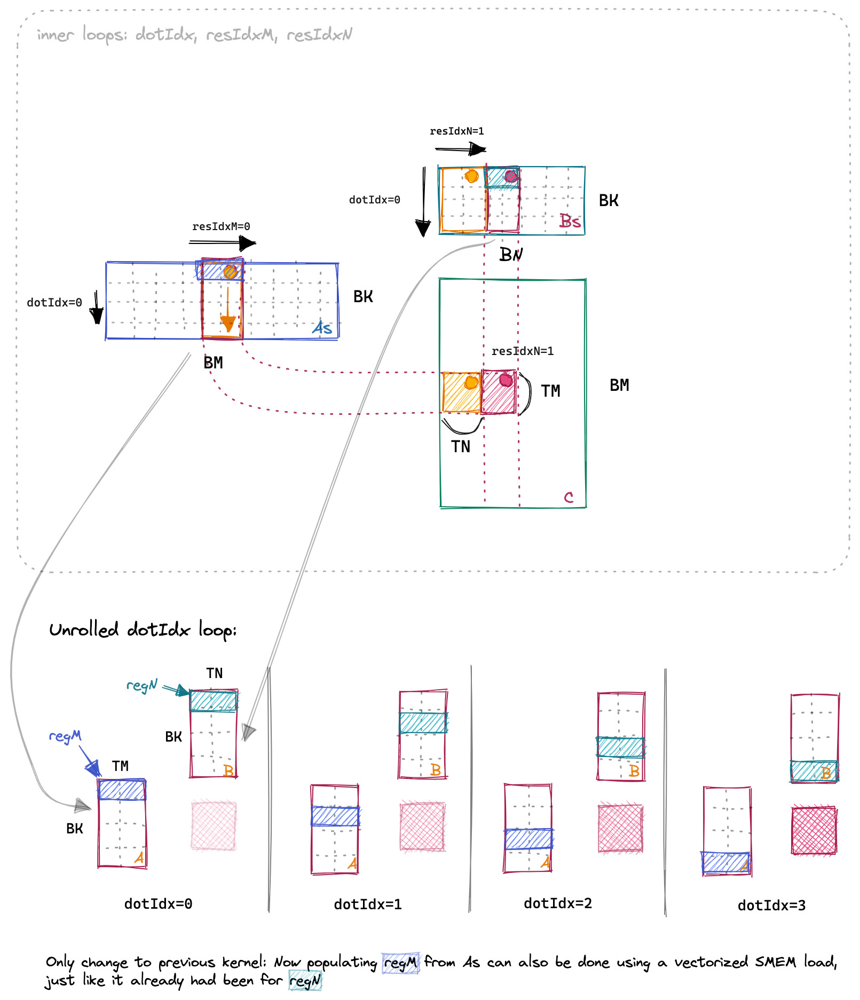

# 向量化访存

向量化访存是指将多个内存访问操作合并为一个内存访问操作。这样可以减少内存访问的次数，提高内存访问的效率。在本节中，我们将介绍如何通过向量化访存来提高矩阵乘法的性能。

## 1. 优化思路

上一个 Kernel 中加载矩阵 A 共享内存的代码如下:

```cpp
for (uint load_offset = 0; load_offset < BM; load_offset += stride_A)
{
    smem_A[(inner_row_A + load_offset) * BK + inner_col_A] = A[(inner_row_A + load_offset) * K + inner_col_A];
}
```

可以看到每次从 A 中读取一个元素, 且每次读取的元素不是连续的。我们可以使用向量读取指令 LDS.128 优化 Shared Memory 访问（对应 float4 数据类型）可以提高访存效率。GPU 是以 4 维向量为基本单位进行计算的，4 个浮点数组成的 float4 向量是 GPU 最基本的类型，使用 GPU 对两个 float4 进行向量计算与对两个整数或两个浮点数进行计算一样，只需要一个指令即可完成。

若每个线程每次取 1 个浮点数，每个线程需要消耗 4 次内存指令，才能将全局内存搬运至共享内存，若采用 float4 向量内存指令，每个线程每次可以搬运 4 个浮点数，则每个线程仅需要执行一次内存指令即可完成搬运。

:::note

LDS.128 指令可以一次性读取 4 个 float 类型的数据。

:::

在将共享内存的值读取到寄存器当中的时候也可以使用用向量化加速。但是需要做一定的处理, 上一个 Kernel 中, 寄存器 A 中的值并不是顺序读取的。因此我们在将数据写入到共享内存的时候需要做一个转置。

同样在将结果写回到全局内存时，也可以一次型写入 4 个 float 类型的数据。这样可以减少全局内存访问的次数。

算法整体流程如下：

  

本 Kerne 和上一个 Kernel 的主要区别就在于如何加载数据到共享内存中。A 矩阵加载过程如下图所示：


共享内存的大小是 `BM * BK`, 我们每次读取 4 个元素。因为后续再把共享内存的数据加载到寄存器的时候我们需要连续的读取。因此我们需要把数据转置一下。B 矩阵由于本身后续加载到寄存器的时候就是连续的读取, 因此不需要转置。

后续的流程和上一个 Kernel 是一样的。区别就是读取和写入的时候使用了向量化的指令。下面让我们结合代码来看一下具体的实现。

## 2. 代码实现

在代码实现上, 我认为最难理解的就是共享内存的加载逻辑以及使用向量化访存后坐标的计算。

首先我们先来解决坐标计算的问题。我们需要定位到这个第几个 block, 第几个线程, Block Tile 的相对位置。这样我们才能正确的计算出每个线程需要读取的数据。

第几个 block 的坐标可以通过 blockIdx 获取:

```cpp
const uint c_row = blockIdx.y;
const uint c_col = blockIdx.x;
```

当前线程对应 thread tile 的左上角元素在 block 中的位置可以通过 threadIdx 获取:

```cpp
const int block_row_thread = BN / TN;
const int block_col_thread = BM / TM;
// 一个线程负责计算 block 中 TM*TN 个元素
const int thread_num = block_row_thread * block_col_thread;

// 当前线程对应 thread tile 的左上角元素在 block 中的位置
const int thread_col = (threadIdx.x % block_row_thread) * TN;
const int thread_row = (threadIdx.x / block_row_thread) * TM;
```

`thread_col` 和 `thread_row` 就是当前线程对应 `thread tile` 的左上角元素在 block 中的位置。下面是比较容易出错的点, 也就是 Tile 坐标的计算。

由于我们使用了向量化访存, 我们在读取的时候都是一次读取 4 个元素。因此在计算 Tile 坐标的时候我们需要注意不要重复读取。`inner_row_a` 和 `inner_col_a` 就是当前线程负责读取的 A 矩阵的坐标。`inner_row_b` 和 `inner_col_b` 就是当前线程负责读取的 B 矩阵的坐标。

```cpp
// 每行4个字节作为一个内存块，当前线程负责第inner_row_a行的第inner_col_a个内存块的搬运
const uint inner_row_a = threadIdx.x / (BK / 4);
const uint inner_col_a = threadIdx.x % (BK / 4) * 4;

// 每行4个字节作为一个内存块，当前线程负责第inner_row_b行的第inner_col_b个内存块的搬运
const uint inner_row_b = threadIdx.x / (BN / 4);
const uint inner_col_b = threadIdx.x % (BN / 4) * 4;
```

`c_row` 和 `c_col` 是用于定位当前 block 的坐标, 我们可以通过下面的代码来计算出当前 block 对应的矩阵的坐标:

```cpp
// 计算当前线程负责计算的矩阵的起始位置
A += c_row * BM * K;
B += c_col * BN;
C += c_row * BM * N + c_col * BN;
```

这样我们就可以通过 `inner_row_a` 和 `inner_col_a` 来计算出当前线程需要读取的 A 矩阵的坐标。以及通过 `inner_row_b` 和 `inner_col_b` 来计算出当前线程需要读取的 B 矩阵的坐标。

相对坐标都有了之后, 我们就只需要用 列坐标 \* 矩阵的宽度 + 行坐标 就可以得到当前线程需要读取的数据的坐标了。

下面我们来看如何将数据加载到共享内存中。首先我们先看下每一轮中需要搬运多少数据:

```cpp
// 每个线程搬运4个浮点数，完成搬运至 smem_a 需要所有线程搬运 ldg_a_num 轮
const int ldg_a_num = BK * BM / thread_num / 4;
// 每个线程搬运4个浮点数，完成搬运至 smem_b 需要所有线程搬运 ldg_b_num 轮
const int ldg_b_num = BK * BN / thread_num / 4;
```

`BK * BM` 是共享内存的大小, `thread_num` 是每个 block 中的线程数, 除以 4 是因为我们一次读取 4 个元素。 有时候一次搬运不完, 我们需要多轮搬运。 搬运的轮数可以通过下面的代码计算出来, 这里的逻辑和上一个 Kernel 是一样的:

```cpp
// 一共 BM 行，搬运 ldg_a_num 轮，每轮搬运 stride_a 行
const int stride_a = BM / ldg_a_num;
// 一共 BN 行，搬运 ldg_b_num 轮，每轮搬运 stride_b 行
const int stride_b = BK / ldg_b_num;
```

在循环中加载数据到共享内存中的时候, 我们需要注意一下, 因为我们使用了向量化访存, 所以我们需要把数据转置一下。

```cpp
#define OFFSET(row, col, ld) ((row) * (ld) + (col))
#define FETCH_FLOAT4(pointer) (reinterpret_cast<float4 *>(&(pointer))[0])

for (int i = 0; i < BM; i += stride_a)
{
    int ldg_index = i / stride_a * 4;
    FETCH_FLOAT4(ldg_reg_a[ldg_index]) = FETCH_FLOAT4(A[OFFSET(i + inner_row_a, inner_col_a, K)]);
    // smem_a 转置存，其中 ldg_reg_a 做中间缓存，目的是读取时可以按FLOAT4读取
    smem_a[OFFSET(inner_col_a, i + inner_row_a, BM)] = ldg_reg_a[ldg_index];
    smem_a[OFFSET(inner_col_a + 1, i + inner_row_a, BM)] = ldg_reg_a[ldg_index + 1];
    smem_a[OFFSET(inner_col_a + 2, i + inner_row_a, BM)] = ldg_reg_a[ldg_index + 2];
    smem_a[OFFSET(inner_col_a + 3, i + inner_row_a, BM)] = ldg_reg_a[ldg_index + 3];
}

for (int i = 0; i < BK; i += stride_b)
{
    FETCH_FLOAT4(smem_b[OFFSET(inner_row_b + i, inner_col_b, BN)]) =
        FETCH_FLOAT4(B[OFFSET(inner_row_b + i, inner_col_b, N)]);
}
```

只有 A 矩阵需要转置, B 矩阵不需要转置。因为 B 矩阵在加载到共享内存中的时候是连续读取的。 这里的代码逻辑也是对应了上图中的加载逻辑。

完成了共享内存的加载之后, 后续的流程和上一个 Kernel 是一样的。我们只需要把共享内存中的数据加载到寄存器中, 然后进行计算, 最后把结果写回到全局内存中。不一样的地方就是我们使用了向量化的指令。

```cpp
// calculate per-thread results
for (uint dot_idx = 0; dot_idx < BK; ++dot_idx)
{
    for (int m = 0; m < TM; m += 4)
    {
        FETCH_FLOAT4(reg_a[m]) = 
            FETCH_FLOAT4(smem_a[OFFSET(dot_idx, thread_row + m, BM)]);
    }
    for (int n = 0; n < TN; n += 4)
    {
        FETCH_FLOAT4(reg_b[n]) 
            = FETCH_FLOAT4(smem_b[OFFSET(dot_idx, thread_col + n, BN)]);
    }

    for (int m = 0; m < TM; m ++)
    {
        for (int n = 0; n < TN; n ++)
        {
            thread_results[m * TN + n] += reg_a[m] * reg_b[n];
        }
    }
}
```

最后我们把结果写回到全局内存中, 写回的时候也使用了向量化的指令:

```cpp
for (int m = 0; m < TM; m++)
{
    for (int n = 0; n < TN; n+=4)
    {
        FETCH_FLOAT4(C[OFFSET(thread_row + m, thread_col + n, N)]) = FETCH_FLOAT4(thread_results[m * TN + n]);
    }
}
```

编译运行代码:

```bash
nvcc -o sgemm_vectorize sgemm_vectorize.cu 
./sgemm_vectorize 256 256 256
``` 

## 3. 性能对比

我们将上该内核的性能和之前的内核进行比较，我们分别计算 256x256、512x512、1024x1024、2048x2048 （Matrix 1、Matrix 2、Matrix 3、Matrix 4、Matrix 5）的矩阵乘法的性能 (us)。在 1080Ti 上运行，结果如下：


| Algorithm | Matrix 1 | Matrix 2 | Matrix 3 | Matrix 4 |
| --------- | -------- | -------- | -------- | -------- |
| Naive     | 95.5152  | 724.396  | 28424    | 228681   |
| 共享内存缓存块    | 40.5293  | 198.374  | 8245.68  | 59048.4  |
| 一维 Thread Tile     | 35.215  | 174.731  | 894.779  | 5880.03  |
| 二维 Thread Tile     | 34.708  | 92.946  | 557.829  | 3509.920  |
| 向量化访存     | 36.567  | 90.745  | 427.701  | 2901.475  |


## 4. 总结

本文我们介绍了一种优化矩阵乘法的方法：向量化访存。向量化访存是指将多个内存访问操作合并为一个内存访问操作。这样可以减少内存访问的次数，提高内存访问的效率。我们通过一个具体的例子介绍了如何使用向量化访存来提高矩阵乘法的性能。从实验结果可以看出，向量化访存的性能比二维 Thread Tile 的性能要好。因此向量化访存是一种提高矩阵乘法性能的有效方法。但是向量化访存对输入数据的要求比较高，需要输入数据是 4 的倍数。因此在实际应用中需要根据实际情况选择合适的优化方法。    

## Reference 

1. https://siboehm.com/articles/22/CUDA-MMM
2. https://github.com/siboehm/SGEMM_CUDA
3. https://github.com/wangzyon/NVIDIA_SGEMM_PRACTICE