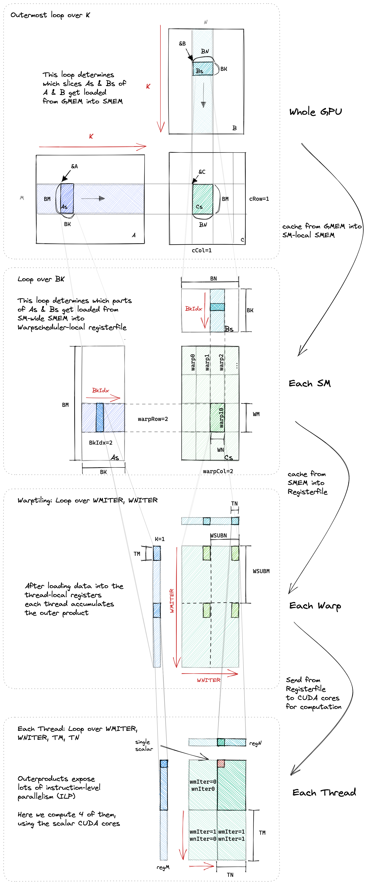

# Warp Tiling

## 1. 优化思路

上一个 Kernel 中我们使用向量化访存的方式来提高访存效率, 它的循环结构如下图所示:


第一个循环 (blocktiling loop) 是对 K 的循环, 这个循环中会将数据从全局内存移动到共享内存中, 第二个循环 (threadtiling loop) 是线程级别的循环, 这个循环中会将数据从共享内存移动到寄存器中, 第三和第四个循环是对寄存器中的数据进行计算。

本文中我们将会在第一个循环, 第二个循环之前加入一个 warp tiling 的循环, 以此来提高访存效率。Warp 是 GPU 硬件中的一个概念, 一个 warp 由 32 个线程组成, 这 32 个线程会被分配到一个 SM 中的一个 warp scheduler 中, warp scheduler 会负责调度这 32 个线程的执行。一个 SM 上可能会有多个 warp scheduler, 下图是一个 SM 中 warp scheduler 的示意图:


在 warp 级别上进行并行计算可以充分利用 GPU 的并行处理能力。通过同时执行多个 warp 中的线程，可以实现更高的计算吞吐量，从而加快整体计算速度。

在使用 warp tiling 之后, 我们的循环结构如下所示:

1. Block Tile: 不同的块可以在不同的 SM 上并行执行。
2. Warp Tile: 不同的 warps 可以在不同的 warp 调度器上并行执行，并且同时在同一个 warp 调度器上执行
3. Thread Tile: 指令可以在同一个 CUDA 核心上并行执行（即指令级并行性，又称 ILP）

:::note

ILP 是指在一个线程中的指令可以并行执行, warp tiling 会增加 warp 级别的并行性, 从而提高计算效率。

:::

下图给出了算法的整体流程图:

  

## 2. 代码实现

在了解了代码的整体结构之后, 我们来看一下 warp tiling 的代码实现。首先我们还是先来看看添加了 warp tiling 之后各个相对坐标要如何计算:

```cpp

```