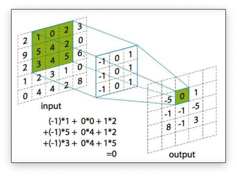
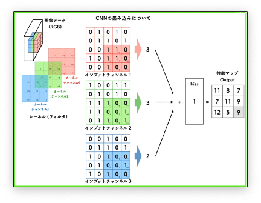

# 卷积算子简易实现

## 1. 什么是卷积运算

卷积运算是一种特殊的线性运算，它是一种对两个实变函数的一种数学运算，表征函数之间的一种重要的运算方式。卷积运算的定义如下：

$$
(f*g)(t) = \int_{-\infty}^{\infty} f(\tau)g(t-\tau)d\tau
$$

其中，$f(t)$和$g(t)$是两个实变函数，$*$表示卷积运算。卷积运算的定义是在实数域上的，但是在深度学习中，我们通常使用离散卷积运算。离散卷积运算的定义如下：

$$
(f*g)(t) = \sum_{\tau=-\infty}^{\infty} f(\tau)g(t-\tau)
$$

其中，$f(t)$和$g(t)$是两个离散函数，$*$表示离散卷积运算。

在图象处理中，卷积运算是一种对图像进行滤波的操作，它可以提取图像的特征。卷积运算的过程如下：

1. 将卷积核与图像进行逐元素相乘；
2. 将相乘的结果求和。

其中，卷积核是一个小的矩阵，它可以提取图像的特征。卷积核的大小通常是$3\times 3$或$5\times 5$。
下图是一个卷积运算的示意图：

  

:::note

卷积的运算过程就是相应区域的数字相乘后相加

:::

有图像处理相关经验的同学应该知道，一个图像是有三个通道的。那么理论上卷积运算也应该是对三个通道都要进行卷积运算才行。所以我们就会有三个卷积核分别进行计算。

  

卷积是一个特征提取的过程，不同的卷积核可以提取图像中不同的特征。

本文将介绍如何使用 CUDA 实现一个卷积算子。

## 2. 卷积算子的实现

CUDA 代码是从并发的角度来实现卷积算子的。具体来说，我们将使用一个线程来计算一个输出元素。这样，我们可以使用一个线程块来计算一个输出通道的所有输出元素。

首先我们先明确一下我们的任务，我们的任务是给定一个矩阵和一个卷积核，计算卷积运算的结果。矩阵的纬度是 $n \times c \times h \times w$，卷积核的纬度是 $k \times c \times r \times s$。其中，$n$ 是 batch size，$c$ 是通道数，$h$ 是数据高，$w$ 是数据宽，$k$ 是卷积核数量，$r$ 是卷积核高，$s$ 是卷积核宽。一些常用的符号定义如下：

```cpp
int n;     // batch szie           
int c;     // 通道数      
int h;     // 数据高               
int w;     // 数据宽               
int k;     // 卷积核数量           
int r;     // 卷积核高             
int s;     // 卷积核宽             
int u;     // 卷积在高方向上的步长 
int v;     // 卷积在宽方向上的步长 
int p;     // 卷积在高方向上的补边 
int q;     // 卷积在宽方向上的补边 

int out_h;    // 卷积在高方向上的输出大小
int out_w;    // 卷积在宽方向上的输出大小
```

卷积运算的结果的纬度是 $n \times k \times out_h \times out_w$。$out_h$ 和 $out_w$ 是卷积运算的结果的高和宽它们的计算代码如下：

```cpp
out_h = (h + 2 * p - r) / u + 1;
out_w = (w + 2 * q - s) / v + 1;
```

首先我们先想一下如何组织线程来进行计算，我们可以用一个线程来计算一个输出元素。这样，我们可以使用一个线程块来计算一个输出通道的所有输出元素。输入的矩阵是一个4维矩阵，我们可以用二维的 grid 和二维的 block：

```cpp
// 定义线程块的大小
const int blockDim_x = 16;
const int blockDim_y = 16;

// 计算线程块和网格的数量
const int gridDim_x = (out_h * out_w + blockDim_x - 1) / blockDim_x;
const int gridDim_y = (k + blockDim_y - 1) / blockDim_y;
```

gridDim_x 和 gridDim_y，分别表示在 x 和 y 方向上需要的线程块数量。

对于输出特征图的大小，我们需要考虑每个输出像素需要进行卷积操作，因此使用 out_h * out_w 计算总的输出像素数量。将总的输出像素数量除以每个线程块中的线程数量，即 blockDim_x 和 blockDim_y，可以得到在 x 和 y 方向上需要的线程块数量。由于 GPU 线程块的数量必须是整数，所以我们使用 `(total_pixels + blockDim - 1) / blockDim` 来确保线程块数量足够覆盖所有像素，并且没有多余的线程块。

接下来我们来看一下卷积运算的实现代码, 首先我们先需要获取线程的索引：

```cpp
// 根据线程在二维网格中的位置计算出线程在一维线程空间中的全局唯一索引
int x = blockIdx.x * blockDim.x + threadIdx.x;
int y = blockIdx.y * blockDim.y + threadIdx.y;
// 表示当前处理的 batch 中的索引
int z = blockIdx.z;
```

检查当前线程是否超出了工作范围。如果超出了输出特征图的范围或者卷积核的数量，或者超出了 batch 的数量: 

```cpp
if (x >= out_h * out_w || y >= k || z >= n)
{
    return;
}
```

下面我们需要明确几个坐标，首先是这个线程计算的是输出特征图的哪一个像素，然后是这个像素对应的输入特征图的哪一个像素，

```cpp
// 计算当前线程处理的输出特征图中的索引
int pos_out_h = x / out_w;
int pos_out_w = x % out_w;

// 计算输入数据的坐标
int pos_ori_h = pos_out_h * u - p;
int pos_ori_w = pos_out_w * v - q;

// 计算输入数据的偏移量，即输入数据中当前像素的起始位置
int in_offset = z * c * h * w + pos_ori_h * w + pos_ori_w;
// 计算卷积核的偏移量，即卷积核中当前通道的起始位置
int weight_offset = y * c * r * s;
// 计算输入数据中通道之间的偏移量 (输入数据的大小是 n * c * h * w)
int in_channel_offset = h * w;
// 计算卷积核中通道之间的偏移量 (卷积核的大小是 k * c * r * s)
int weight_channel_offset = r * s;
```

在理清楚了坐标之后，我们就可以开始计算卷积运算的结果了，计算过程很简单就是把卷积核和输入特征图对应位置的元素相乘然后求和：

```cpp
float sum = 0.0f;

for (int i = 0; i < r; i++)
{
    for (int j = 0; j < s; j++)
    {
        int pos_real_h = pos_ori_h + i;
        int pos_real_w = pos_ori_w + j;

        // 只处理有效的数据点
        if (pos_real_h >= 0 && pos_real_w >= 0 && pos_real_w < w && pos_real_h < h)
        {
            int in_offset_tmp = in_offset;
            int wei_offset_tmp = weight_offset;
            for (int channel = 0; channel < c; channel++)
            {
                // 计算卷积和
                sum += in[in_offset_tmp + i * w + j] * weight[wei_offset_tmp + i * s + j];
                in_offset_tmp += in_channel_offset;
                wei_offset_tmp += weight_channel_offset;
            }
        }
    }
}
```

最后我们将计算结果写入到输出特征图中：

```cpp
// 将计算结果写入到输出特征图中
int out_offset = z * k * out_h * out_w + y * out_h * out_w + x;
out[out_offset] = sum;
```

编译运行命令如下：

```bash
nvcc -o naive_conv naive_conv.cu
./naive_conv
```

## 3. 总结

本文介绗了卷积运算的定义和卷积运算的实现。卷积运算是一种特殊的线性运算，它是一种对两个实变函数的一种数学运算，表征函数之间的一种重要的运算方式。卷积运算的定义是在实数域上的，但是在深度学习中，我们通常使用离散卷积运算。离散卷积运算的定义是在离散函数上的。卷积运算是一种对图像进行滤波的操作，它可以提取图像的特征。卷积运算的过程是将卷积核与图像进行逐元素相乘，然后将相乘的结果求和。

CUDA 代码是从并发的角度来实现卷积算子的。具体来说，我们将使用一个线程来计算一个输出元素。这样，我们可以使用一个线程块来计算一个输出通道的所有输出元素。

## References

1. https://space.keter.top/docs/deep_learning/%E5%9F%BA%E7%A1%80%E7%9F%A5%E8%AF%86/%E5%8D%B7%E7%A7%AF%E7%A5%9E%E7%BB%8F%E7%BD%91%E7%BB%9C
2. http://cs231n.stanford.edu/
