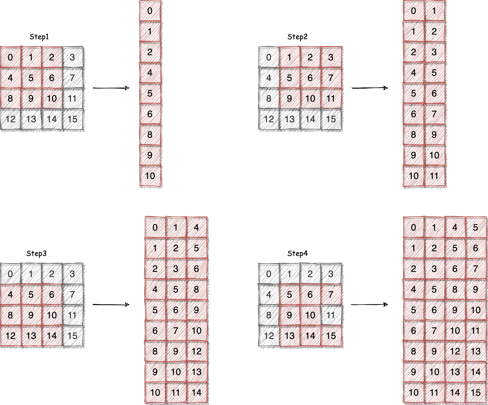

# 卷积算子优化思路介绍

上一篇文章中，我们介绍了卷积算子的简易实现，它是直接模拟卷积操作的过程，这种实现方式的缺点是计算量大，效率低。在本文中，我们将介绍卷积算子的优化思路。

卷积算子的主要优化思路就是将卷积运算转换为矩阵乘法运算。进而卷积算子优化问题就转化为了矩阵乘法优化问题卷积算子的主要优化思路就是将卷积运算转换为矩阵乘法运算。进而卷积算子优化问题就转化为了矩阵乘法优化问题。。这篇文章中我们主要介绍一下如何将卷积运算转换为矩阵乘法运算。

## 1. 卷积算法映射为矩阵乘法

首先我们先来回顾一下卷积算法的定义，假设输入的特征图为 $X$，卷积核为 $K$，输出特征图为 $Y$，$X$ 的大小为 $N \times C \times H \times W$，$K$ 的大小为 $M \times C \times K_h \times K_w$，$Y$ 的大小为 $N \times M \times H \times W$。那么卷积算法的定义如下：

$$
Y[n,oc,oh,ow] = \sum_{ic}\sum_{fh}\sum_{fw}X[n,ic,ih,iw] \times K[oc,ic,fh,fw]
$$

其中，$n$ 表示 batch 的索引，$m$ 表示输出特征图的索引，$i$ 和 $j$ 分别表示输出特征图的高和宽的索引。其中 ih, iw 等坐标计算如下：

```
ih = oh * stride_h + fh - padding_h
iw = ow * stride_w + fw - padding_w
```

其中，$stride_h$ 和 $stride_w$ 分别表示卷积核的高和宽的步长，$padding_h$ 和 $padding_w$ 分别表示卷积核的高和宽的填充。想要把卷积算法映射为矩阵乘法算法，我们需要使用 `im2col` 算法将输入特征图转换为矩阵，然后使用 `gemm` 算法进行矩阵乘法运算。

## 2. im2col 算法

im2col 就是 image to column 的缩写，它是一种将输入特征图转换为矩阵的算法。im2col 算法的主要思想是将卷积核在输入特征图上滑动，每次滑动的步长为卷积核的步长，然后将卷积核覆盖的区域拉成一个列向量，最后将所有的列向量拼接在一起，就得到了一个矩阵。

下面我们通过一个简单的例子来说明 im2col 算法的原理。假设输入特征图的大小为 $4 \times 4$，卷积核的大小为 $3 \times 3$，步长为 1，填充为 0。那么 im2col 算法的过程如下图所示：



从上图中可以看出，im2col 算法的过程就是将卷积核在输入特征图上滑动，每次滑动的步长为卷积核的步长，然后将卷积核覆盖的区域拉成一个列向量，最后将所有的列向量拼接在一起，就得到了一个矩阵。

如果我们把这个矩阵记为 $X_{col}$，那么卷积算法就可以表示为：

$$
Y = K \times X_{col}
$$

其中，$K$ 表示卷积核，$X_{col}$ 表示输入特征图转换得到的矩阵。

## 3. 隐式 gemm 算法

im2col 算法会把输入特征图转换为一个矩阵，然后保存在内存中。其实我们可以直接在计算的时候不用保存这个矩阵，而是直接计算坐标的偏移量，然后直接从输入特征图中读取数据。这种算法就是隐式 gemm 算法。

根据上面的讨论，我们可以把卷积的运算过程，写成一个隐式矩阵乘法 (Implicit GEMM) 的形式：

```
GEMM_M = OC
GEMM_N = N * OH * OW
GEMM_K = IC * FH * FW

For i=0 to GEMM_M
    oc = i
    For j=0 to GEMM_N
        accumulator = 0
        n = j / (OH * OW)
        j_res = j % (OH * OW)
        oh = j_res / OW
        ow = j_res % OW
        For k=0 to GEMM_K
            ic = k / (FH * FW)
            k_res = k % (FH * FW)
            fh = k_res / FW
            fw = k_res % FW
            ih = oh * stride_h - pad_h + fh
            iw = ow * stride_w - pad_w + fw
            accumulator = accumulator + x(n, ic, ih, iw) * w(oc, ic, fh, fw)
        y(n, oc, oh, ow) = accumulator
```

上面的代码中，`GEMM_M` 表示输出特征图的通道数，`GEMM_N` 表示输出特征图的大小，`GEMM_K` 表示输入特征图的大小。在这个算法中，我们直接计算坐标的偏移量，然后直接从输入特征图中读取数据，然后进行计算。

## 4. 总结

总的来说，卷积算子的优化思路就是将卷积运算转换为矩阵乘法运算。这样做的好处是可以利用矩阵乘法的高效实现来提高卷积算子的计算效率。在下一篇文章中，我们将动手实现基于 im2col 算法的卷积算子优化版本。

## References

1. https://zhuanlan.zhihu.com/p/372973726
2. https://blog.csdn.net/m0_45388819/article/details/120757424
3. https://blog.csdn.net/dwyane12138/article/details/78449898


