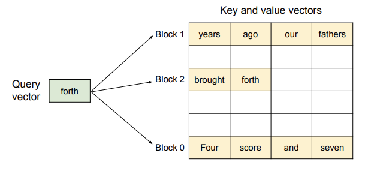
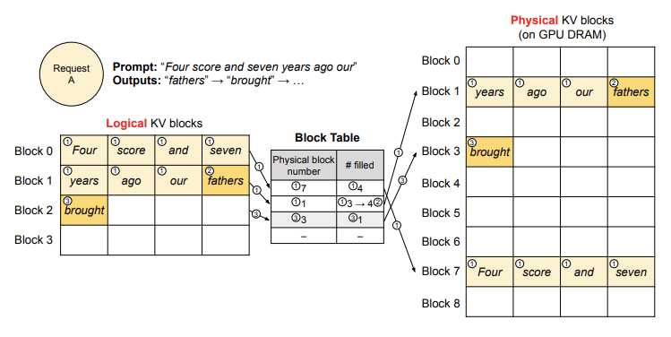
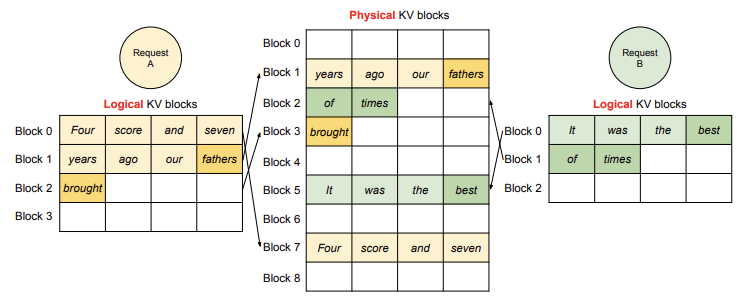

# Page Attention - 原理篇

## 1. KV-Cache

在介绍 Page Attention 之前我们先来介绍一下 LLM 中的 KV-Cache，KV-Cache 是 LLM 中的一个重要组件，它的作用是缓存 Key 和 Value，以减少计算量。

Attention 机制的计算公式如下：

$$
\begin{aligned}
& q_i=W_q x_i, k_i=W_k x_i, v_i=W_v x_i \\
& a_{i j}=\frac{\exp \left(q_i^{\top} k_j / \sqrt{d}\right)}{\sum_{t=1}^i \exp \left(q_i^{\top} k_t / \sqrt{d}\right)}, o_i=\sum_{j=1}^i a_{i j} v_j
\end{aligned}
$$

其中 $q_i, k_i, v_i$ 分别是 Query, Key, Value，$W_q, W_k, W_v$ 是权重矩阵，$x_i$ 是输入向量，$d$ 是维度。$a_{i j}$ 是第 $i$ 个 Query 和第 $j$ 个 Key 的 Attention 分数，$o_i$ 是第 $i$ 个 Query 的输出。

在 Decode 阶段，每次的输出都需要计算一次 Attention，这样会导致计算量过大，KV-Cache 的作用就是缓存 Key 和 Value，以减少计算量。

:::tip

KV-Cache 是一种用空间换时间的策略，通过缓存 Key 和 Value，可以减少计算量。

:::

但是对于 LLM 推理的 Decode 阶段，这个阶段我们事先不知道什么时候生成会停止，也不知道总共会生成多少个 Token，但 KVCache 需要保证在显存中的连续性。因此，我们需要在显存里预留出一片足够大的连续空间。实际场景中训练框架一般会提前申请一份远大于我们实际请求需要的连续显存空间。

下图展示了两个请求：请求 A 的最大可能序列长度为 2048， 请求 B 的最大为 512。现有系统中的这种预分配内存块的方式存在三种主要的内存浪费来源：

1. 为未来的 token 保留的插槽
2. 为可能的最大序列长度超额分配而导致的内部碎片
3. 以及来自内存分配器（如 buddy 分配器）的外部碎片。

在处理请求时，外部内存碎片（即由于分配方式产生的小空隙）是不会被用到的，这一点在处理请求之前就已经知道。而内部内存碎片（因为为最大序列长度预留了过多空间）也是浪费的，但只有在请求结束后，我们才会发现这部分空间其实没被用上。也就是说，这两部分内存都白白占用了空间。

虽然有些预留的内存最终会被使用，但如果预留的时间太长，特别是当预留的空间很大时，这些内存本可以用于其他请求，结果却被占用了，导致系统效率降低。这就是为什么预留过多内存会造成性能瓶颈。

  

Page Attention 的目标就是解决这个问题，它可以动态地分配显存，以减少内存浪费。

## 2. Page Attention

与传统的注意力算法不同，PagedAttention[^1] 允许将连续的键（key）和值（value）向量存储在不连续的内存空间中。具体来说，PagedAttention 将每个序列的 KV 缓存分成若干 KV 块。每个块包含一定数量的 token 的键和值向量，我们称其为 KV 块大小$(B)$。定义键块为 $K_j=\left(k_{(j-1) B+1}, \ldots, k_{j B}\right)$，值块为 $V_j=\left(v_{(j-1) B+1}, \ldots, v_{j B}\right)$。注意力计算公式可以转化为以下按块计算的形式：

$$
A_{i j}=\frac{\exp \left(q_i^{\top} K_j / \sqrt{d}\right)}{\sum_{t=1}^{[i / B\rceil} \exp \left(q_i^{\top} K_t 1 / \sqrt{d}\right)}, o_i=\sum_{j=1}^{\lceil i / B\rceil} V_j A_{i j}^{\top},
$$

其中 $A_{i j}=\left(a_{i,(j-1) B+1}, \ldots, a_{i, j B}\right)$ 是在第 $j$ 个 KV 块上的注意力得分的行向量。

在注意力计算过程中，PagedAttention 会分别识别和提取不同的 KV 块。

下图展示了 PagedAttention 如何存储：键和值向量被分布在三个块中，且这些块在物理内存中是不连续的。在每次计算中，内核将查询 token（例如 “forth”）的查询向量 $q_i$ 与一个块中的键向量 $K_j$（例如块 0 中的 “Four score and seven” 键向量）相乘，计算注意力得分 $A_{i j}$，然后再将 $A_{i j}$ 与值向量 $V_j$ 相乘，得到最终的注意力输出 $o_i$。

  

接下来我们通过一个示例来演示 vLLM 如何在解码单个输入序列时执行 PagedAttention 并管理内存。

  

vLLM 类似于操作系统中的虚拟内存机制，不需要一开始就为可能生成的最大序列长度预留大量内存。相反，它只为 prefill 阶段生成的 KV 缓存预留必要的 KV 块。比如，当输入提示包含 7 个 token 时，vLLM 会将前两个逻辑 KV 块映射到两个物理 KV 块，并将它们作为一个序列输入到 LLM 中。在计算过程中，vLLM 使用 PagedAttention 内核访问之前的 KV 缓存，并将新生成的 KV 缓存保存到物理 KV 块中。通过在一个 KV 块中存储多个 token，vLLM 能够并行处理更多位置的数据，从而提高硬件利用率并减少延迟。不过，块大小越大，可能会增加内存碎片的问题。

随着生成的 token 数量增加，vLLM 会动态为新生成的 KV 缓存分配新的物理块。每个块按顺序填充，只有当前面的块被填满时，才会分配新的物理块。这种方法将每个请求的内存浪费限制在一个块的范围内，因此内存可以更高效地利用，能够容纳更多的请求进入内存，从而提高批处理的吞吐量。当一个请求完成时，它所使用的 KV 块会被释放，供其他请求使用。

在具体 Decode 过程中，vLLM 在 prefill 阶段使用传统的自注意力算法生成提示的 KV 缓存，并将前几个 token 的数据存储在逻辑块中，剩余的空位预留给自回归生成阶段。接着，在自回归解码步骤中，vLLM 利用 PagedAttention 算法处理新生成的 token。如果逻辑块已经满了，vLLM 会为新生成的 KV 缓存分配新的物理块，并将映射关系记录在块表中。如此循环下去，vLLM 在每次解码迭代时，会选择合适的请求进行批处理，并动态分配内存空间，从而提高解码效率并最大限度利用内存。

  

在 LLM 的计算过程中，vLLM 会将多个请求和生成阶段的最新 token 合并为一个序列输入 LLM。vLLM 使用 PagedAttention 访问之前存储的 KV 缓存（这些缓存以逻辑 KV 块的形式存储），并将新生成的 KV 缓存保存到物理 KV 块中。将多个 token 存储在一个 KV 块中（块大小 > 1）可以让 PagedAttention 并行处理更多的位置，从而提高硬件利用率并减少延迟。然而，块大小过大也会增加内存碎片问题。

vLLM 会根据生成的 token 数量动态地将新的物理块分配给逻辑块。所有块都是从左到右依次填充，只有当之前的块全部填满时才会分配新的物理块。通过这种方式，vLLM 将每个请求的内存浪费限制在一个块的范围内，从而更加高效地利用内存。

在上图中展示了 vLLM 如何为两个序列管理内存。这两个序列的逻辑块被映射到不同的物理块中，这些物理块由 GPU 工作节点的块引擎预留。相邻的逻辑块不需要在物理 GPU 内存中是连续的，这样可以更有效地利用物理块的空间，让多个序列同时使用。

## 3. 总结

Page Attention 是一种新的注意力机制，它可以动态地分配显存，以减少内存浪费。Page Attention 允许将连续的键（key）和值（value）向量存储在不连续的内存空间中，从而提高硬件利用率并减少延迟。vLLM 通过 PagedAttention 算法处理新生成的 token，动态分配内存空间，提高解码效率并最大限度利用内存。后续我们会再结合源码来看看 Page Attention 的具体实现。

[^1]: vLLM: https://github.com/vllm-project/vllm