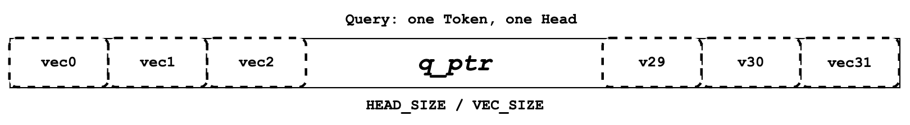
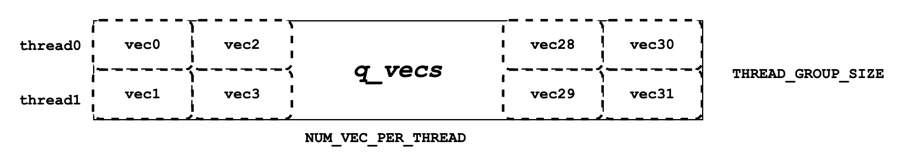
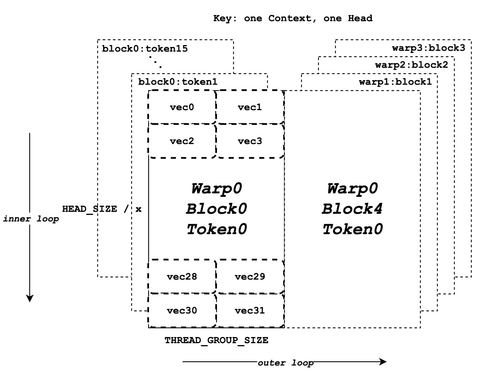
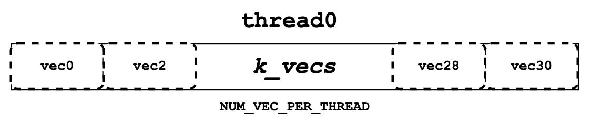
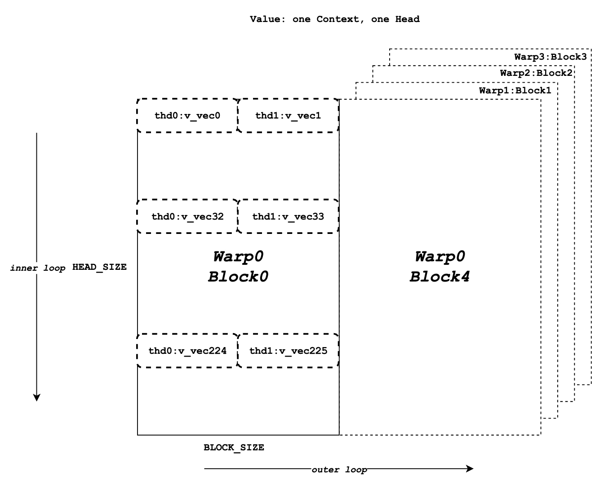
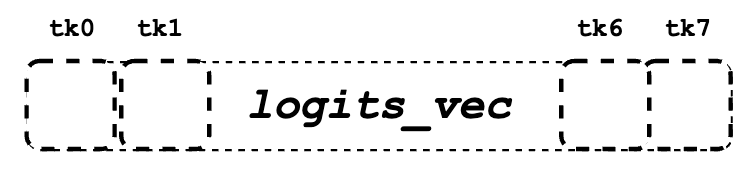
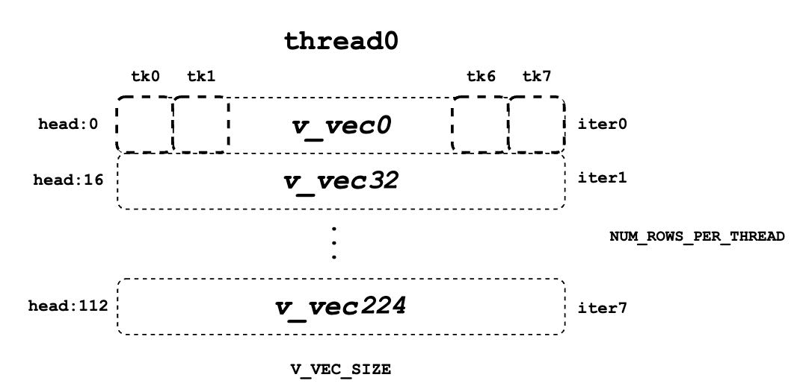

# Page Attention - 源码解析

在上一篇文章中我们介绍了 Page Attention 的原理，本文将结合源码来看看 Page Attention 的具体实现。

目前，vLLM 使用了自己实现的 multi-head query attention 核函数（csrc/attention/attention_kernels.cu）。这个核函数专门为适配 vLLM 的分页键值缓存设计，缓存的键和值分别存储在不同的块中（这里的“块”和 GPU 的线程块是不同的概念，因此在后文中，我会将 vLLM 的分页注意力块称为“块”，而将 GPU 的线程块称为“线程块”）。

:::note

本文主要内容翻译自 vLLM 官方文档: [https://docs.vllm.ai/en/latest/dev/kernel/paged_attention.html](https://docs.vllm.ai/en/latest/dev/kernel/paged_attention.html)

:::

## 1. Input

核函数接收一系列参数，供当前线程执行分配的任务。最重要的三个参数是输入指针 q、k_cache 和 v_cache，它们指向全局内存中的查询、键和值数据，这些数据需要被读取和处理。输出指针 out 指向全局内存中存储结果的位置。实际上，这四个指针指向的是多维数组，但每个线程只访问其被分配到的一部分数据。为了简化，这里省略了所有其他运行时参数。

```cpp
template<
typename scalar_t,
int HEAD_SIZE,
int BLOCK_SIZE,
int NUM_THREADS,
int PARTITION_SIZE = 0>
__device__ void paged_attention_kernel(
... // 其他参数
const scalar_t* __restrict__ out,       // [num_seqs, num_heads, max_num_partitions, head_size]
const scalar_t* __restrict__ q,         // [num_seqs, num_heads, head_size]
const scalar_t* __restrict__ k_cache,   // [num_blocks, num_kv_heads, head_size/x, block_size, x]
const scalar_t* __restrict__ v_cache,   // [num_blocks, num_kv_heads, head_size, block_size]
... // 其他参数
)
```

函数签名上方还有一系列模板参数，它们是在编译时确定的。scalar_t 代表查询、键和值数据元素的数据类型，比如 FP16。HEAD_SIZE 表示每个 head 中的元素数量，BLOCK_SIZE 指的是每个块中的 token 数量，NUM_THREADS 代表每个线程块中的线程数，PARTITION_SIZE 代表张量并行 GPU 的数量（为了简化，我们假设它为 0，即张量并行被禁用）。

## 2. Concepts

在进入具体的计算流程之前，先介绍几个在后面部分需要用到的概念。

**序列 (Sequence)**：序列表示一个客户端的请求。例如，q 指向的数据形状为 [num_seqs, num_heads, head_size]，表示 q 指向的查询序列数据有 num_seqs 个。由于这个核函数是单查询注意力核函数，每个序列只有一个查询 token，因此 num_seqs 就是批处理中处理的 token 总数。

**上下文 (Context)**：上下文由序列中生成的 token 组成。例如，["What", "is", "your"] 是上下文的 token，输入的查询 token 是 "name"，模型可能生成的 token 是 "?"。

**向量 (Vec)**：向量是一起获取并计算的一组元素。对于查询和键数据，向量大小（VEC_SIZE）被设定为每个线程组可以一次获取并计算 16 字节的数据。对于值数据，向量大小（V_VEC_SIZE）设定为每个线程一次可以获取并计算 16 字节的数据。例如，如果 scalar_t 是 FP16（2 字节），线程组大小为 2，则 VEC_SIZE 为 4，而 V_VEC_SIZE 为 8。

## 3. Query

接下来将介绍查询数据是**如何存储在内存中的，以及每个线程如何获取数据**。如前所述，每个线程组会获取一个查询 token 的数据，而每个线程只处理该查询 token 的一部分数据。在每个 warp 中，每个线程组都会获取相同的查询 token 数据，但会将其与不同的键 token 数据相乘。

```cpp
const scalar_t* q_ptr = q + seq_idx * q_stride + head_idx * HEAD_SIZE;
```

  

每个线程定义自己的 q_ptr，指向全局内存中分配给它的查询 token 数据。例如，如果 VEC_SIZE 是 4，HEAD_SIZE 是 128，那么 q_ptr 指向的数据包含总共 128 个元素，这些元素被分成 128 / 4 = 32 个向量 (vecs)。

  

接下来，我们需要将 q_ptr 所指向的全局内存数据读取到共享内存中，存储为 q_vecs。需要注意的是，每个向量 (vec) 会分配到不同的行。例如，如果线程组大小 (THREAD_GROUP_SIZE) 为 2，线程 0 将处理第 0 行的向量，线程 1 处理第 1 行的向量。通过这种方式读取查询数据，相邻的线程（比如线程 0 和线程 1）可以读取相邻的内存数据，从而实现**内存合并**，提升性能。

## 4. Key

与 “Query” 部分类似，本部分介绍键 (Key) 的内存布局和分配。虽然**每个线程组在一次核函数运行中只处理一个查询 token**，但它可能会在多次迭代中处理多个键 token。同时，每个 warp 会在多次迭代中处理多个键 token 块，确保在核函数运行结束后，整个线程组处理完所有的上下文 token。在这里，“处理”指的是执行查询数据和键数据之间的点乘运算。

```cpp
const scalar_t* k_ptr = k_cache + physical_block_number * kv_block_stride
                    + kv_head_idx * kv_head_stride
                    + physical_block_offset * x;
```

与 q_ptr 不同，k_ptr 在每个线程的不同迭代中会指向不同的键 token。上面代码所示，k_ptr 根据 k_cache、分配的块、分配的 head 和分配的 token 指向对应的键 token 数据。

  

上图展示了键数据的内存布局。假设 BLOCK_SIZE 为 16，HEAD_SIZE 为 128，x 为 8，THREAD_GROUP_SIZE 为 2，总共有 4 个 warp。每个矩形代表一个 head 中一个键 token 的所有元素，这些元素将由一个线程组处理。左半部分表示 warp 0 的 16 个键 token 数据块，而右半部分表示其他 warp 或迭代的键 token 数据。在每个矩形中，总共有 32 个向量（每个 token 128 个元素），这些将分别由 2 个线程（一个线程组）处理。

  

接下来，我们需要从 k_ptr 中读取键 token 数据并将其存储在寄存器内存中，作为 k_vecs。我们使用寄存器内存存储 k_vecs，因为它只会被一个线程访问一次，而 q_vecs 会被多个线程多次访问。每个 k_vecs 将包含多个向量，供后续计算使用。在每次内部迭代中都会设置一个向量。向量的分配允许 warp 中相邻的线程一起读取相邻的内存，这有助于内存合并。例如，线程 0 读取向量 0，而线程 1 读取向量 1。在下一次内部循环中，线程 0 读取向量 2，而线程 1 读取向量 3，以此类推。

```cpp
K_vec k_vecs[NUM_VECS_PER_THREAD];
```

## 5. QK

如下面的伪代码所示，在整个 for 循环块开始之前，我们会先获取一个查询 token 的数据并将其存储在 q_vecs 中。然后，在外层 for 循环中，我们会遍历不同的 k_ptrs，它们指向不同的键 token，并在内层 for 循环中准备 k_vecs。最后，我们对 q_vecs 和每个 k_vecs 进行点乘运算。

```cpp
q_vecs = ...
for ... {
   k_ptr = ...
   for ... {
      k_vecs[i] = ...
   }
   ...
   float qk = scale * Qk_dot<scalar_t, THREAD_GROUP_SIZE>::dot(q_vecs[thread_group_offset], k_vecs);
}
```

如前所述，**每个线程一次只获取部分查询和键 token 的数据**。然而，在 `Qk_dot<>::dot` 函数中会发生线程组间的归约运算。因此，返回的 qk 不仅仅是查询和键 token 部分数据的点乘结果，而是整个查询和键 token 数据的完整点乘结果。

例如，如果 HEAD_SIZE 的值为 128，而 THREAD_GROUP_SIZE 为 2，那么每个线程的 k_vecs 将包含总共 64 个元素。然而，返回的 qk 实际上是 128 个查询元素和 128 个键元素的点乘结果。如果你想了解更多关于点乘和归约的细节，可以参考 `Qk_dot<>::dot` 的具体实现。

## 6. Softmax

接下来，我们需要为所有 qk 计算归一化的 softmax，如上图所示，每个 qk 代表一个点乘结果。为此，我们必须获取所有 qk 的最大值（qk_max）和它们的指数和（exp_sum）。这个归约操作应在整个线程块中进行，涵盖查询 token 和所有上下文键 token 之间的结果。

$$
\begin{gathered}
m(x):=\max _i \quad x_i \\
f(x):=\left[\begin{array}{ll}
e^{x_1-m(x)} \ldots & \ldots e^{x_B-m(x)}
\end{array}\right] \\
\ell(x):=\sum_i f(x)_i \\
\operatorname{softmax}(x):=\frac{f(x)}{\ell(x)}
\end{gathered}
$$

### 6.1 qk_max 和 logits

在得到 qk 结果后，我们可以将 qk 设置为临时 logits 结果（最终 logits 应存储归一化的 softmax 结果）。同时，我们可以比较并收集当前线程组计算出的所有 qk 的最大值。

```cpp
if (thread_group_offset == 0) {
   const bool mask = token_idx >= context_len;
   logits[token_idx - start_token_idx] = mask ? 0.f : qk;
   qk_max = mask ? qk_max : fmaxf(qk_max, qk);
}
```

请注意，logits 是存储在共享内存中的，因此每个线程组都会为其分配的上下文 token 设置相应的字段。logits 的整体大小应该是上下文 token 的数量。

```cpp
for (int mask = WARP_SIZE / 2; mask >= THREAD_GROUP_SIZE; mask /= 2) {
    qk_max = fmaxf(qk_max, VLLM_SHFL_XOR_SYNC(qk_max, mask));
}

if (lane == 0) {
   red_smem[warp_idx] = qk_max;
}
```

接下来，我们需要在每个 warp 内获取归约后的 qk_max。核心思路是让 warp 内的线程相互通信，得到最终的最大 qk 值。

```cpp
for (int mask = NUM_WARPS / 2; mask >= 1; mask /= 2) {
    qk_max = fmaxf(qk_max, VLLM_SHFL_XOR_SYNC(qk_max, mask));
}
qk_max = VLLM_SHFL_SYNC(qk_max, 0);
```

最后，通过比较此线程块内所有 warp 的 qk_max，我们可以得到整个线程块的归约 qk_max。然后将最终结果广播到每个线程。

### 6.2 exp_sum

类似于 qk_max，我们也需要对整个线程块的 exp_sum 进行归约。

首先，对每个线程组的所有 exp 值求和，并同时将 logits 的每个条目从 qk 转换为 exp(qk - qk_max)。请注意，这里的 qk_max 已经是整个线程块中的最大 qk。然后我们可以像处理 qk_max 一样对整个线程块的 exp_sum 进行归约。

```cpp
for (int i = thread_idx; i < num_tokens; i += NUM_THREADS) {
    float val = __expf(logits[i] - qk_max);
    logits[i] = val;
    exp_sum += val;
}
...
exp_sum = block_sum<NUM_WARPS>(&red_smem[NUM_WARPS], exp_sum);
```

最后，通过归约后的 qk_max 和 exp_sum，我们可以得到最终归一化的 softmax 结果并存储在 logits 中。这个 logits 变量将在后续步骤中与 value 数据进行点乘运算。现在它应该存储分配给每个上下文 token 的 qk 的归一化 softmax 结果。

```cpp
const float inv_sum = __fdividef(1.f, exp_sum + 1e-6f);
for (int i = thread_idx; i < num_tokens; i += NUM_THREADS) {
   logits[i] *= inv_sum;
}
```

## 7. Value

一个 head 中所有上下文 token 的值数据如下所示：

  

每个线程的 logits_vec 如下所示：

  

每个线程的 v_vec 列表 如下所示：

  


现在我们需要获取值数据，并与 logits 进行点乘运算。与查询和键不同，值数据没有线程组的概念。如图所示，不同于键 token 的内存布局，同一列的元素对应于同一个值 token。对于一个块的值数据，HEAD_SIZE 是行数，BLOCK_SIZE 是列数，这些数据被分成多个 v_vec。

每个线程每次总是从相同的 V_VEC_SIZE token 中获取 V_VEC_SIZE 个元素。因此，单个线程通过多次内部迭代，从不同的行和相同的列中检索多个 v_vec。对于每个 v_vec，它需要与相应的 logits_vec 进行点乘运算，后者也是来自 logits 的 V_VEC_SIZE 个元素。总体来说，通过多次内部迭代，每个 warp 处理一个块的值 token 数据。通过多次外部迭代，整个上下文的值 token 都会被处理。

```cpp
float accs[NUM_ROWS_PER_THREAD];
for ... { // 遍历不同的块
    logits_vec = ...
    for ... { // 遍历不同的行
        v_vec = ...
        ...
        accs[i] += dot(logits_vec, v_vec);
    }
}
```

如上面的伪代码所示，在外部循环中，类似于 k_ptr，logits_vec 遍历不同的块并从 logits 中读取 V_VEC_SIZE 个元素。在内部循环中，每个线程从相同的 token 中读取 V_VEC_SIZE 个元素作为 v_vec，并进行点乘运算。重要的是，在每次内部迭代中，线程会从相同的 token 中获取不同 head 位置的元素。点乘结果会累加到 accs 中。因此，每个 accs 的条目与分配给当前线程的 head 位置对应。

例如，如果 BLOCK_SIZE 为 16，V_VEC_SIZE 为 8，则每个线程每次获取 8 个 token 的 8 个值元素。每个元素来自相同 head 位置的不同 token。如果 HEAD_SIZE 为 128，WARP_SIZE 为 32，对于每次内部循环，warp 需要获取 WARP_SIZE * V_VEC_SIZE = 256 个元素。这意味着 warp 需要进行 128 * 16 / 256 = 8 次内部迭代来处理一个块的值 token。而每个线程中的 accs 变量包含 8 个在 8 个不同 head 位置上累积的元素。对于线程 0，accs 变量将有 8 个元素，分别是值 head 的第 0 个、第 32 个……第 224 个元素，这些元素是从所有分配的 8 个 token 中累积的。

## 8. LV

现在，我们需要在每个 warp 内对 accs 进行归约。这一过程允许每个线程对一个块中所有 token 的分配 head 位置的 accs 进行累加。

```cpp
for (int i = 0; i < NUM_ROWS_PER_THREAD; i++) {
   float acc = accs[i];
   for (int mask = NUM_V_VECS_PER_ROW / 2; mask >= 1; mask /= 2) {
      acc += VLLM_SHFL_XOR_SYNC(acc, mask);
   }
   accs[i] = acc;
}
```

接下来，我们在所有 warp 之间对 accs 进行归约，允许每个线程累加所有上下文 token 的分配 head 位置的 accs。请注意，每个线程的 accs 只存储整个 head 的部分元素的累加结果，覆盖了所有上下文 token。不过，总体上，所有的输出结果已经计算出来，只是存储在不同线程的寄存器内存中。

```cpp
float* out_smem = reinterpret_cast<float*>(shared_mem);
for (int i = NUM_WARPS; i > 1; i /= 2) {
    // 上半部分 warps 写入共享内存
    ...
    float* dst = &out_smem[(warp_idx - mid) * HEAD_SIZE];
    for (int i = 0; i < NUM_ROWS_PER_THREAD; i++) {
        ...
        dst[row_idx] = accs[i];
    }

    // 下半部分 warps 更新输出
    const float* src = &out_smem[warp_idx * HEAD_SIZE];
    for (int i = 0; i < NUM_ROWS_PER_THREAD; i++) {
        ...
        accs[i] += src[row_idx];
    }

    // 写出 accs 结果
}
```

## 9. Output 

现在我们可以将所有已计算的结果从本地寄存器内存写入最终的全局输出内存。首先，我们需要定义 out_ptr 变量，它指向分配的序列和分配的 head 的起始地址。

```cpp
scalar_t* out_ptr = out + seq_idx * num_heads * max_num_partitions * HEAD_SIZE
                + head_idx * max_num_partitions * HEAD_SIZE
                + partition_idx * HEAD_SIZE;
```

最后，我们需要遍历不同的分配 head 位置，并根据 out_ptr 写出对应的累积结果。

```cpp
for (int i = 0; i < NUM_ROWS_PER_THREAD; i++) {
    const int row_idx = lane / NUM_V_VECS_PER_ROW + i * NUM_ROWS_PER_ITER;
    if (row_idx < HEAD_SIZE && lane % NUM_V_VECS_PER_ROW == 0) {
        from_float(*(out_ptr + row_idx), accs[i]);
    }
}
```


