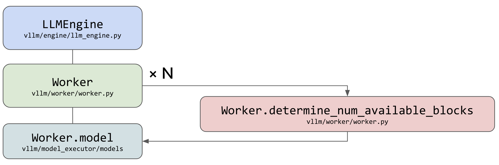

# vLLM 代码结构介绍

在这个系列中，我们将深入解读 vLLM 的源码实现，包括 vLLM 的代码结构、调度策略、PageAttention 的实现等内容。在开始详细介绍之前，本篇将对 vLLM 的代码结构进行一个简要概述，后续我们会逐步深入。

在阅读本系列源码解读文章之前，你需要了解连续批处理和 PageAttention 的基础概念。本系列会对这些概念进行简单介绍，但不会深入讲解。

:::note

本系列的代码基于 vLLM 的 0.6.3 版本介绍

:::

## 1. vLLM 整体代码架构

  

vLLM 的代码架构以 LLMEngine 作为核心组件展开，是整个推理过程的起点。在架构图中，LLMEngine 是处理请求的主要入口，它和 Centralized Controller（中央控制器）在同一个进程中运行，且都位于 CPU 上。LLMEngine 的任务是接收用户请求，并与中央控制器配合，确保请求能够被分配到合适的计算资源中处理。

## 1.1 Centralized Controller

Centralized Controller 实际上是实现了调度功能的模块，叫做 Scheduler（调度器）。它决定每个推理阶段的任务调度，主要负责选择哪些数据需要送到模型去推理，并且管理 KV Cache 的分配。然而，调度器并不直接处理这些物理缓存块的实际存储与管理，只是分配了缓存块的 ID，而数据的实际存储则由分布式 Worker 处理，这些 Worker 分布在 GPU 上。

在调度器之下，架构图中展示了 BlockSpaceManager 和 BlockAllocator，它们的任务是管理计算所需的内存块。BlockSpaceManager 是一种抽象管理器，而 BlockAllocator 则是真正参与内存分配的类，它有 CPU 和 GPU 两种类型，用于管理不同设备上的内存块。BlockAllocator 的作用不仅限于 GPU 上的内存管理，还包括当 GPU 显存不足时，将某些缓存块卸载到 CPU 并进行管理，以便稍后再重新加载到 GPU 中。这种内存管理机制确保系统可以处理更大规模的模型而不受显存限制。

## 1.2 Distributed Workers

右侧的 Distributed Workers 是整个推理任务的执行者，图中绿色部分展示了这些 Worker 的结构。你可以将它们理解为多个 GPU 进程，每个 GPU 都有一个对应的 Worker，它们负责模型的实际加载和推理。架构中称它们为 Worker，但更准确的说法可能是 Executor，因为它不仅执行推理，还对这些 Worker 实例进行整体管理和协调。

每个 Worker 中都有两个关键模块：CacheEngine 和 Worker.model（model_runner）。CacheEngine 负责管理实际的缓存数据，确保所有的计算任务都有合适的资源可用。而 Worker.model 则负责模型的加载和执行，利用 PagedAttention 这样的组件来高效处理注意力机制，从而保证推理任务的性能。

## 2. vLLM 处理请求的流程

在了解了 vLLM 的核心模块之后，我们来看一看当一个请求过来的时候，各个模块是如何协作的。

### 2.1 初始化并加载模型权重

  

在具体执行之前，vLLM 需要初始化并加载模型权重。vLLM 支持从 HF Hub 加载模型，也支持从本地加载模型。在加载模型的过程中，vLLM 会将模型权重加载到 GPU 中，以便后续的推理任务可以直接在 GPU 上执行。

### 2.1.1 估计 KV Cache 的物理块数量

在模型部署的初始化阶段，vLLM 会通过一个模拟实验步骤来决定 GPU 和 CPU 上可以分配的 KV cache 物理块数量，确保后续推理时的内存分配不会导致显存溢出。这个步骤在 vLLM 中被称为 determine_num_available_blocks。

首先，在启动 LLMEngine 时，系统会进行一个 “假数据模拟” 来测量模型的内存使用情况。它通过构造假数据并执行一次模拟前向推理，来观察 GPU 上模型运行时的峰值内存需求。在这次前向推理中，系统不使用 KV cache，而是单纯地模拟模型推理所需的基本内存。这种方式可以帮助确定整个推理过程会占用多少显存，从而为后续的内存分配提供依据。

在完成内存需求的测量后，vLLM 会使用测得的内存数据来计算可分配给 KV cache 的显存总量。具体来说，分配给 KV cache 的显存等于 GPU 总显存减去在不使用 KV cache 时推理所占用的显存（包括模型本身和推理过程中的中间数据）。这样可以确保显存分配合理，不会因为内存不足而导致 OOM（Out Of Memory）错误。

接下来，通过计算显存中可以分配的物理块数量，vLLM 会确定 GPU 上可以使用的 KV cache 数量。物理块的大小由用户定义，包括多个参数，例如 block_size、num_heads、head_size、num_layers 以及数据类型的大小（如 fp16 对应的字节数是 2）。计算公式会依据这些参数来估算单个物理块的大小，然后根据剩余显存估算出可以分配的物理块总数。

总之，determine_num_available_blocks 的主要作用是通过模拟一次推理，来确定 GPU 和 CPU 上的内存可以容纳多少个 KV cache 物理块，从而在推理正式开始之前完成显存的预分配。这种方法确保了系统可以在推理阶段高效地使用内存资源，最大程度地避免因为显存不足而导致的推理失败问题。

  

### 2.1.2 预分配 KV Cache

在确定好 KV cache 块的大小之后，vLLM 会进行显存的预分配，以确保后续推理过程中有足够的内存来存储 KV cache。这一过程的核心是创建空的张量（empty tensor），并将它们直接分配到 GPU 上，从而锁定一定的显存空间专门用于 KV cache。这种显存预分配的方式能够避免推理过程中频繁的动态内存分配，提升系统的稳定性和推理效率。

预分配的显存专门用于 KV cache，因此在 vLLM 初始化后，你可能会注意到显存的占用比单纯加载模型时要多一些。这是因为这些额外的显存已经被预先分配给了 KV cache，确保它们在推理时不会受到其他任务的影响。通过这种显存的预先规划和锁定，系统在处理推理请求时能够更高效地管理内存资源，避免了推理阶段因显存分配不足而出现的瓶颈。

  

在后续的文章中，我们会详细介绍 vLLM 的内存管理机制，包括 BlockAllocator 的实现细节以及 KV cache 的分配策略。

## 2.2 处理 Request 

在完成了模型的加载和 KV cache 的预分配之后，vLLM 就可以开始处理用户的请求了。

### 2.1 请求到达 LLMEngine

当用户发送请求时，例如输入了一个文本提示 "The future of Artificial Intelligence"，LLMEngine 首先会对请求进行处理。第一步是将输入文本进行 Tokenization（即将文本转换为一系列标识符，称为 tokens），这些 tokens 可以被模型识别和处理。之后，LLMEngine 将这些 tokens 加入到 Scheduler 的等待队列中，准备进一步处理。

  

### 2.2 调度器的任务

在请求进入调度器后，Scheduler 会根据当前的资源情况（如可用的 KV 缓存块）来决定如何执行任务。调度器维护了三个请求队列：

- Waiting Queue：等待执行的请求。
- Running Queue：当前正在处理的请求。
- Swapped Queue：由于显存不足而被暂时置换出去的请求。

调度器会判断是否有足够的内存块可以分配给新的 tokens。如果有足够的可用 KV 块，则请求从等待队列移动到正在运行的队列（waiting → running）；如果内存不足，调度器会将一些运行中的请求交换到 CPU 内存（running → swapped），以腾出空间让新请求进入运行队列。

  

### 2.3 Worker 执行推理

当请求进入运行队列后，Scheduler 会将任务分发给多个 Worker。每个 Worker 在 GPU 上运行，负责实际的推理计算。在这一过程中，CacheEngine 会按照调度器的指示管理缓存块，包括在 GPU 和 CPU 之间交换内存块，确保内存资源得到高效利用。此外，CacheEngine 还会对共享缓存块执行写时复制（copy-on-write），以确保数据的一致性和高效性。

  

### 2.4 模型的推理过程

每个 Worker 中的 Worker.model 模块负责加载并执行模型推理。在这个过程中，它会依赖 PagedAttention 来实现高效的注意力计算。PagedAttention 是优化的注意力机制实现，适用于大规模的 Transformer 模型，并使用诸如 xformers 或 FlashAttention 等技术来加速推理。

此外，模型的其他部分（例如线性层、量化层等）也进行了优化，以便在分布式执行和张量并行的情况下达到最高性能。在推理阶段，Sampler 会负责选择下一个生成的 token，使用贪心算法、随机采样或者 Beam Search 等策略。

  

### 2.5 请求的完成与结果返回

推理完成后，结果会被发送回 LLMEngine。LLMEngine 会对生成的 tokens 进行 detokenization，将它们转换回可读的文本，并最终将生成的结果流式地返回给用户。这一流程使得生成的结果可以尽快交付给用户，而无需等待整个请求的完全完成。

整个请求的处理流程由 LLMEngine 进行协调调度，通过 Scheduler 管理内存和资源的有效利用，Worker 在 GPU 上执行具体的推理计算，最终将结果流式地返回给用户。

  

在接下来的文章中，我们将深入介绍 vLLM 的内存管理机制、调度策略以及其他实现细节

## 参考文献

1. https://zhuanlan.zhihu.com/p/691045737
2. https://arxiv.org/pdf/2309.06180
3. https://docs.google.com/presentation/d/1RgUD8aCfcHocghoP3zmXzck9vX3RCI9yfUAB2Bbcl4Y/edit#slide=id.g2716b686c46_0_3

