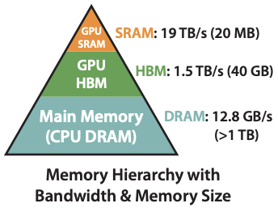
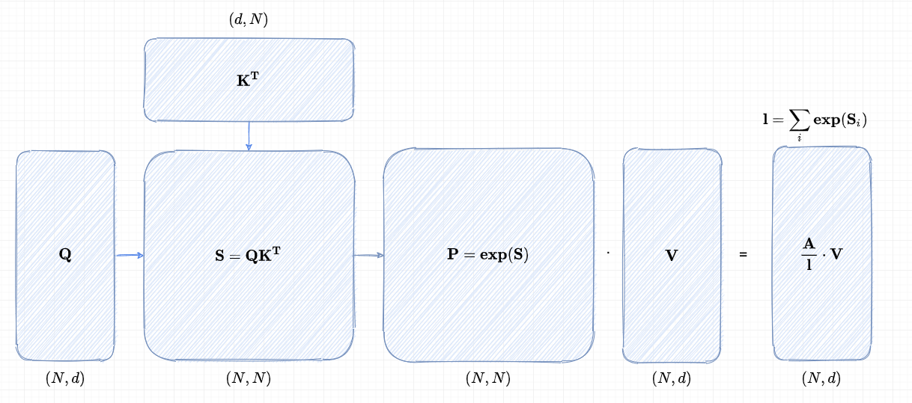
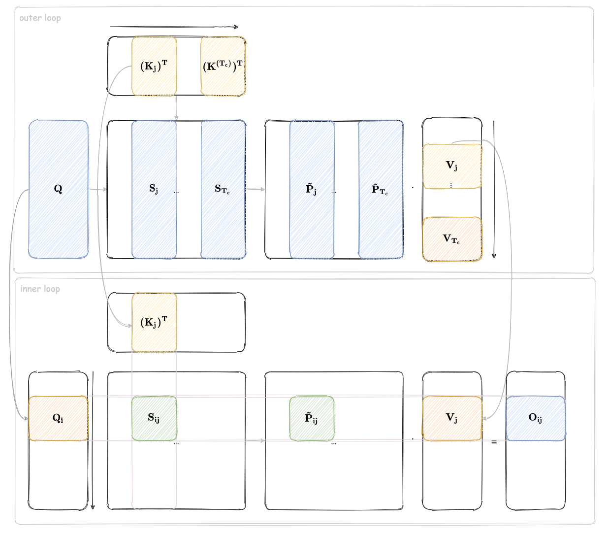

# Flash Attention v1 理论篇

Transformer 模型的时候处理速度较慢，且会占用大量的显存。自注意力的时间和内存复杂度是与序列长度的平方成正比。在 GPU 上，计算速度已超过内存速度，并且
Transformers 中的**大多数操作都受到内存访问的瓶颈**。因此，内存访问模式的优化是加速 Transformer 模型的关键。Flash Attention 是一种高效的自注意力实现，它通过将内存访问模式与计算结合起来，减少了内存带宽的使用，从而提高了性能。

在这个系列中，我们将介绍 Flash Attention 系列的原理和实现。

## 1. GPU 的层次结构

老规矩，我们还是先回顾一下 GPU 的层次结构。GPU 内存层次结构由不同大小和速度的多种形式的内存组成，较小的内存速度较快。例如，A100 GPU 具有 40-80GB 的高带宽内存（HBM），带宽为 1.5-2.0TB/s，并且每个 108 个流处理器有 192KB 的片上 SRAM，其带宽估计约为 19TB/s [44, 45]。片上 SRAM 的速度比 HBM 快一个数量级，但其大小小了多个数量级。

  

## 2. 标准 Attention

给定输入序列 $\mathbf{Q}, \mathbf{K}, \mathbf{V} \in \mathbb{R}^{N \times d}$，其中 $N$ 是序列长度，而 $d$ 是头部维度，我们希望计算注意力输出 $\mathbf{O} \in \mathbb{R}^{N \times d}$：

$$
\mathbf{S}=\mathbf{Q} K^{\top} \in \mathbb{R}^{N \times N}, \quad \mathbf{P}=\operatorname{softmax}(\mathbf{S}) \in \mathbb{R}^{N \times N}, \quad \mathbf{O}=\mathbf{P V} \in \mathbb{R}^{N \times d},
$$

在标准的注意力机制实现中，矩阵 $\mathbf{S}$ 和 $\mathbf{P}$ 需要被显式地存储在高速但容量有限的高带宽内存（HBM）中。这种存储方式带来了 $O(N^2)$ 的内存开销，这在处理大规模输入时尤其值得关注。

以一个具体实例来看，在 GPT-2 模型中，序列长度 $N$ 为 1024，而每个特征的维度 $d$ 仅为 64，即 $N \gg d$。由于注意力机制的核心操作（如 softmax 函数）大多受限于内存访问速度，对 HBM 的高频访问不仅增加了内存带宽压力，还显著延长了计算的整体墙钟时间（wall-clock time），从而降低了模型的运行效率。

## 3. Flash Attention

FlashAttention 的核心思想可以用两个关键词来概括：**分块计算** 和 **动态重计算**。这两种技术的结合，使得注意力机制在保持高效的同时，显著减少了内存占用。

### 3.1 分块计算：化整为零

传统的 Softmax 需要一次性加载整个输入数据，才能计算全局的最大值和归一化系数。而 FlashAttention 采用了 **增量式计算** 的方式，将输入数据分成小块，依次加载到 GPU 的片上缓存（SRAM）中。

我们首先定义一些变量方便后续的讨论：

| **变量**                | **尺寸（shape）**          | **说明**                     |
|-------------------------|--------------------------|-----------------------------|
| $\mathbf{Q}, \mathbf{K}, \mathbf{V}$ | $N \times d$          | 输入矩阵                     |
| $\mathbf{Q}_i$          | $B_r \times d$          | $\mathbf{Q}$ 的第 $i$ 个行分块 |
| $\mathbf{K}_j, \mathbf{V}_j$ | $B_c \times d$        | $\mathbf{K}, \mathbf{V}$ 的第 $j$ 个行分块 |
| $\mathbf{S}_{ij}$       | $B_r \times B_c$        | 局部注意力分数矩阵           |
| $\tilde{m}_{ij}$        | $B_r$                   | 局部行最大值向量             |
| $\tilde{\mathbf{P}}_{ij}$ | $B_r \times B_c$      | 局部未归一化的注意力权重     |
| $\tilde{\ell}_{ij}$     | $B_r$                   | 局部行和向量                 |
| $m_i^{\mathrm{new}}$    | $B_r$                   | 更新后的全局行最大值         |
| $\ell_i^{\mathrm{new}}$ | $B_r$                   | 更新后的全局行和             |
| $\mathbf{O}_i$          | $B_r \times d$          | 输出的第 $i$ 个分块          |

首先，FlashAttention 将输入矩阵 $\mathbf{Q}, \mathbf{K}, \mathbf{V}$ 划分为若干小块。假设片上缓存的大小为 $M$，则 $\mathbf{Q}$ 被划分为 $T_r = \lceil N/B_r \rceil$ 个块，每块大小为 $B_r \times d$；$\mathbf{K}$ 和 $\mathbf{V}$ 被划分为 $T_c = \lceil N/B_c \rceil$ 个块，每块大小为 $B_c \times d$。这里 $B_r$ 和 $B_c$ 的选择基于缓存的大小和特征维度 $d$。

对于每一块 $\mathbf{K}_j$ 和 $\mathbf{V}_j$，FlashAttention 将其从 HBM 加载到 SRAM，然后与每一块 $\mathbf{Q}_i$ 计算局部注意力分数 $\mathbf{S}_{ij} = \mathbf{Q}_i \mathbf{K}_j^T$。$\mathbf{S}_{ij}$ 的大小为 $B_r \times B_c$，远小于全局矩阵 $N \times N$。

为了在分块计算中保持数值稳定性，FlashAttention 维护两个全局统计量：行最大值 $m_i \in \mathbb{R}^{B_r}$ 和行和 $\ell_i \in \mathbb{R}^{B_r}$。对于每一块 $\mathbf{S}_{ij}$，计算局部最大值 $\tilde{m}_{ij}$ 和局部归一化系数 $\tilde{\ell}_{ij}$，并根据这些值动态更新全局统计量。

在更新输出矩阵 $\mathbf{O}_i$ 时，FlashAttention 采用增量式的方法，将每一块的计算结果逐步累加。具体公式为：  

$$
\mathbf{O}_i \leftarrow \text{diag}(\ell_i^{\text{new}})^{-1} \left( \text{diag}(\ell_i) e^{m_i - m_i^{\text{new}}} \mathbf{O}_i + e^{\tilde{m}_{ij} - m_i^{\text{new}}} \tilde{\mathbf{P}}_{ij} \mathbf{V}_j \right)
$$

这一公式确保了输出结果与全局计算等价。在每一块计算完成后，更新后的 $\mathbf{O}_i$、$\ell_i$ 和 $m_i$ 被写回 HBM，供后续计算使用。

:::note

本文不探讨公式的具体推导过程，感兴趣的读者可以参考 [2]

:::

上图是 FlashAttention 的分块计算的示意图，外层循环中会对 $\mathbf{K}$ 和 $\mathbf{V}$ 进行分块，而内层循环中会对 $\mathbf{Q}$ 进行分块。每个外层循环中都会计算得到 $\mathbf{O_{i,j}}$，并将其根据公式更新到 $\mathbf{O}$ 中。

这里我们以一个最简单的例子来说明更新的过程。

我们以 **序列长度 $ N = 4 $ 、特征维度 $ d = 2  $为例**，将输入矩阵 $\mathbf{Q}, \mathbf{K}, \mathbf{V}$ 均分为 **2 块**，展示 FlashAttention 的分块计算和流式更新过程。假设：
- $\mathbf{Q} \in \mathbb{R}^{4 \times 2}$，分为 2 块：$\mathbf{Q}_1 \in \mathbb{R}^{2 \times 2}$, $\mathbf{Q}_2 \in \mathbb{R}^{2 \times 2}$（每块行数 $ B_r = 2 $ ）。
- $\mathbf{K}, \mathbf{V} \in \mathbb{R}^{4 \times 2}$，分为 2 块：$\mathbf{K}_1, \mathbf{V}_1 \in \mathbb{R}^{2 \times 2}$, $\mathbf{K}_2, \mathbf{V}_2 \in \mathbb{R}^{2 \times 2}$（每块行数 $ B_c = 2 $ ）。

初始状态下：
- 输出矩阵 $\mathbf{O} = \begin{bmatrix} 0 & 0 \\ 0 & 0 \\ 0 & 0 \\ 0 & 0 \end{bmatrix}$。
- 全局统计量：$\ell = [0, 0, 0, 0]^T$, $m = [-\infty, -\infty, -\infty, -\infty]^T$。

---

**步骤 1：外层循环 $ j=1 $，处理块 $\mathbf{K}_1$ , $\mathbf{V}_1$ :**

1. **加载 $\mathbf{K}_1$, $\mathbf{V}_1$ 到 SRAM**：

    $$
    \mathbf{K}_1 = \begin{bmatrix} k_{11} & k_{12} \\ k_{21} & k_{22} \end{bmatrix}, \quad \mathbf{V}_1 = \begin{bmatrix} v_{11} & v_{12} \\ v_{21} & v_{22} \end{bmatrix}
    $$

2. **内层循环 $i=1$，处理块 $\mathbf{Q}_1$ ：**
   - **加载数据**：
     $$
     \mathbf{Q}_1 = \begin{bmatrix} q_{11} & q_{12} \\ q_{21} & q_{22} \end{bmatrix}, \quad \mathbf{O}_1 = \begin{bmatrix} 0 & 0 \\ 0 & 0 \end{bmatrix}, \quad \ell_1 = [0, 0]^T, \quad m_1 = [-\infty, -\infty]^T
     $$
   - **计算局部注意力分数**：
     $$
     \mathbf{S}_{11} = \mathbf{Q}_1 \mathbf{K}_1^T = \begin{bmatrix} q_{11}k_{11} + q_{12}k_{12} & q_{11}k_{21} + q_{12}k_{22} \\ q_{21}k_{11} + q_{22}k_{12} & q_{21}k_{21} + q_{22}k_{22} \end{bmatrix} \in \mathbb{R}^{2 \times 2}
     $$
   - **局部统计量**：
     - 逐行最大值 $\tilde{m}_{11} = [\max(\mathbf{S}_{11}[1,:]), \max(\mathbf{S}_{11}[2,:])]^T$。
     - 未归一化注意力权重 $\tilde{\mathbf{P}}_{11} = \exp(\mathbf{S}_{11} - \tilde{m}_{11})$。
     - 逐行和 $\tilde{\ell}_{11} = [\text{sum}(\tilde{\mathbf{P}}_{11}[1,:]), \text{sum}(\tilde{\mathbf{P}}_{11}[2,:])]^T$。
   - **更新全局统计量**：
     - 全局最大值 $m_1^{\text{new}} = \max(m_1, \tilde{m}_{11})$。
     - 全局行和 $\ell_1^{\text{new}} = e^{m_1 - m_1^{\text{new}}} \ell_1 + e^{\tilde{m}_{11} - m_1^{\text{new}}} \tilde{\ell}_{11}$。
   - **更新输出**：
     $$
     \mathbf{O}_1 \leftarrow \text{diag}(\ell_1^{\text{new}})^{-1} \left( \text{diag}(\ell_1) e^{m_1 - m_1^{\text{new}}} \mathbf{O}_1 + e^{\tilde{m}_{11} - m_1^{\text{new}}} \tilde{\mathbf{P}}_{11} \mathbf{V}_1 \right)
     $$
   - **写回 HBM**：更新后的 $\mathbf{O}_1$ 对应前两行，$\ell_1$ 和 $m_1$ 同步更新。

3. **内层循环 $i=2$，处理块 $\mathbf{Q}_2$ ：**
   - 类似地，加载 $\mathbf{Q}_2 = \begin{bmatrix} q_{31} & q_{32} \\ q_{41} & q_{42} \end{bmatrix}$，计算 $\mathbf{S}_{21} = \mathbf{Q}_2 \mathbf{K}_1^T$，更新后两行 $\mathbf{O}_2$。

**步骤 2：外层循环 $ j=2 $，处理块 $\mathbf{K}_2, \mathbf{V}_2$ **

1. **加载 $\mathbf{K}_2, \mathbf{V}_2$ 到 SRAM**：
   $$
   \mathbf{K}_2 = \begin{bmatrix} k_{31} & k_{32} \\ k_{41} & k_{42} \end{bmatrix}, \quad \mathbf{V}_2 = \begin{bmatrix} v_{31} & v_{32} \\ v_{41} & v_{42} \end{bmatrix}
   $$

2. **内层循环 $ i=1 $，处理块 $\mathbf{Q}_1$ ：**
   - **加载数据**：当前 $\mathbf{O}_1$ 已包含来自 $\mathbf{V}_1$ 的贡献。
   - **计算局部注意力分数**：
     $$
     \mathbf{S}_{12} = \mathbf{Q}_1 \mathbf{K}_2^T = \begin{bmatrix} q_{11}k_{31} + q_{12}k_{32} & q_{11}k_{41} + q_{12}k_{42} \\ q_{21}k_{31} + q_{22}k_{32} & q_{21}k_{41} + q_{22}k_{42} \end{bmatrix} \in \mathbb{R}^{2 \times 2}
     $$
   - **更新统计量**：根据 $\mathbf{S}_{12}$ 的局部最大值和行和，更新 $m_1^{\text{new}}$ 和 $\ell_1^{\text{new}}$。
   - **更新输出**：
     $$
     \mathbf{O}_1 \leftarrow \text{diag}(\ell_1^{\text{new}})^{-1} \left( \text{diag}(\ell_1) e^{m_1 - m_1^{\text{new}}} \mathbf{O}_1 + e^{\tilde{m}_{11} - m_1^{\text{new}}} \tilde{\mathbf{P}}_{12} \mathbf{V}_2 \right)
     $$
   - **结果等价于全局 Softmax**：最终 $\mathbf{O}_1$ 为前两行注意力结果的加权和。

3. **内层循环 $ i=2 $，处理块 $\mathbf{Q}_2$ ：**
   - 类似地，计算 $\mathbf{S}_{22} = \mathbf{Q}_2 \mathbf{K}_2^T$，更新后两行 $\mathbf{O}_2$。

通过这种分阶段、分块处理的方式，FlashAttention 在不牺牲计算精度的前提下，显著提升了注意力机制的效率，成为处理长序列任务的利器。

### 3.2 动态重计算：用时间换空间

在反向传播阶段，传统的注意力机制需要存储前向传播生成的完整注意力矩阵，这进一步加剧了内存压力。FlashAttention 采用了 **动态重计算** 的策略：在前向传播中，只存储必要的中间结果（如最大值和归一化系数），而在反向传播时，按需重新计算注意力矩阵。

我们的文章里面展示只实现前向传播的计算，反向传播的详细过程可以参考 [2]。

## 参考文献

[1] Andrei Ivanov, Nikoli Dryden, Tal Ben-Nun, Shigang Li, and Torsten Hoefler. Data movement is all you need: A case study on optimizing transformers. Proceedings of Machine Learning and Systems, 3:711–732, 2021
[2] https://zhuanlan.zhihu.com/p/669926191
[3] http://www.zh0ngtian.tech/posts/49b73eba.html

