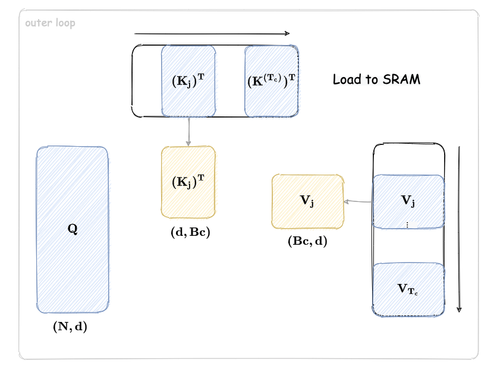
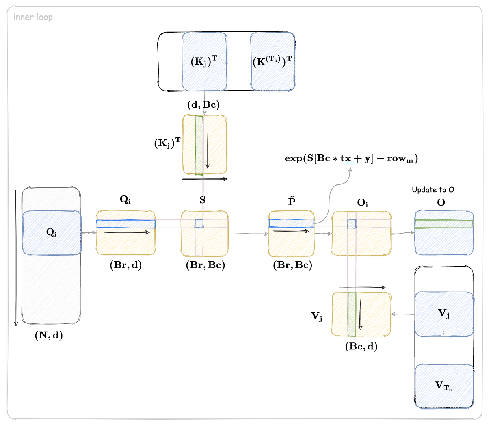

# Flash Attention v1 实现篇

在上一篇中，我们介绍了 Flash Attention v1 的基本原理和分块计算的思想。本文将深入探讨 Flash Attention v1 的实现细节。

## 1. 整体设计思路

的是 Flash Attention 的 CUDA 内核接收三个输入张量 $\mathbf{Q}$（Q）、$\mathbf{K}$（键）、$\mathbf{V}$（值），计算 $\mathbf{QK^T}$，然后经过 softmax 归一化得到注意力权重，最终与 $\mathbf{V}$ 相乘得到输出 $\mathbf{O}$。在这个过程中，还维护了中间状态 $\mathbf{l}$ 和 $\mathbf{m}$（分别代表累积指数和归一化系数），以便分块累积计算长序列时保持数值稳定性。总体上，每个线程块（block）负责处理一个 batch 的一个 head 内的一部分数据，利用共享内存（sram）来减少全局内存访问延迟。整个内核通过嵌套两层循环来实现对大矩阵分块计算的过程。

## 2. 核函数外的主机代码与内核启动

核函数在启动前，主机代码首先要确定每个线程块（block）需要使用的共享内存大小。这里的计算公式为：

```cpp
const int sram_size = (3 * Bc * D * sizeof(float)) + (Bc * Br * sizeof(float));
```

这段代码由两部分组成：

`(3 * Bc * D * sizeof(float))` 此处 3 代表共享内存中划分出来的三个区域：Qi、Kj 和 Vj。Bc 表示每个 block 中需要加载的元素个数（其实和线程数有关，每个线程负责加载 1 组 d 元素），D 就是每个向量的维度，也就是每个线程加载的数据条数。 sizeof(float) 是每个浮点数的字节数（通常为 4 字节）。 整体来看，这部分计算出的是存储 Qi、Kj 和 Vj 这三个数据块所需要的共享内存总字节数。

`(Bc * Br * sizeof(float))` 此部分对应共享内存中 S 区域，用于存储中间计算结果。 Br 则通常代表内层循环中维度的大小，同样乘上 Bc 与 float 的字节数，得到对应的共享内存所需大小。

将两个部分相加，就得到了每个 block 所需的共享内存总量 `sram_size`。如此计算可以确保在调用内核时把共享内存传递进去，从而保证内核中的动态共享内存可以正确使用。

为了避免请求的共享内存超过设备的最大允许值，程序调用了：

```cpp
int max_sram_size;
cudaDeviceGetAttribute(&max_sram_size, cudaDevAttrMaxSharedMemoryPerBlock, 0);
printf("Max shared memory: %d, requested shared memory: %d \n", max_sram_size, sram_size);
```

如果请求的 sram_size 超过 max_sram_size，那么内核启动时将会失败，这时候我们需要调整 Bc、D、Br 的参数，找到平衡点，既能保证算法所需内存，又不会超过硬件限制。

接下来，我们需要设置 CUDA 内核的执行维度（也就是 gridDim 和 blockDim）：

```cpp
dim3 grid_dim(B, nh);  // B: batch 大小，nh: head 数
dim3 block_dim(Bc);   // 每个块内有 Bc 个线程
```

网格（grid）的维度设置为 dim3(B, nh)，第一个维度 B 对应批量（batch）大小，每个 batch 分配一个 block 行。第二个维度 nh 则对应多头注意力中的 head 数，每个 head 分配到不同的 block 列。这样就保证了在一个 kernel 启动中，不同 batch 与不同 head 可以并行执行而互不影响。

线程块（block）设置为 dim3(Bc)，意味着每个 block 中一维有 Bc 个线程，每个线程负责计算指定数据片段。

最后，内核调用语句为：

```cpp
flash_attn_v1_kernel<<<grid_dim, block_dim, sram_size>>>(d_Q, d_K, d_V, N, D, Tc, Tr, Bc, Br, softmax_scale, d_l, d_m, d_O);
```

## 3. 核函数内的计算逻辑

### 3.1. 线程与数据布局

Kernel 开头定义了以下变量：

```cpp
int tx = threadIdx.x;
int bx = blockIdx.x;
int by = blockIdx.y;  // batch 和 head 索引
```

这几行代码直接利用 CUDA 内置变量获取当前线程在线程块内的位置（tx）以及线程块在整个网格中的位置（bx 和 by）。其中：

- tx 表示线程在当前 block 内部的索引
- bx 用来标识当前线程块所属的 batch
- by 表示当前线程块所属的 head（多头注意力中每个 head 单独处理注意力计算）

这样的编号方式使得每个线程块都能精确知道自己应当处理哪一部分数据。

紧接着，代码计算了两个偏移量：

```cpp
int qkv_offset = (bx * gridDim.y * N * d) + (by * N * d);
int lm_offset = (bx * gridDim.y * N) + (by * N);
```

`qkv_offset` 这一偏移量用于确定当前线程块在全局内存中 Q、K、V 这三个张量的起始位置。`bx * gridDim.y` 表示每个 batch 内有 `gridDim.y` 个 head（也就是每个 batch 中的线程块数）。乘以 N * d 后，可以理解为一个 batch 内所有 head 占据的存储空间大小。于是 `bx * gridDim.y * N * d`就跳过了前面所有 batch 的数据。`(by * N * d)` 则是在当前 batch 内，按 head 顺序找到对应 head 的起始位置。

`lm_offset` 这一偏移量用于 l 和 m 两个中间状态数据的定位。`(bx * gridDim.y * N) + (by * N)` 与 `qkv_offset` 类似，区别在于与 Q、K、V 数据相比，l 和 m 的数据不涉及向量维度 d。同样 `bx * gridDim.y` 表示前面所有 batch 内所有 head 的数据总大小，乘以 N 后跳过了这些数据。

借助这两段偏移量的计算，每个线程块都能“知道”自己在全局数据结构中的准确位置。

### 3.2 共享内存的划分与加载

在 CUDA 内核中，我们经常利用共享内存（Shared Memory）来减少对全局内存的访问，以提高数据的访问速度。动态共享内存大小在内核启动时由主机代码传入（即 sram_size 参数），从而保证内核需要多少共享内存就申请多少内存空间。

为了更好地利用这块共享内存，代码通过手动划分来存储不同数据，其代码如下：

```cpp
extern __shared__ float sram[];
int tile_size = Bc * d;  // size of Qi, Kj, Vj
float* Qi = sram;
float* Kj = &sram[tile_size];
float* Vj = &sram[tile_size * 2];
float* S = &sram[tile_size * 3];
```

这里我们可以逐一拆解每个部分的作用：

- **Qi 区域**: 用来存储当前片（tile）中从 Q 张量 Q 载入的数据。在内核后续计算 $QK^T$ 时，线程需要利用共享内存里的 Qi 进行向量点乘操作。Qi 的大小为 `tile_size`，即 Bc 个向量，每个向量的维度为 d。Bc 一般对应块内线程数量，每个线程负责处理一个向量或一个向量的一部分。
- **Kj 区域**: Kj 用于存储从全局内存中加载的键（Key）张量的一部分。外层循环中会把总数据分块，每次将一块键数据载入共享内存。同 Qi 一样，也有 tile_size 大小（Bc * d 的数据量）。
- **Vj 区域**: Vj 与 Kj 类似，不过它存储的是值(Value)张量的一部分。运算中配合 softmax 后的注意力权重对每个线程所对应的值进行加权求和，最终生成输出。
- **S 区域**: S 区域专门用来存储计算结果——也就是 $QK^T$ 相乘得到的分数 Matrix S。在执行 softmax 操作之前，每个线程对自己对应的输出行内的所有元素，将点乘结果保存到 S 里。

### 3.3 外层循环：分块加载键和值

下面我们详细解析外层循环中分块加载键（K）和值（V）的代码，看看它是如何利用每个线程的协作，将全局内存中的 K、V 张量按照分块（tile）的方式加载到共享内存中，从而实现更高效的数据复用和计算。

在实现多头注意力计算时，整体的 K 和 V 张量往往规模较大，所以一次性把全部数据加载到共享内存是不可能的。为了解决这个问题，程序采用了分块加载的方式：

- Tc 表示总共需要加载多少个“tile”块，每个 tile 包含一部分连续的键和值数据
- 每个线程块在每次外层循环迭代过程中，只加载一个 tile 的数据，用于后续计算

```cpp
// 整个 K、V 张量被分成 Tc 个 tile
// 每个 tile 大小为 tile_size（定义为 Bc * d）
for (int j = 0; j < Tc; j++) {
    // Load Kj, Vj from HBM to SRAM
    for (int x = 0; x < d; x++) {
        Kj[(tx * d) + x] = K[qkv_offset + (tile_size * j) + (tx * d) + x];
        Vj[(tx * d) + x] = V[qkv_offset + (tile_size * j) + (tx * d) + x];
    }
    __syncthreads();
```

这一段代码通过外层循环分块来加载 K 和 V 数据，每次循环由每个线程加载连续 d 个数据，并计算出正确的全局偏移地址，确保加载到共享内存中的 Kj 和 Vj 是当前 tile 对应的数据。通过调用 `__syncthreads()`，所有线程在继续下一步前等待该 tile 加载完成。



### 3.4 内层循环：计算注意力分数

下面我们来看看内层循环所实现的 Q 加载和 softmax 计算过程，看看这一部分代码是如何在共享内存中加载 Q 向量 Qi，并利用加载好的键 Kj 进行内积计算，然后对计算结果执行 softmax 预处理，从而为后续注意力加权做好准备。

代码中对每个 Q 分块（tile），利用一个内层循环来处理，每次循环处理一部分 Q 数据以及对应的 softmax 计算：

```cpp
    for (int i = 0; i < Tr; i++) {
        ... // 内部代码
    }
```

其中，Tr 表示 Q 被分成 Tr 个块，每个块依次处理，既可以应对长序列，也能在共享内存有限的情况下循环利用已经加载的数据。

内层循环开始时，每个线程首先将自己需要的查询数据从全局内存复制到共享内存区 Qi 中：

```cpp
    for (int x = 0; x < d; x++) {
        Qi[(tx * d) + x] = Q[qkv_offset + (tile_size * i) + (tx * d) + x];
    }
```

这里的流程与之前加载 Kj、Vj 的步骤类似，每个线程把对应的 d 维查询向量数据加载到共享内存 Qi 区域。

加载完查询向量后，每个线程从全局内存读取之前累计的中间状态值，这些状态值用于 softmax 的数值稳定更新：

```cpp
    // 上一阶段累积中行内最大值（用于防止指数溢出）
    float row_m_prev = m[lm_offset + (Br * i) + tx];
    // 上一阶段累积的归一化因子（行内所有 softmax 权重的总和）
    float row_l_prev = l[lm_offset + (Br * i) + tx];
```

接下来，每个线程计算查询向量 Qi 与所有加载在共享内存中键 Kj 的内积，从而获得每个注意力分数。代码实现如下：

```cpp
    // 计算 S = QK^T, 并找到当前行的最大值 row_m
    float row_m = -INFINITY;
    for (int y = 0; y < Bc; y++) {
        float sum = 0;
        for (int x = 0; x < d; x++) {
            sum += Qi[(tx * d) + x] * Kj[(y * d) + x];
        }
        sum *= softmax_scale;
        S[(Bc * tx) + y] = sum;

        if (sum > row_m)
            row_m = sum;
    }
```

对于每个线程而言，它负责一行的计算，假设该行对应一个查询向量 Qi。外层循环（变量 y）遍历当前 tile 中加载的所有键数据，共有 Bc 个键向量。 内层循环（变量 x）计算 Qi 与第 y 个键向量之间的点积。由于每个向量有 d 个分量，所以内层进行 d 次乘法加法累加，得到 sum。计算完点积之后，乘以 softmax_scale 参数。这一步通常用于缩放内积结果，防止数值过大或过小。

将这个结果存储到共享内存的 S 数组中，对应的存储位置为 S[(Bc * tx) + y]，保证每个线程负责的查询行中对应的所有注意力分数都存放在连续内存中。

同时，通过比较更新 row_m 的值，找到当前计算这一行中所有注意力分数的最大值。这个最大值在后续 softmax 算子中用于减值，保证数值稳定性，防止指数计算溢出。

完成点积计算后，接下来进行 softmax 的核心操作，对每个注意力分数，都先做一个指数计算，但在计算之前先减去 row_m，以实现数值稳定性。

```cpp
    // P = exp(S - row_m), row_l = rowsum(P)
    float row_l = 0;
    for (int y = 0; y < Bc; y++) {
        S[(Bc * tx) + y] = __expf(S[(Bc * tx) + y] - row_m);
        row_l += S[(Bc * tx) + y];
    }
```

对 S 数组中存储的每个注意力分数，统一减去当前行的最大值 row_m。减去 row_m 后，再用 `__expf` 计算指数函数。每个线程遍历自己计算的这一行中所有的元素，**计算出的指数值重新覆盖 S 中对应位置**，同时累**加得到整行的归一化因子** row_l，也就是后续 softmax 中用来归一化的分母。

整个内层循环实现的关键步骤如下：

1. 以每个分块查询为单位，通过内层循环加载 Q 相关数据到共享内存 Qi，确保快速访问
2. 读取之前累积的状态（row_m_prev 和 row_l_prev），为跨块累计计算做准备
3. 对于共享内存中加载的键 Kj，计算 Qi 与 Kj 的内积，得到未经归一化的注意力分数 S
4.  在计算过程中减去每行的最大值（row_m），利用 `__expf` 函数计算指数，同时累加这些指数值，得到 softmax 归一化所需的总和 row_l

  


### 3.5 状态更新与输出计算

在分块计算长序列的注意力时，由于不能一次性处理整个序列，所以将查询 Q、键 K、值 V 分成多个块。对于每个分块计算 softmax 部分后，我们需要将当前块的新计算结果与之前累积的结果合并。这就需要设计一种数值稳定的融合策略，既要保证计算结果正确，又要防止由于指数计算产生数值溢出或下溢。

在本段代码中，用两个中间状态：

- row_m：当前块中求得的最大值（用于 softmax 数值平移）
- row_l：当前块完指数处理后的行和（用于归一化）

同时，前一块累积保存的状态为 row_m_prev 与 row_l_prev。下面的步骤正是将这两部分状态融合，得到新的累计状态 row_m_new 与 row_l_new，再结合当前计算结果更新输出 O

首先，我们计算新的最大值和归一化系数。代码如下：

```cpp
    float row_m_new = max(row_m_prev, row_m);
    float row_l_new = (__expf(row_m_prev - row_m_new) * row_l_prev) +
                    (__expf(row_m - row_m_new) * row_l);
```

计算新的最大值 row_m_new 时，由于要融合两部分的 softmax 结果，新的最大值取的是前一块和当前块两者的较大值。这样保证在进行指数变换时不会因过大的差距导致数值的不稳定。

更新归一化系数 row_l_new 这一式子体现了两块归一化部分如何合并：

- `__expf(row_m_prev - row_m_new)` 乘以前块的累积归一化系数 row_l_prev，得到前块在新归一化系数中所占的贡献；
- `__expf(row_m - row_m_new)` 乘以当前块的归一化系数 row_l，同理得到当前块的贡献；

将两部分相加，结果就是新的归一化因子 row_l_new，这种更新方案也是流式 softmax 计算中的一种常见技巧，通过分块计算后在物理意义上“拼接”所有块的结果。关键在于：

1. 乘以相应的指数因子，可以将两个块的非归一化权重能够在同一数值域下叠加求和
2. 取新最大值后，对前后状态进行归一化，确保整体输出后续只需再除以这个新归一化系数即可

接下来，代码进入输出计算阶段。目的是将 softmax 计算得到的权重（经过指数处理后的 S）与对应 V 值进行加权求和，再融合前一块累积的部分。代码如下：

```cpp
    // Write O, l, m to HBM
    for (int x = 0; x < d; x++) {
        float pv = 0;  // Pij * Vj
        for (int y = 0; y < Bc; y++) {
            pv += S[(Bc * tx) + y] * Vj[(y * d) + x];
        }
        O[qkv_offset + (tile_size * i) + (tx * d) + x] = (1 / row_l_new) \
            * ((row_l_prev * __expf(row_m_prev - row_m_new) * O[qkv_offset + (tile_size * i) + (tx * d) + x]) \
            + (__expf(row_m - row_m_new) * pv));
    }
```

for 循环遍历向量维度 x，对于每个查询向量的每个元素，都需要进行加权求和。

循环内，pv 初始化为 0，然后通过遍历 y（即遍历当前块内所有键和值数据），累加 S 中 softmax 权重与 Vj 中对应的元素之积。这里 S 中存储的已做指数处理的加权权重，与 Vj 相乘，得到当前块对该查询向量在 x 维产生的部分输出。

接下来融合累积结果与当前计算的结果。前一块的累积结果已存储在全局内存的 O 中，对应部分在当前块中仍然可用。由于前一块的累积是在 row_l_prev 归一化下完成的，因此需要通过乘以 `__expf(row_m_prev - row_m_new)` 来转换到以新状态 row_m_new 为基准的数值域；同理，当前块的新计算 pv 也要乘以 `__expf(row_m - row_m_new)`。将这两部分累加后，再乘以 (1 / row_l_new) 得到最终的归一化输出。

在计算完当前块的输出 O 后，还要将新的中间状态写回全局内存，供后续块继续融合使用：

```cpp
    m[lm_offset + (Br * i) + tx] = row_m_new;
    l[lm_offset + (Br * i) + tx] = row_l_new;
```

## 4. 编译运行

完整代码在仓库的同级目录下的 `flash_attn_v1.cu` 文件中。可以通过以下命令编译运行：

```bash
nvcc flash_attn_v1.cu -o flash_attn_v1
./flash_attn_v1
```

## 参考

- [FlashAttention: Fast and Memory-Efficient Exact Attention with IO-Awareness](https://arxiv.org/abs/2006.04533)
- https://github.com/tspeterkim/flash-attention-minimal

