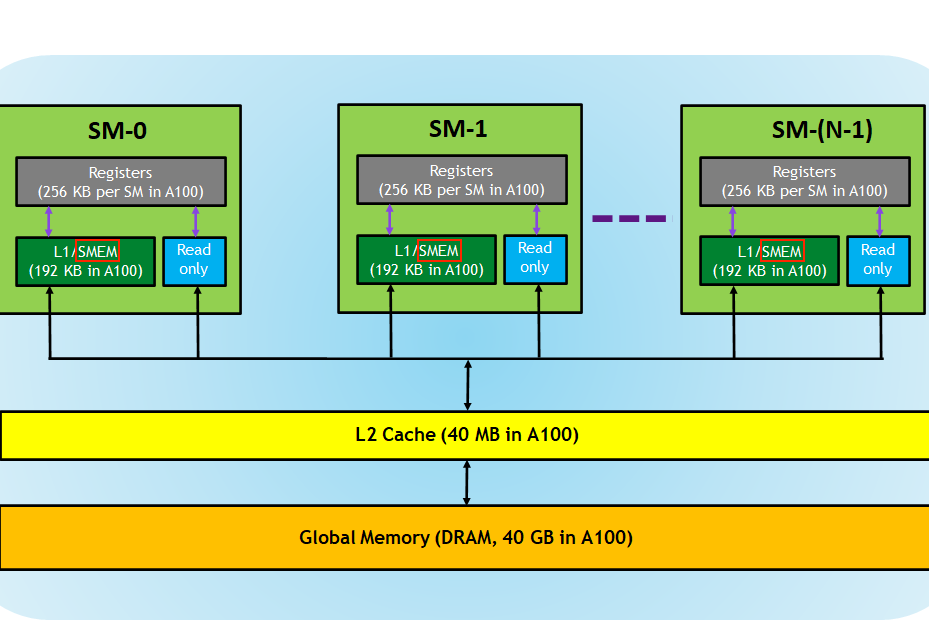

# Triton 内存与数据搬运

## 前言

在上一节中，我们学习了 Triton 的核心编程范式，理解了 Program Instance 的概念，掌握了用 `tl.arange` 进行向量化操作，也学会了用 mask 处理边界。但当时我们只处理了简单的 1D 向量操作。

真实世界的应用往往更复杂：我们需要处理**多维数据**（如图像的 2D 矩阵），需要理解**内存布局**对性能的影响，还需要处理**更复杂的边界情况**（如 padding）。

这一节，我们将从 1D 走向 2D，探索 Triton 的内存管理和数据搬运机制。

期望在阅读完本文后，你能够：
- 理解多维数组的 stride 概念，掌握 2D 地址计算方法
- 理解内存连续性对性能的影响
- 掌握 Triton 的高级加载参数（cache_modifier、eviction_policy）
- 学会使用数据复用技巧减少内存访问

---

## 一、从 1D 到 2D - 指针与多维地址计算

还记得 Triton 01 中的向量加法吗？我们用 `offsets = pid * BLOCK_SIZE + tl.arange(0, BLOCK_SIZE)` 来计算一维索引。

现在，如果我们需要处理一个矩阵，应该怎么办？

### 1.1 任务描述

给定一个 M×N 的矩阵 `A`，计算其转置 `B = A^T`。

这是一个经典的 2D 操作，能很好地展示多维地址计算。在内存中，矩阵是按**行优先**顺序存储的。例如，一个 3×4 的矩阵：

```
A = [[1,  2,  3,  4],
     [5,  6,  7,  8],
     [9, 10, 11, 12]]
```

在内存中的实际布局是：`[1, 2, 3, 4, 5, 6, 7, 8, 9, 10, 11, 12]`

如果要访问 `A[i][j]`（第 i 行，第 j 列），内存地址是：
```
物理地址 = base_ptr + i * N + j
```

这里的关键概念是 **stride（步长）**：
- **行 stride** = N（每行的元素数，跨过一行需要移动 N 个位置）
- **列 stride** = 1（每列的元素间隔）

### 1.2 CUDA 实现

在 CUDA 中，处理 2D 数据需要使用 2D grid 和 2D block：

```cuda
__global__ void transpose_cuda(float *A, float *B, int M, int N) {
    // 每个线程计算自己的 2D 坐标
    int row = blockIdx.y * blockDim.y + threadIdx.y;
    int col = blockIdx.x * blockDim.x + threadIdx.x;

    // 边界检查
    if (row < M && col < N) {
        B[col * M + row] = A[row * N + col];  // 转置：行列交换
    }
}
```

在 CUDA 中，每个线程处理一个元素。你需要：
- 用 `dim3` 定义 2D 的 block 和 grid
- 通过 `threadIdx.x/y` 和 `blockIdx.x/y` 计算每个线程的坐标
- 用 `if (row < M && col < N)` 做边界检查
- 手动计算转置后的索引

### 1.3 Triton 实现

在 Triton 中，咱们不需要一个个线程地思考，而是**以数据块为单位**：

```python
@triton.jit
def transpose_triton(
    a_ptr, b_ptr,
    M, N,
    stride_am, stride_an,  # A 的行 stride 和列 stride
    stride_bm, stride_bn,  # B 的行 stride 和列 stride
    BLOCK_SIZE_M: tl.constexpr,
    BLOCK_SIZE_N: tl.constexpr,
):
    # 1. 获取 2D Program ID
    pid_m = tl.program_id(axis=0)  # 行方向的 Program ID
    pid_n = tl.program_id(axis=1)  # 列方向的 Program ID

    # 2. 计算当前块负责的行列范围（向量化）
    rows = pid_m * BLOCK_SIZE_M + tl.arange(0, BLOCK_SIZE_M)
    cols = pid_n * BLOCK_SIZE_N + tl.arange(0, BLOCK_SIZE_N)

    # 3. 创建 2D mask（broadcast 机制）
    mask = (rows[:, None] < M) & (cols[None, :] < N)

    # 4. 计算指针并加载数据
    a_ptrs = a_ptr + (rows[:, None] * stride_am + cols[None, :] * stride_an)
    a = tl.load(a_ptrs, mask=mask)

    # 5. 存储（转置：交换 rows 和 cols 的位置）
    b_ptrs = b_ptr + (cols[None, :] * stride_bm + rows[:, None] * stride_bn)
    tl.store(b_ptrs, a, mask=mask)
```

#### 核心变化

**从 1D 到 2D，主要有三个变化**：

| 1D（向量加法） | 2D（矩阵转置） |
|---------------|---------------|
| `pid = tl.program_id(0)` | `pid_m = tl.program_id(0)`, `pid_n = tl.program_id(1)` |
| `offsets = pid * BLOCK_SIZE + tl.arange(0, BLOCK_SIZE)` | `rows = ...`, `cols = ...`（两个独立的偏移数组） |
| `mask = offsets < n_elements` | `mask = (rows[:, None] < M) & (cols[None, :] < N)` |

#### Broadcast 机制

这里有个非常重要的技巧：**Broadcast（广播）**

```python
rows = pid_m * BLOCK_SIZE_M + tl.arange(0, BLOCK_SIZE_M)  # 形状: (BLOCK_SIZE_M,)
cols = pid_n * BLOCK_SIZE_N + tl.arange(0, BLOCK_SIZE_N)  # 形状: (BLOCK_SIZE_N,)

# 添加新维度后：
rows[:, None]  # 形状: (BLOCK_SIZE_M, 1)
cols[None, :]  # 形状: (1, BLOCK_SIZE_N)

# 相加后自动 broadcast 到 (BLOCK_SIZE_M, BLOCK_SIZE_N)
mask = (rows[:, None] < M) & (cols[None, :] < N)
```

这种 broadcast 机制让我们能够用简洁的代码生成 2D 的坐标网格，而不需要像 CUDA 那样写两层循环。

> **💡 底层原理：Broadcast 是如何编译的？**
>
> 你可能会担心：`rows[:, None] * stride + cols[None, :]` 这种操作会不会在运行时构造大数组？
>
> 完全不会！Triton 编译器会将这个 broadcast 操作**展开为标量代码**，而不是运行时构造 2D 数组。编译器知道 `rows` 和 `cols` 的编译时值，会直接生成对应的内存访问指令。
>
> 对于 BLOCK_SIZE=64 的情况，编译后类似：
> ```cuda
> // 伪代码
> for (int i = 0; i < 64; i++) {
>     for (int j = 0; j < 64; j++) {
>         ptr[i][j] = base + (pid_m * 64 + i) * stride_am + (pid_n * 64 + j) * stride_an;
>     }
> }
> ```
> 然后编译器会进一步优化这个循环，自动进行内存合并访问（coalescing），让相邻线程访问相邻内存。

### 1.4 Host 端调用

```python
def transpose(a: torch.Tensor) -> torch.Tensor:
    """
    转置矩阵 a

    Args:
        a: (M, N) 的 tensor

    Returns:
        (N, M) 的转置 tensor
    """
    M, N = a.shape
    b = torch.empty(N, M, device=a.device, dtype=a.dtype)

    # Grid 配置：2D grid
    grid = lambda meta: (
        triton.cdiv(M, meta['BLOCK_SIZE_M']),  # 行方向的 Program 数
        triton.cdiv(N, meta['BLOCK_SIZE_N']),  # 列方向的 Program 数
    )

    # 启动 kernel
    transpose_triton[grid](
        a, b,
        M, N,
        a.stride(0), a.stride(1),  # PyTorch 自动获取 stride
        b.stride(0), b.stride(1),
        BLOCK_SIZE_M=64,
        BLOCK_SIZE_N=64,
    )

    return b
```


## 二、内存连续性与访问模式

理解了 2D 地址计算后，咱们来看看一个对性能影响巨大的因素：**内存连续性**。

### 2.1 什么是内存连续性？

在 GPU 编程中，有一个非常重要的性能优化原则：**Memory Coalescing**。

简单来说，当相邻的线程访问相邻的内存地址时，GPU 可以将这些访问合并为一个大的内存事务，从而大幅提高带宽利用率。

**好例子 vs 坏例子**：

```python
# 好的访问：连续访问
x = torch.randn(1024, 1024, device='cuda')
print(x.is_contiguous())  # True
# 在内存中：[x[0,0], x[0,1], ..., x[0,1023], x[1,0], x[1,1], ...]

# 坏的访问：转置后不连续
y = x.T  # 转置
print(y.is_contiguous())  # False
# 在内存中：[x[0,0], x[1,0], ..., x[1023,0], x[0,1], x[1,1], ...]
```

### 2.2 实验对比

让我们用实际代码看看连续性对性能的影响：

```python
@triton.jit
def vector_add_contiguous(x_ptr, y_ptr, out_ptr, n_elements, BLOCK_SIZE: tl.constexpr):
    """连续访问版本"""
    pid = tl.program_id(0)
    offsets = pid * BLOCK_SIZE + tl.arange(0, BLOCK_SIZE)
    mask = offsets < n_elements

    x = tl.load(x_ptr + offsets, mask=mask)
    y = tl.load(y_ptr + offsets, mask=mask)
    out = x + y
    tl.store(out_ptr + offsets, out, mask=mask)


@triton.jit
def vector_add_strided(x_ptr, y_ptr, out_ptr, n_elements, stride, BLOCK_SIZE: tl.constexpr):
    """跨步访问版本"""
    pid = tl.program_id(0)
    offsets = pid * BLOCK_SIZE + tl.arange(0, BLOCK_SIZE)
    mask = offsets < n_elements

    # 跨步访问（非连续）
    x = tl.load(x_ptr + offsets * stride, mask=mask)
    y = tl.load(y_ptr + offsets * stride, mask=mask)
    out = x + y
    tl.store(out_ptr + offsets * stride, out, mask=mask)
```

**性能测试结果**（典型值）：

```
Size    | Stride | Time (ms) | Slowdown
--------|--------|-----------|----------
1048576 |   1    |    5.23   |  1.00x
1048576 |   2    |    6.87   |  1.31x
1048576 |   4    |    9.45   |  1.81x
1048576 |   8    |   12.34   |  2.36x
```

可以看到，随着 stride 增大，访问速度明显下降！

> **💡 底层原理：为什么 stride 越大越慢？**
>
> GPU 的内存访问是以**事务（transaction）为单位**的。一个 warp（32 个线程）访问连续的 32 个 float（128 字节）时，可以合并为**单个内存事务**。
>
> 但当 stride=8 时，这 32 个线程访问的是间隔 8 个元素的数据：
> ```
> 线程 0: addr[0]
> 线程 1: addr[8]
> 线程 2: addr[16]
> ...
> ```
>
> 这些地址跨越了多个 cache line，GPU 需要发起**多个内存事务**，浪费了大量带宽。
>
> Triton 编译器会尽量优化访问模式，但如果数据本身的内存布局不连续，编译器也无力回天。所以**保持输入 tensor 的连续性**非常重要。

### 2.3 如何检查和修复

PyTorch 提供了方便的 API：

```python
# 检查连续性
x = torch.randn(1024, 1024, device='cuda')
print(x.is_contiguous())  # True

y = x.T  # 转置
print(y.is_contiguous())  # False

# 查看实际内存布局
print(x.stride())  # (1024, 1) - 行优先，连续
print(y.stride())  # (1, 1024) - 列优先，不连续

# 使其连续
y_contiguous = y.contiguous()
print(y_contiguous.is_contiguous())  # True
```

在 Triton 中，stride 信息是通过参数传递给 kernel 的：

```python
transpose_triton[grid](
    a, b,
    M, N,
    a.stride(0), a.stride(1),  # 获取实际的 stride 值
    b.stride(0), b.stride(1),
    BLOCK_SIZE_M=64,
    BLOCK_SIZE_N=64,
)
```

### 2.4 性能优化建议

1. **尽量使用连续的 tensor**：在 PyTorch 中使用 `.contiguous()` 确保内存连续
2. **注意转置操作**：转置后的 tensor 通常不连续，考虑是否真的需要转置
3. **避免频繁的切片**：切片可能产生不连续的 tensor
4. **使用 stride 参数**：Triton 支持任意 stride，但性能会受影响


## 三、向量化加载与存储进阶

在 Triton 01 中，我们只用了 `tl.load(ptr, mask=mask)` 的基础形式。实际上，`tl.load` 还有很多强大的参数可以帮助我们优化性能。

### 3.1 tl.load 的高级参数

```python
tl.load(
    pointer,           # 指针（标量或向量）
    mask=None,         # 边界掩码
    other=None,        # mask=False 时的默认值
    cache_modifier="", # 缓存控制 hint
    eviction_policy="",# 缓存驱逐策略
)
```

### 3.2 cache_modifier 详解

`cache_modifier` 参数告诉 GPU 的缓存系统如何处理这些数据。

| 修饰符 | 含义 | 使用场景 |
|--------|------|----------|
| `""` | 默认 | 通用场景，让硬件自动决定 |
| `".ca"` | Cache All | 数据会被多次访问，建议缓存 |
| `".cg"` | Cache Global | 数据会被频繁访问，缓存在 L1/L2 |
| `".cs"` | Cache Stream | 数据只使用一次，不缓存（流式） |

**原理：GPU 缓存层次结构**

现代 GPU 有多层缓存：

  


`cache_modifier` 就是在提示 Triton：这个数据应该放在哪一层缓存最合适

让我们看一个完整的矩阵乘法例子：

```python
@triton.jit
def matmul_kernel(
    a_ptr, b_ptr, c_ptr,
    M, N, K,
    stride_am, stride_ak,
    stride_bk, stride_bn,
    stride_cm, stride_cn,
    BLOCK_SIZE_M: tl.constexpr,
    BLOCK_SIZE_N: tl.constexpr,
    BLOCK_SIZE_K: tl.constexpr,
):
    pid = tl.program_id(0)
    pid_m = pid // (triton.cdiv(N, BLOCK_SIZE_N))
    pid_n = pid % (triton.cdiv(N, BLOCK_SIZE_N))

    # 当前块负责的输出范围
    rm = pid_m * BLOCK_SIZE_M + tl.arange(0, BLOCK_SIZE_M)
    rn = pid_n * BLOCK_SIZE_N + tl.arange(0, BLOCK_SIZE_N)

    accumulator = tl.zeros((BLOCK_SIZE_M, BLOCK_SIZE_N), dtype=tl.float32)

    # 分块计算：沿着 K 维度切分
    for k in range(0, K, BLOCK_SIZE_K):
        rk = k * BLOCK_SIZE_K + tl.arange(0, BLOCK_SIZE_K)

        # A 的块：形状 (BLOCK_SIZE_M, BLOCK_SIZE_K)
        a_ptrs = a_ptr + (rm[:, None] * stride_am + rk[None, :] * stride_ak)

        # B 的块：形状 (BLOCK_SIZE_K, BLOCK_SIZE_N)
        b_ptrs = b_ptr + (rk[:, None] * stride_bk + rn[None, :] * stride_bn)

        mask = (rm[:, None] < M) & (rn[None, :] < N) & (rk[None, :] < K)

        # A 的这个块在当前 k 迭代中只访问一次
        # 下一次循环 (k+1) 会加载完全不同的数据
        a = tl.load(a_ptrs, mask=mask, other=0.0, cache_modifier=".ca")

        # B 的这个块会被多个 output 块复用
        # 不同的 (pid_m, pid_n) 可能访问相同的 B 块
        b = tl.load(b_ptrs, mask=mask, other=0.0, cache_modifier=".cg")

        accumulator += tl.dot(a, b)
```


- **A 矩阵**：对于固定的 `(pid_m, pid_n)`，在循环中每次 `k` 迭代加载的是 A 的不同列块。当前 `k` 加载的数据在 `k+1` 时不会再被用到，所以**每个块只访问一次**。

- **B 矩阵**：虽然当前循环中也只访问一次，但 B 的同一块数据可能被**不同的 Program**（不同的 `pid_m`）访问和复用。使用 `.cg` 可以让它留在缓存中，供其他 Program 使用。


在大多数情况下，使用默认策略即可。cache_modifier 是**hint**（提示），不是强制命令，最终决策权在 Triton 手中。只有在性能瓶颈明显时，才考虑手动调整并测试效果。

> **💡 底层原理：cache_modifier 如何影响 PTX？**
>
> 当你指定 `cache_modifier=".cg"` 时，Triton 会生成不同的 PTX 指令：
>
> ```ptx
> // 默认
> ld.global.f32 {%r1}, [%ptr];
>
> // .cg (Cache at Global level - L2)
> ld.global.cg.f32 {%r1}, [%ptr];
>
> // .ca (Cache All - L1 + L2)
> ld.global.ca.f32 {%r1}, [%ptr];
> ```
>
> 这些是 PTX 的缓存操作符，直接控制 GPU 的 L1/L2 缓存行为。`.cg` 告诉 GPU 这个数据值得留在 L2 缓存中，`.ca` 则表示连 L1 也值得缓存。
>
> Triton 编译器会自动将这些 hints 转换为对应的 PTX 指令，无需你手动编写汇编。

### 3.3 eviction_policy 的使用

`eviction_policy` 控制缓存行的替换策略。

| 策略 | 含义 | 使用场景 |
|------|------|----------|
| `"evict_first"` | 优先驱逐 | 临时数据、只读一次 |
| `"evict_last"` | 最后驱逐 | 需要保留的数据 |

**示例**：

```python
# 只读数据，用完后立即驱逐
data = tl.load(
    input_ptr + offsets,
    mask=mask,
    other=0.0,
    eviction_policy="evict_first"
)
```

cache hints 的效果因 GPU 架构和数据访问模式而异，需要实际测试来确定最佳策略。在大多数情况下，使用默认策略即可，只有在性能瓶颈明显时才考虑手动调整。


## 四、数据复用优化

在 Triton 01 作业中的 1D 卷积，朴素实现是这样的：

```python
# 朴素方法：每个元素单独加载
x_left = tl.load(x_ptr + offsets - 1, mask=..., other=0.0)
x_center = tl.load(x_ptr + offsets, mask=..., other=0.0)
x_right = tl.load(x_ptr + offsets + 1, mask=..., other=0.0)
result = x_left + x_center + x_right
```

问题来了：**相邻的 Program 会重复加载相同的数据！**

### 4.1 优化方法

解决方案很简单：**一次性加载更多的数据，然后在 SRAM 中切片**

```python
@triton.jit
def conv1d_optimized(input_ptr, output_ptr, n_elements, BLOCK_SIZE: tl.constexpr):
    """
    优化版 1D 卷积：Y[i] = X[i-1] + X[i] + X[i+1]

    优化策略：加载更大的块，然后切片，减少重复加载
    """
    pid = tl.program_id(0)

    # 加载 BLOCK_SIZE + 2 个元素（左边 1 个，右边 1 个）
    block_start = pid * BLOCK_SIZE - 1  # 向前偏移 1
    offsets = block_start + tl.arange(0, BLOCK_SIZE + 2)

    # 边界处理
    mask = (offsets >= 0) & (offsets < n_elements)

    # 一次性加载所有需要的元素
    x = tl.load(input_ptr + offsets, mask=mask, other=0.0)

    # 切片获取所需的邻居
    x_left = x[:-2]    # [0, 1, 2, ..., BLOCK_SIZE-1]
    x_center = x[1:-1] # [1, 2, 3, ..., BLOCK_SIZE]
    x_right = x[2:]    # [2, 3, 4, ..., BLOCK_SIZE+1]

    # 计算
    result = x_left + x_center + x_right

    # 存储结果
    output_offsets = pid * BLOCK_SIZE + tl.arange(0, BLOCK_SIZE)
    output_mask = output_offsets < n_elements
    tl.store(output_ptr + output_offsets, result, mask=output_mask)
```

### 4.2 对比分析

| 方法 | 加载次数 | 数据复用 | 性能 |
|------|---------|---------|------|
| 朴素方法 | 3 × BLOCK_SIZE | 无 | 慢 |
| 优化方法 | 1 × (BLOCK_SIZE + 2) | 高 | 快 |

内存访问减少了约 **3 倍**！

### 4.3 与 CUDA Shared Memory 的对比

| 特性 | CUDA | Triton |
|------|------|--------|
| 显式声明 | `__shared__ float smem[1024];` | 无需显式声明 |
| 手动同步 | `__syncthreads();` | 自动处理 |
| Bank Conflict | 需要手动处理 | 编译器自动优化 |

Triton 的优势在于**简洁性**：你只需要关注"我需要什么数据"，编译器会自动处理"如何高效地访问这些数据"。

> **💡 底层原理：Triton 如何自动优化内存访问？**
>
> 在优化版 1D 卷积中，我们加载了 `BLOCK_SIZE + 2` 个元素，然后用切片 `x[:-2]`, `x[1:-1]`, `x[2:]`。
>
> Triton 编译器会分析这些切片的使用模式：
> 1. 发现 `x` 被多次访问（三次切片操作）
> 2. 自动将 `x` 分配到寄存器或 Shared Memory（取决于大小）
> 3. 切片操作编译为**指针偏移**，不产生实际数据拷贝
>
> 相当于 CUDA 中手动写：
> ```cuda
> __shared__ float x[BLOCK_SIZE + 2];
> // ... 加载到 smem ...
> float x_left = x[0];      // 直接索引，无拷贝
> float x_center = x[1];
> float x_right = x[2];
> ```
>
> 此外，Triton 编译器还会自动检测 Bank Conflict。如果发现访问模式会导致 conflict，它会尝试重排数据或访问顺序——这是手动 CUDA 编程中需要费力优化的事。


## 五、高级工具：tl.make_block_ptr

前面我们学习了如何手动计算 2D/多维张量的地址。但实际上 Triton 提供了一个更强大的工具：`tl.make_block_ptr`。

### 5.1 什么是 Block Pointer？

`tl.make_block_ptr` 是一个专门用于处理多维张量访问的高级工具。它可以：
- 自动处理多维地址计算
- 支持任意维度的张量
- 自动优化内存访问模式

### 5.2 基本用法

```python
@triton.jit
def using_block_ptr(...):
    # 创建一个 2D block pointer
    a_ptr = tl.make_block_ptr(
        base=a_ptr,              # 基地址
        shape=(M, N),            # 张量形状
        strides=(stride_am, stride_an),  # stride
        offsets=(pid_m * BLOCK_SIZE_M, pid_n * BLOCK_SIZE_N),  # 当前块偏移
        block_shape=(BLOCK_SIZE_M, BLOCK_SIZE_N),  # 块大小
        order=(1, 0),            # 维度顺序：列连续（Row-Major）
    )

    # 加载数据（注意：必须显式指定 boundary_check！）
    a = tl.load(a_ptr, boundary_check=(0, 1), padding_option="zero")

    # 使用数据
    result = a * 2.0
```

注意使用 `tl.make_block_ptr` 时，`tl.load` **不会自动处理边界**！你必须显式指定 `boundary_check` 参数，否则当矩阵尺寸不是 BLOCK_SIZE 的倍数时，代码会越界访问或读取错误数据。

### 5.3 在循环中使用 Block Pointer

Block Pointer 真正的优势在于循环迭代。普通指针需要手动计算 `ptr += stride`，而 Block Pointer 有专属的神器：`tl.advance`。

**普通指针的循环**（需要手动计算偏移）：

```python
@triton.jit
def matmul_manual_pointer(...):
    for k in range(0, K, BLOCK_SIZE_K):
        # 手动计算下一块的地址
        a_ptrs = a_ptr + (rm[:, None] * stride_am + (k * BLOCK_SIZE_K + tl.arange(0, BLOCK_SIZE_K))[None, :] * stride_ak)
        a = tl.load(a_ptrs, mask=mask, other=0.0)
        # ... 计算 ...
```

**Block Pointer 的循环**（自动前进）：

```python
@triton.jit
def matmul_block_ptr(...):
    # 初始化 Block Pointer
    a_block_ptr = tl.make_block_ptr(
        base=a_ptr,
        shape=(M, K),
        strides=(stride_am, stride_ak),
        offsets=(pid_m * BLOCK_SIZE_M, 0),
        block_shape=(BLOCK_SIZE_M, BLOCK_SIZE_K),
        order=(1, 0),
    )

    for k in range(0, K, BLOCK_SIZE_K):
        # 加载当前块
        a = tl.load(a_block_ptr, boundary_check=(0, 1), padding_option="zero")

        # ... 计算 ...

        # 移动到下一个 K 块（沿着第 1 维移动 BLOCK_SIZE_K）
        a_block_ptr = tl.advance(a_block_ptr, (0, BLOCK_SIZE_K))
```

`tl.advance` 会更新 Block Pointer 的内部状态，使其指向下一个逻辑块，完全不需要手动计算复杂的 stride 偏移。这在矩阵乘法、卷积等需要反复遍历张量的场景中非常方便。

> **💡 底层原理：tl.advance 是如何实现的？**
>
> `tl.advance(a_block_ptr, (0, BLOCK_SIZE_K))` 不会运行时计算复杂地址。
>
> Block Pointer 是一个**编译期抽象**，它记录了：
> - 基地址指针
> - 各维度的 stride
> - 当前块偏移
>
> `tl.advance` 只需要更新偏移量，编译器会直接生成：
> ```ptx
> // 假设沿着第二维移动 BLOCK_SIZE_K
> add.u64 %ptr, %base_ptr, %new_offset;  // 单个加法指令！
> ```
>
> 相比手动计算 `ptr += stride0 * delta0 + stride1 * delta1`，效率完全相同，但代码更清晰，不易出错。

### 5.4 tl.store 的特殊说明

使用 Block Pointer 写入时有一个重要的限制：**tl.store 不支持 padding_option**。

```python
# 读取时可以指定 padding_option
a = tl.load(a_block_ptr, boundary_check=(0, 1), padding_option="zero")

# 写入时不能指定 padding_option
# tl.store(c_block_ptr, result, boundary_check=(0, 1), padding_option="zero")  # 错误
tl.store(c_block_ptr, result, boundary_check=(0, 1))  # 正确
```

这是逻辑上的必然：读取时越界可以补 0，但写入时越界是非法的。Triton 会自动屏蔽掉越界的写入操作（通过 boundary_check）。

### 5.5 关于 order 参数的深入理解

`order` 参数应该按照 **stride 从小到大**（即变化最快到最慢）的顺序排列维度。

对于 Row-Major（行优先）的矩阵：

- 列索引（第 1 维）变化最快，stride = 1
- 行索引（第 0 维）变化最慢，stride = N

因此 `order=(1, 0)`，把变化最快的维放在前面。Triton 会利用这个信息来优化数据搬运（如 Swizzling 以避免 Bank Conflict），最大化 L2 Cache 的命中率。

> **💡 底层原理：order 如何影响数据搬运？**
>
> `order` 参数不仅影响代码正确性，还直接影响性能。
>
> 当你指定 `order=(1, 0)` 时，Triton 编译器知道数据是**列连续**的。在从 DRAM 搬运数据到 SRAM 时，它会：
> 1. 按照连续维度优先加载数据（提高内存吞吐）
> 2. 进行 **Swizzling** 优化：重新排列数据在 Shared Memory 中的布局，避免 Bank Conflict
> 3. 生成向量化加载指令（如 `ld.global.nc.f32.v4`，一次加载 4 个 float）
>
> 如果 `order` 设置错误，不仅访问模式会低效，编译器也无法进行这些优化。所以在使用 Block Pointer 时，**正确设置 order 非常关键**。

### 5.6 什么时候使用 Block Pointer？

| 场景 | 推荐方式 |
|------|---------|
| 简单的 1D/2D 操作 | 手动计算（更直观） |
| 复杂的多维张量（3D+） | Block Pointer（更简洁） |
| 快速原型开发 | Block Pointer |

Block Pointer 是 Triton 的高级特性，在处理复杂张量操作时非常有用。

## 六、总结

完成本节学习后，你应该理解了 stride 概念，能处理 2D/多维张量的地址计算。掌握了 Triton 的 broadcast 机制（`[:, None]` 和 `[None, :]`），也理解了内存连续性对性能的影响。在编程技能方面，你能够实现 2D/多维操作的 Triton kernel，可以使用 cache_modifier 和 eviction_policy 优化访存，还能通过数据复用减少内存访问次数。同时，你也了解了 `tl.make_block_ptr` 这个高级工具的使用场景。

从思维转换的角度来看，CUDA 的思维方式是"这个线程处理第 (row, col) 个元素"，而 Triton 的思维方式转变为"这个 Program 处理第 [rows...][cols...] 批元素"。在边界检查上，CUDA 用 `if (row < M && col < N)`，而 Triton 用 `mask = (rows[:, None] < M) & (cols[None, :] < N)` 进行向量化检查。在数据管理方面，CUDA 需要手动管理 Shared Memory 和同步，而 Triton 只需加载更大的块、使用切片操作，编译器会自动优化。

## 参考资料


1. [Triton Tutorial 04: Matrix Multiplication](https://triton-lang.org/main/getting-started/tutorials/04-matrix-multiplication.html)
2. [Triton Tutorial 05: Softmax](https://triton-lang.org/main/getting-started/tutorials/05-softmax.html)